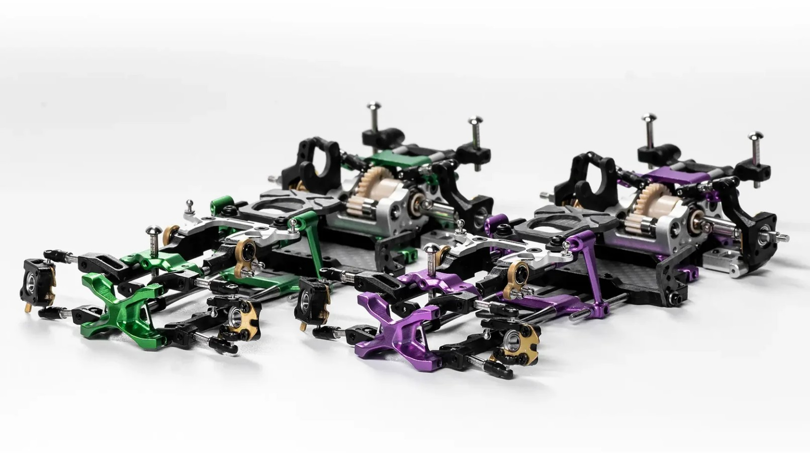

# Ark Edge AE24X

{ width="500" }

## Quick facts

- **Developed by:** *Ark Edge*

- **Release:** *March 2025*

- **Origin:** *China*

- **Status:** *Available(Pro op version)*

- **Production:** *Batch*

- **Scale:** *1/24*

- **Body mounting:** *Magnet mounting*

- **Materials:** *Injection molded plastic, aluminum, carbon fiber, titanium(upgrade parts, included with PRO version)*

---

## Adjustability

### At-a-glance

- **Wheelbase:** ✅

- **Camber:** Front ✅ / Rear ✅

- **Toe:** Front ✅ / Rear ✅ ❌ (is it available only with op rear knuckles?)

- **Caster:** ✅

- **Ackermann quick adjustment:** ✅

- **Ride height:** Front ✅ / Rear ✅

- **Track width:** Front ✅ / Rear ✅

- **Front shocks:** preload ✅ / angle ✅ (hinge point of catilever link on lower arm)

- **Rear shocks:** preload ✅ / angle ✅

- **Active systems:** ✅ (Floating gearbox)

- **Motor position:** mid ✅ / high ✅ / rear ❌ ?

- **Servo position:** ✅

- **Pinion-Spur distance:** ✅

- **Front knuckle KPI hinge point:** ❌

- **Front knuckle steering linkage hinge point:** ❌

- **Steering rack linkage hinge point:** ✅ (Option part)

### Details

- **Wheelbase adjustment method:** *slider*

- **Wheelbase range:** *94–116 mm*

- **Track width range:** *72~80 mm*

- **Caster adjustment:** *slider*

- **Ackermann adjustment:** *slider*

- **Rear toe behavior:** *static*

---

## Drivetrain

- **Gearbox type:** *gear/belt hybrid*

- **Motor orientation:** *transverse*

- **Forces:** *pro-torque*

- **Reversible:** ❌ ?

- **Differential:** *spool / LSD Differential(option part)*

---

## Steering

- **Steering method:** *direct*

- **Servo position:** *upper deck*

---

## Suspension

- **Front:** *double wishbone, independent, cantilever 2 shocks/4 shocks*

- **Rear:** *double wishbone, independent, 2 shocks (multi-link conversion possible, with upgrade rear lower arms and rear hubs)*

- **Shocks type:** *friction shocks*

## Notes WIP section

{ width="500" }

---

## Contribute

Have extra info or experience with this chassis? [Contribute here](../../contribute/contribute.md)

---

## Sources / credits / reviews

