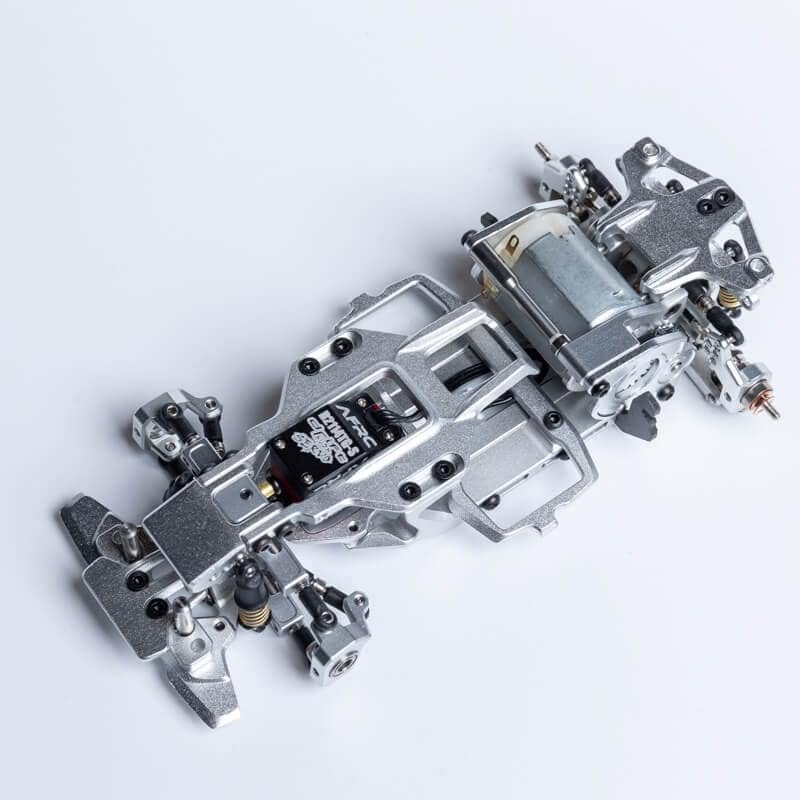
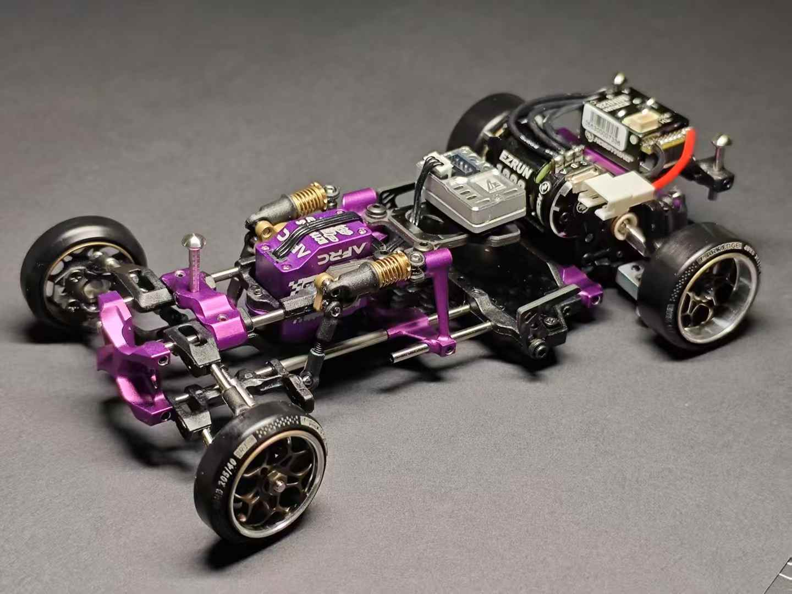

# Ark Edge AE28U

{ width="500" }

## Quick facts

- **Developed by:** *Ark Edge*

- **Release:** *July 2024*

- **Origin:** *China*

- **Status:** *Discontinued*

- **Production:** *Batch*

- **Scale:** *1/24-1/28*

- **Body mounting:** *Magnet mounting/MINI-Z*

- **Materials:** *Aluminum, brass, injection molded plastic*

---

## Adjustability

### At-a-glance

- **Wheelbase:** ✅

- **Track width:** Front ✅ / Rear ✅

- **Camber:** Front ✅ / Rear ✅

- **Camber gain:** Front ❌ ✅ / Rear ✅

- **Caster:** ✅

- **Ackermann quick adjustment:** ✅

- **Toe:** Front ✅ / Rear ✅

- **Ride height:** Front ✅ / Rear ✅

- **Front shocks:** preload ✅ / angle ✅

- **Rear shocks:** preload ✅ / angle ✅

- **Active systems:** ❌

- **Motor position:** mid ✅ / high ❌ / rear ❌ (not confirmed)

- **Servo position:** ❌

- **Belt tension/Pinion size:** ✅

- **Extendable dogbones:** ✅

- **Front knuckle KPI:** ❌

- **Steering linkage position on knuckle:** ❌

- **Servo inclination:** ❌ (not confirmed)

- **Steering rack linkage position:** ❌

### Details

- **Wheelbase adjustment method:** *slider & steps*

- **Wheelbase range:** *86–116 mm*

- **Track width range:** *unknown*

- **Caster adjustment:** *stepless*

- **Ackermann adjustment:** *stepless*

- **Rear toe behavior:** *static*

---

## Drivetrain

- **Gearbox type:** *gear-driven*

- **Motor orientation:** *transverse*

- **Forces:** *pro-torque*

- **Reversible:** ❌

- **Differential:** *ball LSD*

---

## Steering

- **Steering method:** *direct drive*

- **Servo position:** *upper deck*

---

## Suspension

- **Front:** *double wishbone, independent, 2 shocks*

- **Rear:** *double wishbone, independent, 2 shocks*

- **Shocks type:** *friction shocks*

## Community ratings

## History & Development

AE28U is Ark Edge's first product and it faced mixed feelings at first. The price point was very high, and since it was an unproven brand, hobbyists were cautious. It looked different from most chassis on the market and initially felt somewhat out of sync with the direction of the hobby. At a time when many manufacturers and enthusiasts were increasingly focused on 1:24 model kits and chasss, anodized in bright colors, Ark Edge released a clean silver chassis capable of supporting wheelbases as short as 86 mm, giving considerable attention to MINI-Z sized bodies.

Rather than ignoring the skepticism, the Ark Edge team actively sought contact with the community worldwide, requesting feedback, releasing update parts and sending them free of charge to customers who had already purchased the kit. Still, many enthusiasts, although already believing in the quality of the parts and accepting that the brand is trustworthy, were still uncertain, because there was very little footage showing how the AE28U actually performed on track. Several well-known hobbyists initially questioned the AE28U's drifting performance. 

However, Ark Edge stood their ground once more, shared through social media and were active enough, persistent enough to slowly earn their reputation. They also released their own gyro, which went a bit viral for a while, helping increase the brand's visibility within the community. 

While the AE28U never became the dominant chassis many expected, it established Ark Edge as a serious manufacturer. The lessons learned from the AE28U directly influenced the development of the [AE24X](../ae24x/page.md), a chassis that would go on to receive significantly broader recognition within the community. 

---

## Contribute

Have extra info or experience with this chassis? [Contribute here](../../contribute/contribute.md)

---

## Sources / credits / reviews

