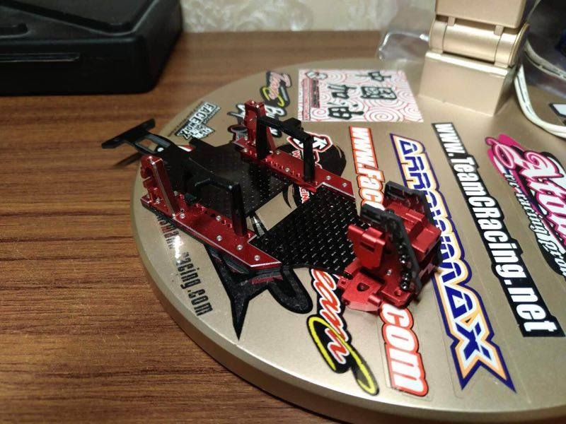

# Atomic DRZ

{ width="500" }

## Quick facts

- **Developed by:** *Legowo Setiawan and Atomic*

- **Release:** *March 2018*

- **Origin:** *Hongkong in collaboration with Indonesian developer*

- **Status:** *Discontinued*

- **Production:** *Batch*

- **Scale:** *1/28*

- **Body mounting:** *MINI-Z*

- **Materials:** *Injection molded plastic, carbon fiber, stainless steel, aluminum(upgrades)*

---

## Adjustability

### At-a-glance

- **Wheelbase:** ❌(✅ Option plates or conversions with adjustable wheelbase later released) 

- **Camber:** Front ✅ / Rear ✅

- **Toe:** Front ✅ / Rear ✅ 

- **Caster:** ✅

- **Ackermann quick adjustment:** ❌

- **Ride height:** Front ✅ / Rear ✅

- **Track width:** Front ✅ / Rear ❌

- **Front shocks:** preload ✅ / angle ✅

- **Rear shocks:** preload ✅ / angle ✅

- **Active systems:** ❌

- **Motor position:** mid ✅ / high ❌ / rear ❌

- **Servo position:** ❌

- **Pinion-Spur distance:** ✅

- **Front knuckle KPI hinge point:** ❌

- **Front knuckle steering linkage hinge point:** ❌

- **Steering rack linkage hinge point:** ❌

### Details

- **Wheelbase adjustment method:** *changing the chassis plate*

- **Wheelbase range:** *94mm stock. 90mm Optional chassis plate(Conversions such as Super Skeeter allow more adjustability)*

- **Track width range:** *65mm. Front is adjustable*

- **Caster adjustment:** *shims*

- **Ackermann adjustment:** *via steering links length*

- **Rear toe behavior:** *static*

---

## Drivetrain

- **Gearbox type:** *gear-driven*

- **Motor orientation:** *transverse*

- **Forces:** *anti-torque*

- **Reversible:** ❌

- **Differential:** *open*

---

## Steering

- **Steering method:** *pivoted*

- **Steering system:** *sliding rack*

- **Servo position:** *lower deck*

---

## Suspension

- **Front:** *double wishbone, independent, 2 shocks*

- **Rear:** *double wishbone, independent, 2 shocks*

- **Shocks type:** *friction shocks*

## Notes

Atomic DRZ is the first ever production small scale RWD RC Drift chassis!

It is based on Atomic's AMR AWD platform.

Optional CNC parts from red anodized aluminum were released from Atomic.

{ width="500" }

BM Racing released red upgrade parts as well.

{ width="500" }

Super Skeeter conversion kit:

- direct drive steering

- quick Ackermann adjustment

- quick caster adjustment

- wheelbase adjustment

---

## Contribute

Have extra info or experience with this chassis? [Contribute here](../../contribute/contribute.md)

---

## Sources / credits / reviews

