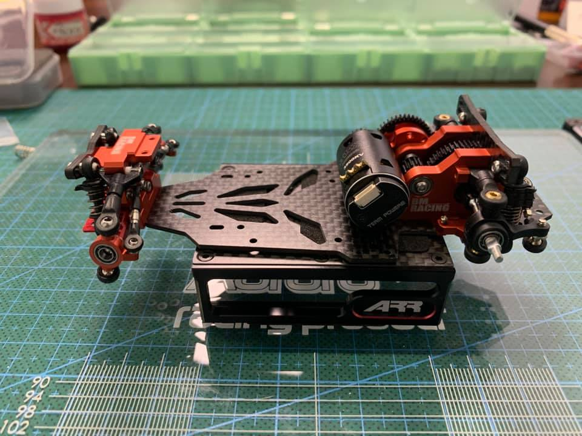
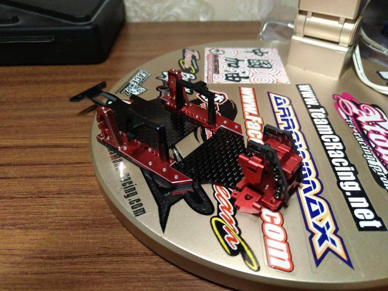

# Atomic DRZ

{ width="500" }

**The first production small-scale RWD drift chassis.**

## Quick facts

- **Developed by:** *Legowo Setiawan and Atomic*

- **Release:** *March 2018*

- **Origin:** *Hongkong in collaboration with Indonesian developer*

- **Status:** *Discontinued*

- **Production:** *Batch*

- **Scale:** *1/28*

- **Body mounting:** *MINI-Z*

- **Materials:** *Injection molded plastic, carbon fiber, stainless steel, aluminum(upgrades)*

---

## Adjustability

### At-a-glance

- **Wheelbase:** ❌(✅ Option plates or conversions with adjustable wheelbase later released) 

- **Camber:** Front ✅ / Rear ✅

- **Toe:** Front ✅ / Rear ✅ 

- **Caster:** ✅

- **Ackermann quick adjustment:** ❌

- **Ride height:** Front ✅ / Rear ✅

- **Track width:** Front ✅ / Rear ❌

- **Front shocks:** preload ✅ / angle ✅

- **Rear shocks:** preload ✅ / angle ✅

- **Active systems:** ❌

- **Motor position:** mid ✅ / high ❌ / rear ❌

- **Servo position:** ❌

- **Pinion-Spur distance:** ✅

- **Front knuckle KPI hinge point:** ❌

- **Front knuckle steering linkage hinge point:** ❌

- **Steering rack linkage hinge point:** ❌

### Details

- **Wheelbase adjustment method:** *changing the chassis plate*

- **Wheelbase range:** *94mm stock. 90mm Optional chassis plate(Conversions such as Super Skeeter allow more adjustability)*

- **Track width range:** *65mm. Front is adjustable*

- **Caster adjustment:** *shims*

- **Ackermann adjustment:** *via steering links length*

- **Rear toe behavior:** *static*

---

## Drivetrain

- **Gearbox type:** *gear-driven*

- **Motor orientation:** *transverse*

- **Forces:** *anti-torque*

- **Reversible:** ❌

- **Differential:** *open*

---

## Steering

- **Steering method:** *pivoted*

- **Steering system:** *sliding rack*

- **Servo position:** *lower deck*

---

## Suspension

- **Front:** *double wishbone, independent, 2 shocks*

- **Rear:** *double wishbone, independent, 2 shocks*

- **Shocks type:** *friction shocks*

## Community ratings

## History & Development

Atomic DRZ was the first production small-scale RWD drift chassis, marking a major milestone in the history of the hobby.

Released in March 2018, it brought RWD micro drifting out of the experimental and independent-conversion stage and into a commercially available platform. The chassis was developed through a collaboration between RC Atomic and Legowo Setiawan. The DRZ kit was based on Atomic's AMR AWD platform.

As the first production small-scale RWD drift chassis, the DRZ introduced many enthusiasts to the hobby. At the time, the community was still very small and there were virtually no competing production platforms to compare it against.

Compared with later generations of small-scale RWD drift chassis, the original DRZ was relatively simple, but its importance was not in extreme adjustability or exotic mechanics. Its greatest contribution was making small-scale RWD drifting accessible through a complete production kit.

Early coverage from creators such as Beaver's Hobby Channel and Mikos Spaulding(DriftaHolics RC) helped introduce the platform to a wider RC audience, bringing greater visibility to small-scale RWD drifting.

Over the following years, both production and independent platforms emerged, including [DriftART](../../da/driftart/page.md), [XRX DPA](../../xrx-dpa/page.md), [TRC](../../trc/trc/page.md) and [BMR-X](../../bm-racing/bmrx/page.md). Together, these designs rapidly accelerated the evolution of small-scale RWD drifting.

Atomic later released optional red anodized CNC aluminum upgrades for the platform.

---

BM Racing also produced red upgrade parts for the DRZ. Their involvement with the platform predates the release of the company's own BMR-X chassis in January 2020 and may have contributed to BM Racing's later development of a complete drift platform.

{ width="500" }

---

{ width="500" }

The Super Skeeter conversion kit significantly modernized the DRZ platform, adding features such as:

- direct-drive steering
- quick Ackermann adjustment
- quick caster adjustment
- wheelbase adjustment

---

Although later chassis surpassed the DRZ in adjustability, refinement and manufacturing quality, its historical importance remains clear. The DRZ established the first production platform dedicated to small-scale RWD drifting and laid the foundation for the generations of production chassis that followed.

---

## Contribute

Have extra info or experience with this chassis? [Contribute here](../../../contribute/contribute.md)

---

## Sources / credits / reviews

Legowo Setiawan, RC Atomic, Beaver Pchay, Chris Tronic

