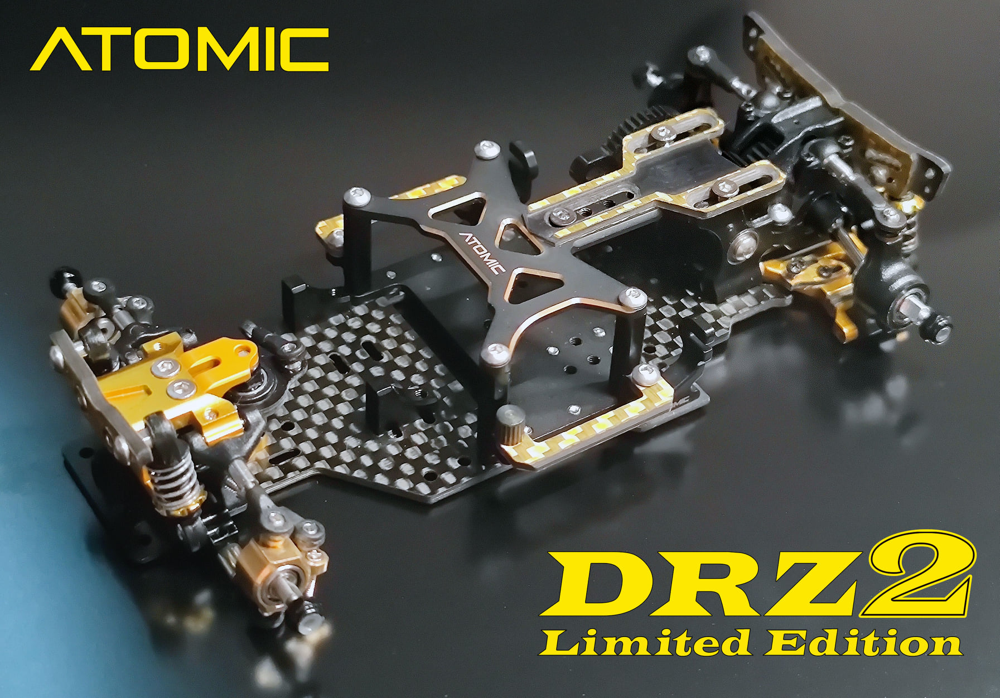
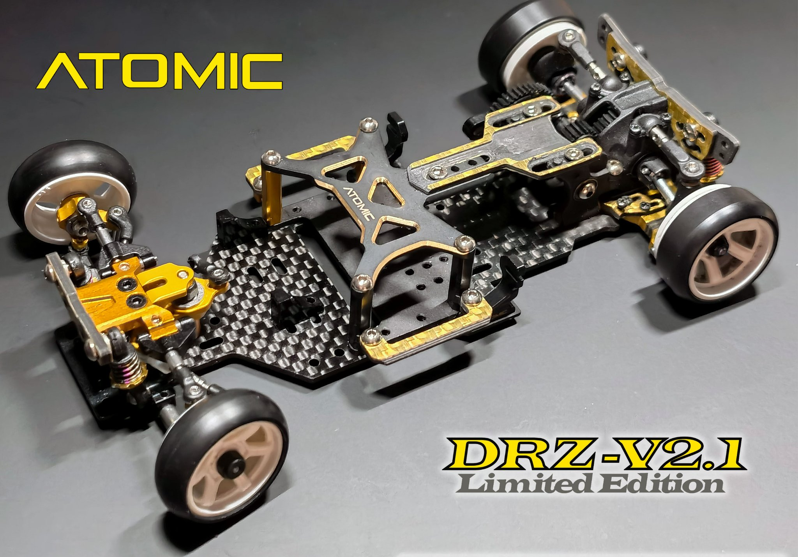

# Atomic DRZ2

{ width="500" }

## Quick facts

- **Developed by:** *RC Atomic*

- **Release:** *July 2020*

- **Origin:** *Hong Kong*

- **Status:** *Discontinued*

- **Production:** *Mass*

- **Scale:** *1/24-1/28*

- **Body mounting:** *Magnet mounting/MINI-Z*

- **Materials:** *Injection molded plastic, brass, stainless steel, carbon fiber, aluminum*

---

## Adjustability

### At-a-glance

- **Wheelbase:** ✅

- **Camber:** Front ✅ / Rear ✅

- **Toe:** Front ✅ / Rear ✅

- **Caster:** ✅

- **Ackermann quick adjustment:** ❌

- **Ride height:** Front ✅ / Rear ✅

- **Track width:** Front ✅ / Rear ✅ (Upgrade parts)

- **Front shocks:** preload ✅ / angle ✅ 

- **Rear shocks:** preload ✅ / angle ✅

- **Active systems:** ❌

- **Motor position:** mid ✅ / high ❌ / rear ❌

- **Servo position:** ❌

- **Pinion-Spur distance:** ✅

- **Front knuckle KPI hinge point:** ❌

- **Front knuckle steering linkage hinge point:** ❌

- **Steering rack linkage hinge point:** ✅ (Upgrade parts)

### Details

- **Wheelbase adjustment method:** *steps / + slider (upgrade parts)*

- **Wheelbase range:** *90–98 mm(102-114 mm with upgrade parts)*

- **Track width range:** *xx–yy mm*

- **Caster adjustment:** *shims*

- **Ackermann adjustment:** *adjusting linkages length*

- **Rear toe behavior:** *static*

---

## Drivetrain

- **Gearbox type:** *gear-driven*

- **Motor orientation:** *transverse*

- **Forces:** *anti-torque*

- **Reversible:** ❌

- **Differential:** *Ball*

---

## Steering

- **Steering method:** *pivoted*

- **Steering system:** *bellcrank*

- **Servo position:** *lower deck*

---

## Suspension

- **Front:** *double wishbone, independent, 2 shocks / monoshock-coupled option parts*

- **Rear:** *double wishbone, independent, 2 shocks*

- **Shocks type:** *friction shocks*

## Notes

After releasing several seperate upgrades, the first evolution of DRZ2 was released in june, 2021.

{ width="500" }

**DRZ2 Limited Edition, or simply DRZ2LE featuring:**

Adjustable wheelbase from 94 to 114 milimeters and longer front arms and extendable rear arms to fit 1/24 bodies.

New front bulkhead, brass side body mount, brass battery mount and optional aluminum servo mount.

Later, optional aluminum gearbox, rear knuckles, and rear arms were also introduced.

{ width="500" }

**DRZ2.1LE was the next evolution of DRZ2 platform offering:**

New front knuckles, aluminum steering crank with more adjustability, dog-leg steering linkages, rear shocks and axles.

These changes improved steering lock and allowed a softer rear end suspension resulting in more predictable handling. 

---

## Contribute

Have extra info or experience with this chassis? [Contribute here](../../contribute/contribute.md)

---

## Sources / credits / reviews

