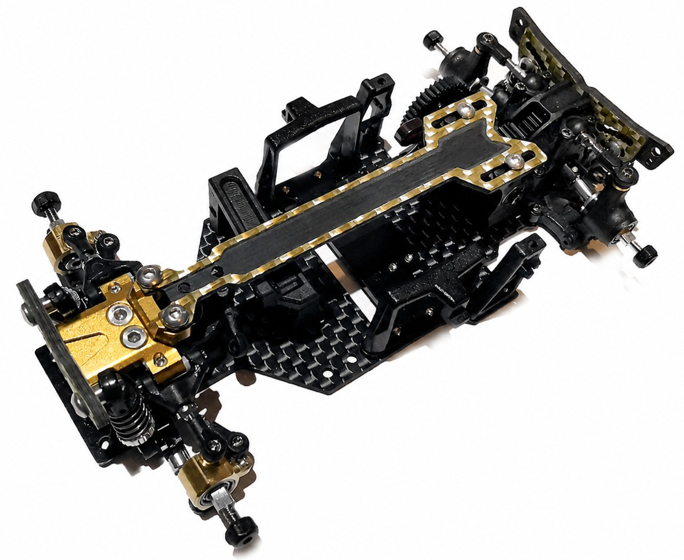
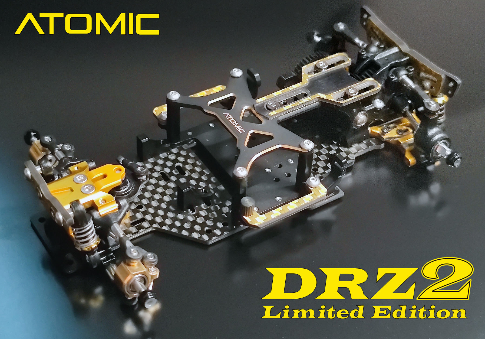
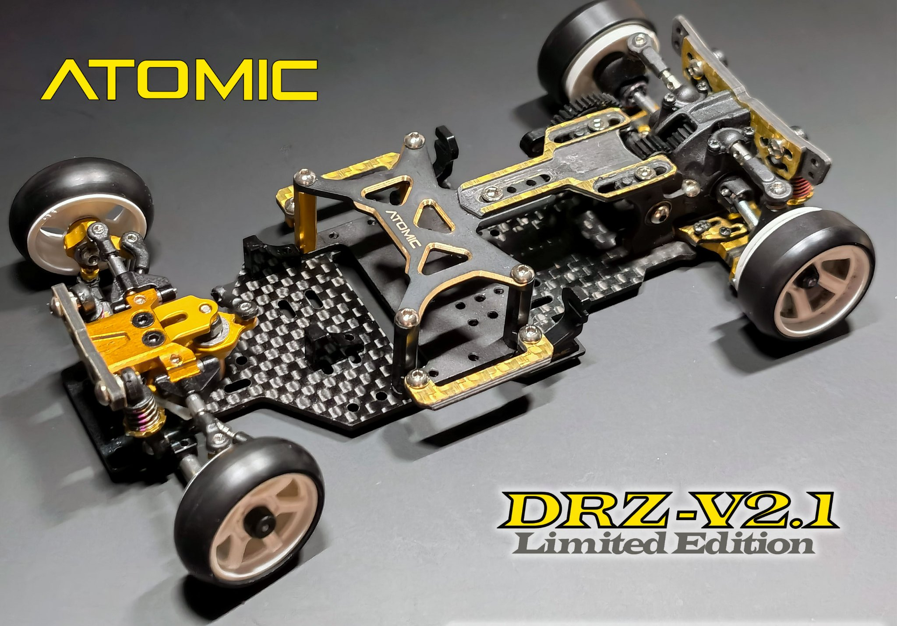

# Atomic DRZ2

{ width="500" }

## Quick facts

- **Developed by:** *RC Atomic*

- **Release:** *July 2020*

- **Origin:** *Hong Kong*

- **Status:** *Discontinued*

- **Production:** *Mass*

- **Scale:** *1/24-1/28*

- **Body mounting:** *Magnet mounting/MINI-Z*

- **Materials:** *Injection molded plastic, brass, stainless steel, carbon fiber, aluminum*

---

## Adjustability

### At-a-glance

- **Wheelbase:** ✅

- **Track width:** Front ✅ / Rear ❌ (✅ Upgrade parts)

- **Camber:** Front ✅ / Rear ✅

- **Camber gain:** Front ❌ / Rear ❌ (✅ With optional rear hubs)

- **Caster:** ✅

- **Ackermann quick adjustment:** ❌

- **Toe:** Front ✅ / Rear ✅

- **Ride height:** Front ✅ / Rear ✅

- **Front shocks:** preload ✅ / angle ✅ 

- **Rear shocks:** preload ✅ / angle ✅

- **Active systems:** ❌

- **Motor position:** mid ✅ / high ❌ / rear ❌

- **Belt tension/Pinion size:** ✅

- **Front knuckle KPI:** ❌

- **Steering linkage position on knuckle:** ❌

- **Steering rack linkage position:** ✅ (Upgrade bellcrank, 2.1LE)

### Details

- **Wheelbase adjustment method:** *steps; slider with upgrade parts, LE and 2.1LE*

- **Wheelbase range:** *90–98 mm; 102-114 mm with upgrade parts; 94-114 mm for LE and 2.1LE*

- **Track width range:** *65-?? mm*

- **Caster adjustment:** *shims*

- **Ackermann adjustment:** *linkages length; 2 bellcrank positions; 3 steering linkage postions on bellcrank for 2.1LE*

- **Rear toe behavior:** *static*

---

## Drivetrain

- **Gearbox type:** *gear-driven*

- **Motor orientation:** *transverse*

- **Forces:** *anti-torque*

- **Reversible:** ❌

- **Differential:** *Ball*

---

## Steering

- **Steering method:** *pivoted*

- **Steering system:** *bellcrank*

---

## Suspension

- **Front:** *double wishbone, independent, 2 shocks / monoshock-coupled option parts*

- **Rear:** *double wishbone, independent, 2 shocks*

- **Shocks type:** *friction shocks*

## Community ratings

## History & Development

DRZ2 was introduced in July 2020 as a major redesign of Atomic’s existing small-scale RWD platform. While retaining elements of the earlier [DRZ](../drz/page.md) and AMR architecture, it introduced substantially revised front geometry, a new steering system and greater wheelbase flexibility, with the goal of improving high-angle drifting while making the chassis easier to assemble and tune.

One of its defining changes was the adoption of a simplified single-crank steering system. Atomic stated that the design was selected after testing several alternatives, including curved racks, dual-arm systems and direct servo steering. By reducing the number of joints, bearings and ball links, the system was intended to simplify assembly while reducing steering play and wobble.

Contemporary feedback frequently described DRZ2 as considerably easier to build, tune and drive than the original DRZ. Several owners reported that the chassis performed well with minimal initial setup, while DRZ1 had often required considerably more experimentation to achieve similar results. This helped establish DRZ2 as a comparatively approachable and predictable production platform.

The platform continued to evolve through the 2021 Limited Edition and the 2022 V2.1 Limited Edition. The Limited Edition expanded wheelbase and track-width flexibility through longer front links, extendable rear arms and a revised chassis layout, while V2.1 introduced updated knuckles, steering crank, wheel shafts, linkages and softer suspension components that significantly increased steering angle and improved performance over uneven surfaces.

{ width="500" }

{ width="500" }

Community feedback remained generally positive, particularly regarding stability, steering response and ease of setup. Some experienced users nevertheless regarded DRZ2 as a comparatively straightforward and conservative design beside the increasingly sophisticated and highly adjustable chassis appearing at the time. Its extensive catalogue of optional parts also meant that a fully upgraded build could cost substantially more than the base kit.

DRZ2 was succeeded by the [DRZ3-MP](../drz3mp/page.md) in December 2022.

---

## Contribute

Have extra info or experience with this chassis? [Contribute here](../../../contribute/contribute.md)

---

## Sources / credits / reviews

