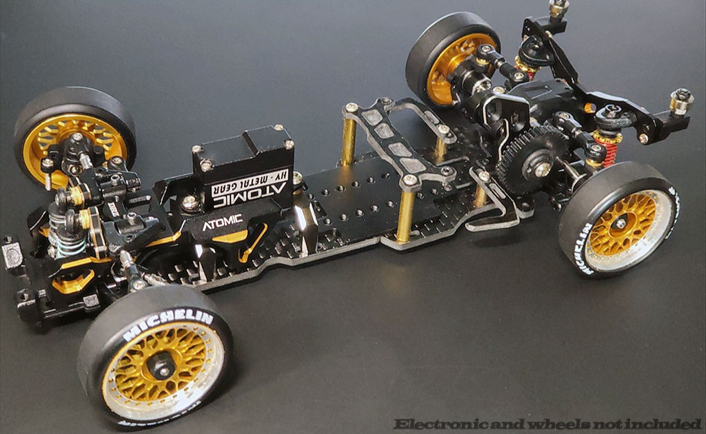

# Atomic DRZ3-MS

{ width="500" }

## Quick facts

- **Developed by:** *RC Atomic*

- **Release:** *May 2023*

- **Origin:** *Hong Kong*

- **Status:** *Available*

- **Production:** *Mass*

- **Scale:** *1/24-1/28*

- **Body mounting:** *Magnet mounting*

- **Materials:** *Aluminum, carbon fiber, injection molded plastic*

---

## Adjustability

### At-a-glance

- **Wheelbase:** ✅

- **Camber:** Front ✅ / Rear ✅

- **Toe:** Front ✅ / Rear ✅

- **Caster:** ✅

- **Ackermann quick adjustment:** ✅

- **Ride height:** Front ✅ / Rear ✅

- **Track width:** Front ✅ / Rear ❌ (✅ Optional parts)

- **Front shocks:** preload ✅ / angle ❌

- **Rear shocks:** preload ✅ / angle ✅

- **Active systems:** ✅

- **Motor position:** mid ✅ / high ✅ / rear ✅

- **Servo position:** ✅

- **Pinion-Spur distance:** ✅

- **Front knuckle KPI hinge point:** ❌

- **Front knuckle steering linkage hinge point:** ❌

- **Steering rack linkage hinge point:** ✅

### Details

- **Wheelbase adjustment method:** *slider / steps*

- **Wheelbase range:** *90–120 mm*

- **Track width range:** *xx–yy mm*

- **Caster adjustment:** *stepless*

- **Ackermann adjustment:** *stepless*

- **Rear toe behavior:** *static*

---

## Drivetrain

- **Gearbox type:** *gear-driven*

- **Motor orientation:** *transverse*

- **Forces:** *anti-torque*

- **Reversible:** ✅

- **Differential:** *Ball*

---

## Steering

- **Steering method:** *direct*

- **Steering system:** *direct drive*

- **Servo position:** *lower deck installed servo mount*

---

## Suspension

- **Front:** *Double wishbone, independent, 2 shocks working with cantilever arms.*

- **Rear:** *Double wishbone, independent, 2 shocks*

- **Shocks type:** *friction shocks*

## Notes

DRZ3MS's steering crank is only compatible with servos with 3.5 to 3.9mm spline. A few examples from GT55racing.com: 
-Atomic 1885
-Atomic 1820 series
-Atomic BZ-UP017 series
-AGFRC A06CLS series

---

## Contribute

Have extra info or experience with this chassis? [Contribute here](../../contribute/contribute.md)

---

## Sources / credits / reviews

