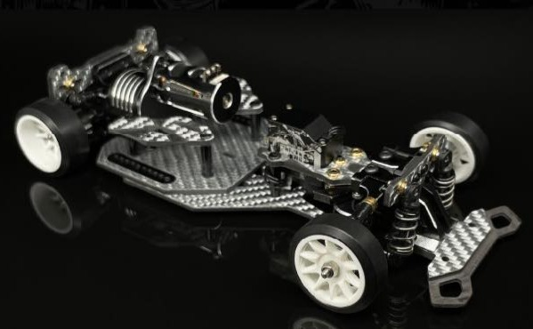
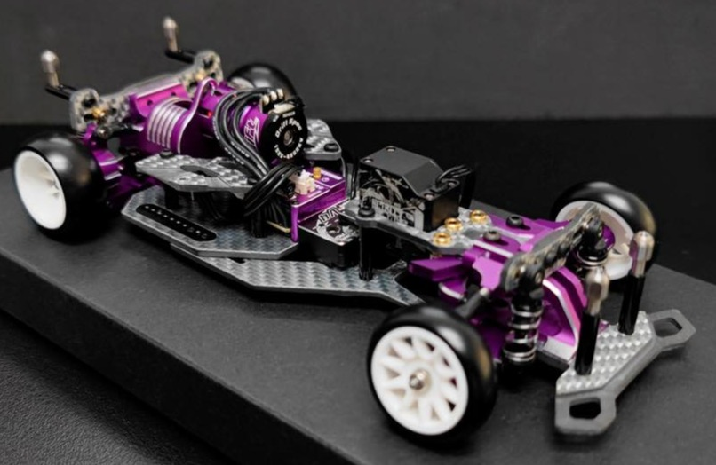
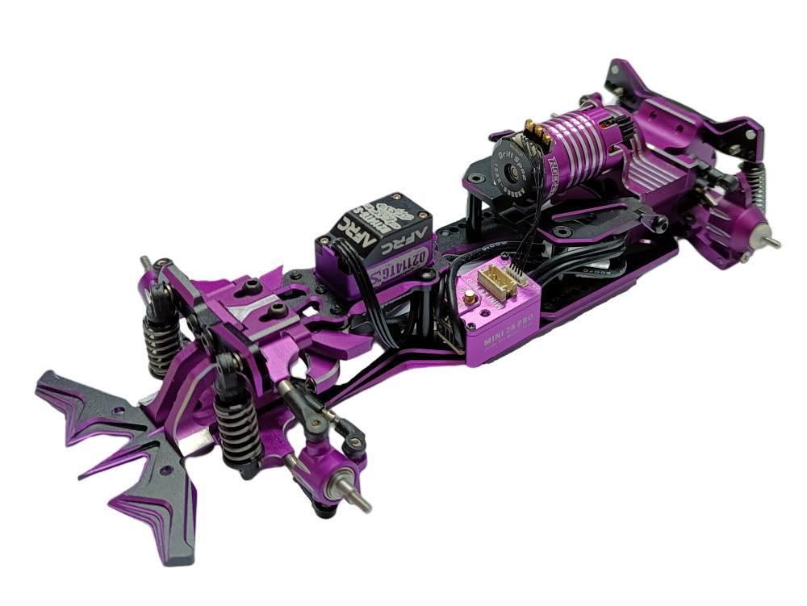
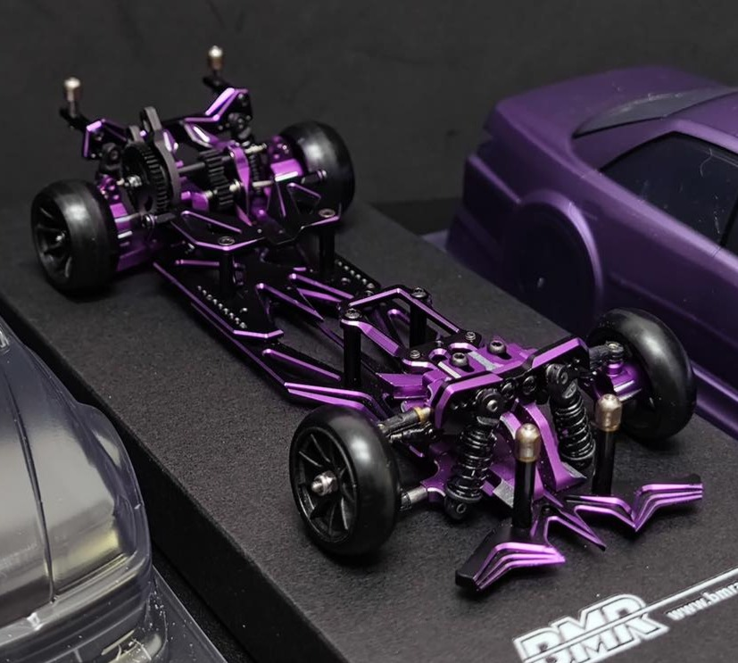

# BMR-X PRO

{ width="500" }

## Quick facts

- **Developed by:** *BM Racing*

- **Release:** *January 2023*

- **Origin:** *China*

- **Status:** *Discontinued*

- **Production:** *Mass*

- **Scale:** *1/24*

- **Body mounting:** *Magnet mounting*

- **Materials:** *Aluminum, carbon fiber, injection molded plastic*

---

## Adjustability

### At-a-glance

- **Wheelbase:** ✅

- **Camber:** Front ✅ / Rear ✅

- **Toe:** Front ✅ / Rear ❌ (not confirmed)

- **Caster:** ✅

- **Ackermann quick adjustment:** ❌

- **Ride height:** Front ✅  / Rear ✅ 

- **Track width:** Front ✅ / Rear ❌ (✅ with optional arms)

- **Front shocks:** preload ✅ / angle ✅

- **Rear shocks:** preload ✅ / angle ✅

- **Active systems:** ❌

- **Motor position:** center-high longitudinal (fixed)

- **Servo position:** ❌

- **Pinion-Spur distance:** ✅

- **Front knuckle KPI hinge point:** ❌

- **Front knuckle steering linkage hinge point:** ❌

- **Steering rack linkage hinge point:** ❌

### Details

- **Wheelbase adjustment method:** *slider & steps*

- **Wheelbase range:** *99.5–117 mm*

- **Track width range:** *xx–yy mm*

- **Caster adjustment:** *stepless*

- **Ackermann adjustment:** *spacers*

- **Rear toe behavior:** *static*

---

## Drivetrain

- **Gearbox type:** *gear-driven*

- **Motor orientation:** *longitudinal*

- **Forces:** *Torque-twist*

- **Reversible:** ❌

- **Differential:** *spool*

---

## Steering

- **Steering method:** *pivoted*

- **Steering system:** *slide rack*

- **Servo position:** *upper deck*

---

## Suspension

- **Front:** *double wishbone, independent, 2 shocks*

- **Rear:** *double wishbone, independent, 2 shocks*

- **Shocks type:** *friction shocks*

## Community ratings

## History & Development

Limited production of 200 Purple BMR-X PRO units was released by BM Racing in April 2023.

{ width="500" }

Aluminum chassis upgrade released in July 2023.

{ width="500" }

The platform evolved into the [BMR-X EVO](../bmrx-evo/page.md)

{ width="500" }

---

## Contribute

Have extra info or experience with this chassis? [Contribute here](../../../contribute/contribute.md)

---

## Sources / credits / reviews

