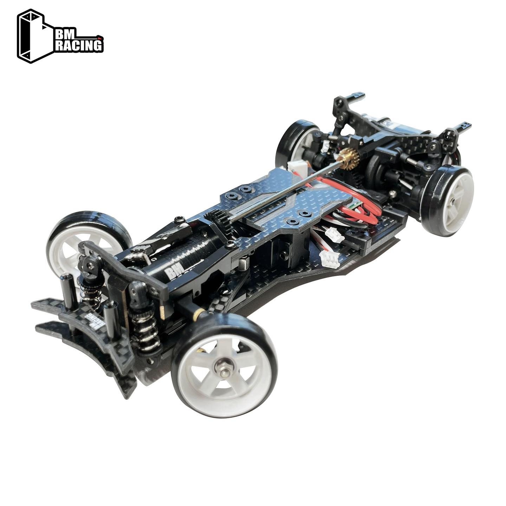

# BMR-X

{ width="500" }

## Quick facts

- **Developed by:** *BM Racing*

- **Release:** *January 2020*

- **Origin:** *China*

- **Status:** *Available(current revised version)*

- **Production:** *Mass*

- **Scale:** *1/24*

- **Body mounting:** *Magnet mounting*

- **Materials:** *carbon fiber, plastic, brass, stainless steel, aluminum*

---

## Adjustability

### At-a-glance

- **Wheelbase:** ✅

- **Camber:** Front ✅ / Rear ✅

- **Toe:** Front ✅ / Rear ❌(optional toe block)

- **Caster:** ✅ (Tiny range)

- **Ackermann quick adjustment:** ❌

- **Ride height:** Front ✅ / Rear ✅

- **Track width:** Front ✅ / Rear ❌

- **Front shocks:** preload ✅ / angle ✅

- **Rear shocks:** preload ✅ / angle ✅

- **Active systems:** ❌

- **Motor position:** *front mounted, longitudinal (fixed)*

- **Servo position:** ❌

- **Front knuckle KPI hinge point:** ❌

- **Front knuckle steering linkage hinge point:** ❌

- **Steering rack linkage hinge point:** ❌

### Details

- **Wheelbase adjustment method:** *slider / steps*

- **Wheelbase range:** *98–118 mm*

- **Track width range:** *starting from around 78 mm*

- **Caster adjustment:** *shims*

- **Ackermann adjustment:** *steering linkages*

- **Rear toe behavior:** *static*

---

## Drivetrain

- **Gearbox type:** *gear-driven*

- **Motor orientation:** *longitudinal. The first small scale rwd drift chassis with front motor layout*

- **Forces:** *torque steer*

- **Differential:** *spool*

---

## Steering

- **Steering method:** *pivoted*

- **Steering system:** *dual-arm wiper (bellcrank type)*

- **Servo position:** *lower deck*

---

## Suspension

- **Front:** *double wishbone, independent, 2 shocks*

- **Rear:** *double wishbone, independent, 2 shocks*

- **Shocks type:** *friction shocks*

## Notes

{ width="500" }

The first released version of the BMR-X was actually the fully hopped-up BMR-X VIP in January 2020, with brass upgrades and adjustable offset 22mm wheels.

Then the standard version release was June 2020 and it came as a kit.

Currently, the BMR-X standard comes pre-build.

---

## Contribute

Have extra info or experience with this chassis? [Contribute here](../../contribute/contribute.md)

---

## Sources / credits / reviews

