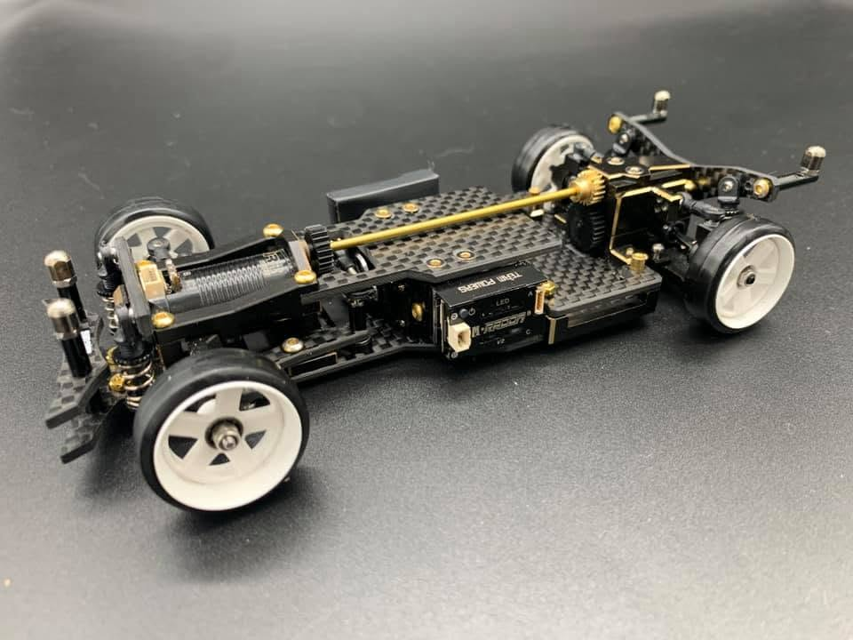
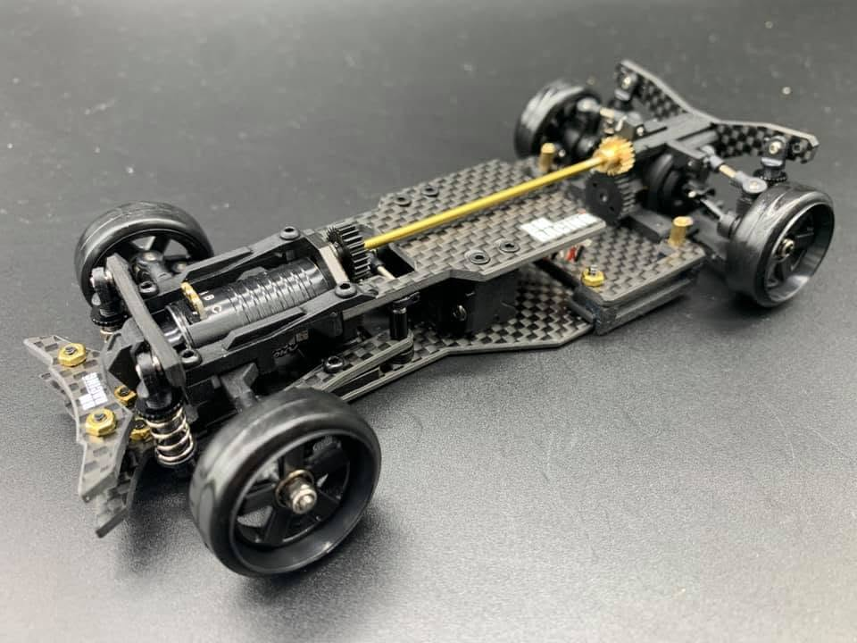
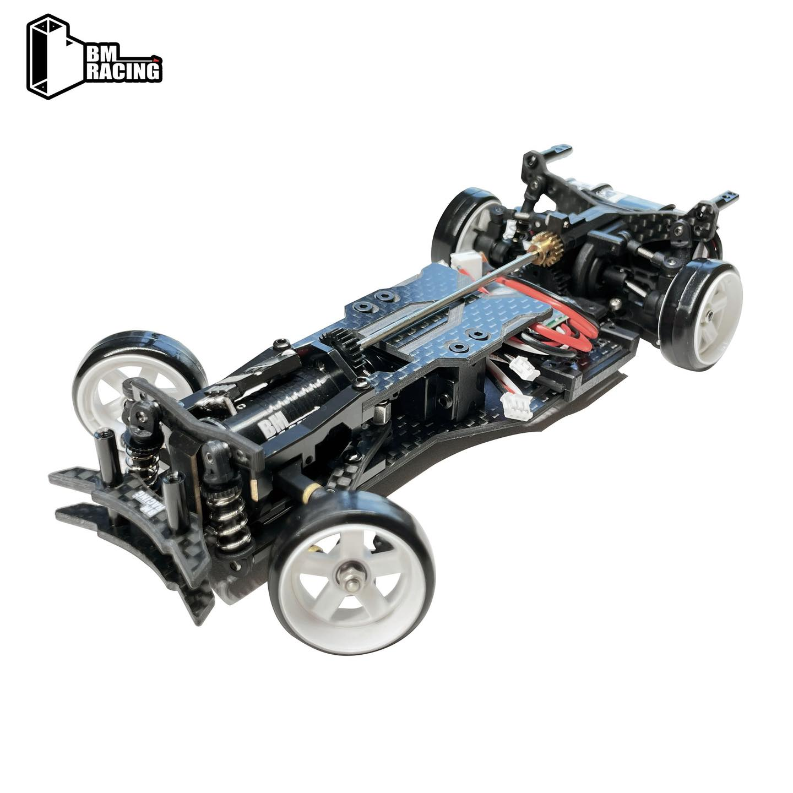
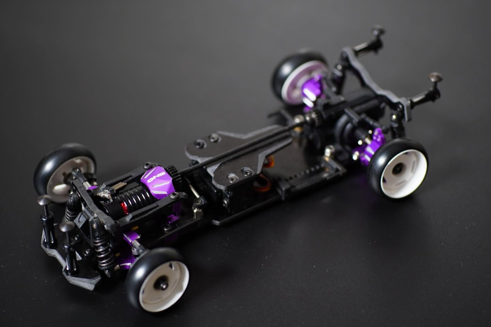

# BMR-X

{ width="500" }

## Quick facts

- **Developed by:** *BM Racing*

- **Release:** *January 2020*

- **Origin:** *China*

- **Status:** *Available(current revised version)*

- **Production:** *Mass*

- **Scale:** *1/24*

- **Body mounting:** *Magnet mounting*

- **Materials:** *carbon fiber, plastic, brass, stainless steel, aluminum*

---

## Adjustability

### At-a-glance

- **Wheelbase:** ✅

- **Track width:** Front ✅ / Rear ❌ (✅ BMR-X ONE)

- **Camber:** Front ✅ / Rear ✅

- **Camber gain:** Front ❌ / Rear ❌

- **Caster:** ✅ (Tiny range)

- **Ackermann quick adjustment:** ❌

- **Toe:** Front ✅ / Rear ❌(optional toe block)

- **Ride height:** Front ✅ / Rear ✅

- **Front shocks:** preload ✅ / angle ✅

- **Rear shocks:** preload ✅ / angle ✅

- **Active systems:** ❌

- **Motor position:** *front mounted, longitudinal (fixed)*

- **Belt tension/Pinion size:** ✅

- **Extendable dogbones:** ❌

- **Front knuckle KPI:** ❌

- **Steering linkage position on knuckle:** ❌

- **Steering rack linkage position:** ❌

### Details

- **Wheelbase adjustment method:** *slider / steps*

- **Wheelbase range:** *98–118 mm (104-123.5 mm BMR-X ONE)*

- **Track width range:** *starting from around 78 mm*

- **Caster adjustment:** *shims*

- **Ackermann adjustment:** *steering linkages*

- **Rear toe behavior:** *static*

---

## Drivetrain

- **Gearbox type:** *gear-driven*

- **Motor orientation:** *longitudinal. The first small scale rwd drift chassis with front motor layout*

- **Forces:** *torque steer*

- **Differential:** *spool*

---

## Steering

- **Steering method:** *pivoted*

- **Steering system:** *dual-arm wiper (bellcrank type)*

- **Servo position:** *lower deck*

---

## Suspension

- **Front:** *double wishbone, independent, 2 shocks*

- **Rear:** *double wishbone, independent, 2 shocks*

- **Shocks type:** *friction shocks*

## Community ratings

## History & Development

When the BMR-X was introduced in early 2020, BM Racing approached small-scale RWD drifting from a noticeably different direction than most manufacturers of the time. Instead of developing another MINI-Z based platform, the company designed the BMR-X specifically as a 1/24 scale FR-layout chassis, capable of fitting a wide variety of static model kit bodies from manufacturers such as Aoshima, Tamiya and Fujimi.

One of the defining characteristics of the original BMR-X was its unusual front-mounted longitudinal motor layout. According to BM Racing, the concept was developed to increase front grip and overall stability, while its 1/24 architecture was designed to support a wide variety of static model kit bodies. Another distinctive feature was its use of Kyosho RWD-style front wheels, with the front bearings housed inside the wheels rather than on conventional AWD-style.

**BMR-X VIP (2020)**

{ width="500" }

Rather than releasing an entry-level kit first, BM Racing introduced the fully optioned BMR-X VIP in January 2020. Equipped with numerous brass upgrades and premium components, it was later followed by a considerably more affordable Standard Version released as a kit in June 2020. Over the following years the platform received continuous production updates, including revised weight distribution, longer CVDs, improved front axle design, steel drivetrain options, revised body mounts, pre-built chassis versions, ARR and RTR packages, as well as several limited editions.

**BMR-X Standard (2020)**

{ width="500" }

Community feedback generally praised the driving characteristics of the chassis and its distinctive FR concept, while recurring discussions focused on the durability of the original plastic rear solid axle assembly and the limited availability of spare parts outside Asia. BM Racing gradually addressed many of these concerns through revised components, longer drive cups and eventually a steel rear solid axle upgrade.

In 2021, BM Racing also introduced the limited Black Edition, combining factory-installed option parts, electronics and body shell in a special production run of only 50 units.

**BMR-X Black (2021)**

{ width="500" }

In 2025, after several years of focusing on the BMR-X Pro series, BM Racing revisited its original FR concept with the release of the BMR-X ONE. Rather than simply re-releasing the original chassis, the new version introduced redesigned suspension components, revised motor and battery mounts, increased adjustability and numerous updated parts while preserving the distinctive front-mounted longitudinal motor layout that defined the original BMR-X.

**BMR-X ONE(2025)**

{ width="500" }

## Contribute

Have extra info or experience with this chassis? [Contribute here](../../../contribute/contribute.md)

---

## Sources / credits / reviews

