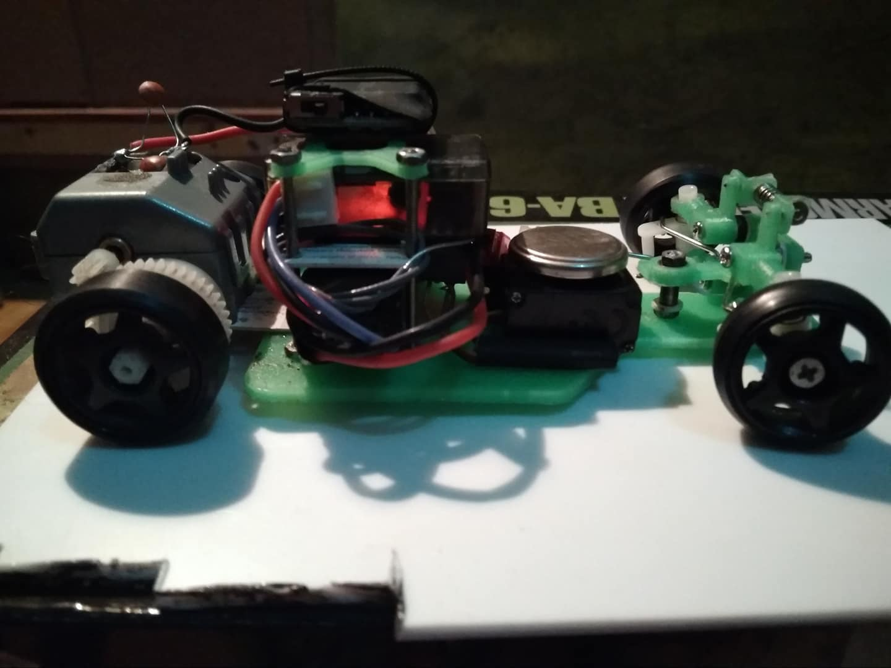
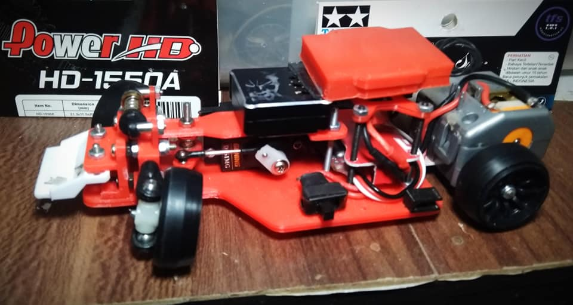
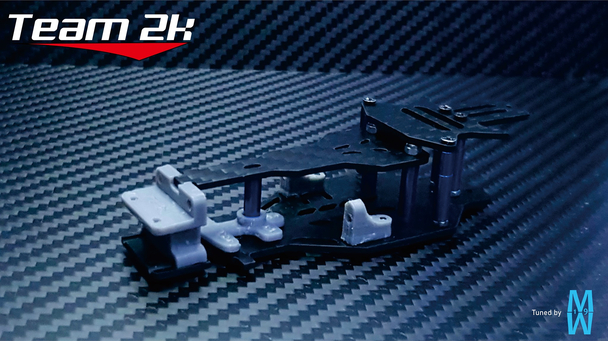
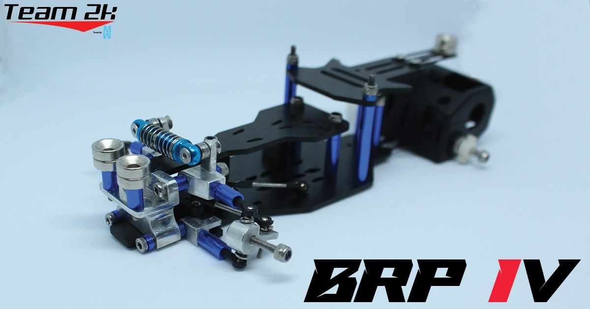

# BRP

{ width="500" }

## Quick facts

- **Developed by:** *Pebysetyana*

- **Release:** *August 2019*

- **Origin:** *Indonesia*

- **Status:** *Unknown*

- **Production:** *Pre-order*

- **Scale:** *1/28*

- **Body mounting:** *MINI-Z, magnet mounting*

- **Materials:** *3D printed PLA(carbon fiber conversion and aluminum/carbon version IV)*

---

## Adjustability

### At-a-glance

- **Wheelbase:** ✅

- **Camber:** Front ✅ / Rear ❌

- **Toe:** Front ✅ / Rear ❌

- **Caster:** ✅

- **Ackermann quick adjustment:** ✅

- **Ride height:** Front ✅ / Rear ❌

- **Track width:** Front ✅ / Rear - Unknown

- **Front shock:** preload ✅ / angle ❌

- **Active systems:** ❌

- **Motor position:** mid ❌ / high ❌ / rear ✅

- **Servo position:** ❌

- **Pinion-Spur distance:** ❌

- **Front knuckle KPI hinge point:** ❌

- **Front knuckle steering linkage hinge point:** ✅

- **Steering rack linkage hinge point:** ❌(✅ Limited version IV by 2k)

### Details

- **Wheelbase adjustment method:** *slider / steps*

- **Wheelbase range:** *94–110 mm*

- **Track width range:** *72–unknown mm*

- **Caster adjustment:** *shims*

- **Ackermann adjustment:** *stepless*

- **Rear toe behavior:** *static*

---

## Drivetrain

- **Gearbox type:** *gear-driven*

- **Motor orientation:** *transverse*

- **Forces:** *pro-torque*

- **Reversible:** ❌

- **Differential:** *spool / ball(Mini-Z upgrade)*

---

## Steering

- **Steering method:** *pivoted*

- **Steering system:** *bellcrank*

- **Servo position:** *lower deck*

---

## Suspension

- **Front:** *double wishbone, independent(coupled), monoshock*

- **Rear:** *T-bar*

- **Shock type:** *friction shock*

## Notes

One of the first independent designs to appear, BRP became famous at local grounds.

---

The first prototype version was presented in October 2018.

{ width="500" }

---

Two months later, in december 2018, the V2 was released.

{ width="500" }

---

The third version was released in august 2019, and it became very popular.

{ width="500" } 

---

December 2020, Team 2k release carbon fiber conversion kit, compatible with BRPV2 and BRPV3, including lower deck, upper deck and battery box.

{ width="500" }

---

April 2021, Team 2k presented BRP IV made of carbon fiber and aluminum.

{ width="500" }

---

## Contribute

Have extra info or experience with this chassis? [Contribute here](../../contribute/contribute.md)

---

## Sources / credits / reviews

