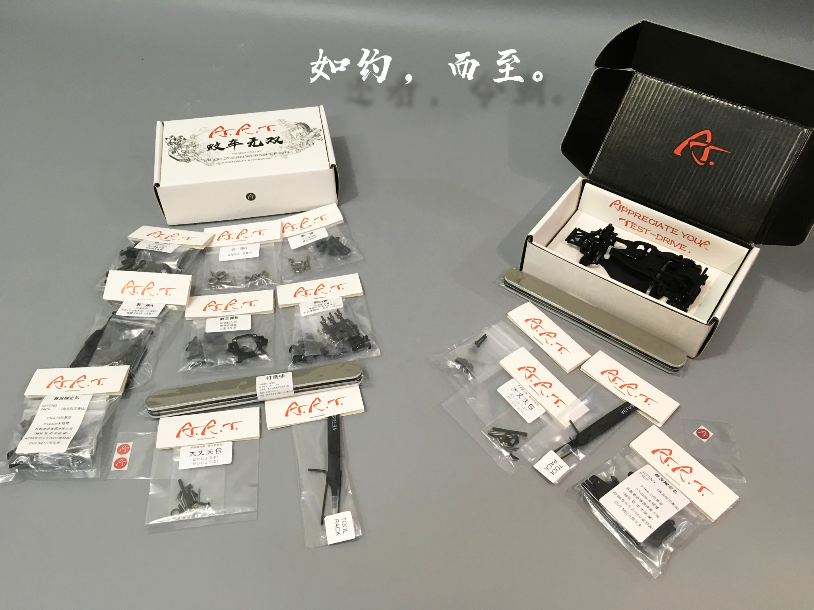
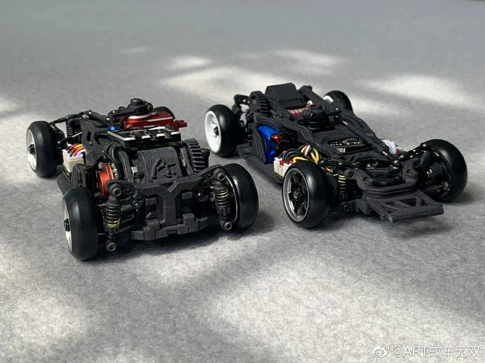

# DriftART

{ width="500" }

## Quick facts

- **Developed by:** *DriftART (Mr. Chen)*

- **Release:** *September 2019*

- **Origin:** *China*

- **Status:** *Discontinued*

- **Production:** *Batch ~200 units exclusively sold in China*

- **Scale:** *1/28*

- **Body mounting:** *MINI-Z*

- **Materials:** *Nylon 3D Printed*

---

## Adjustability

### At-a-glance

- **Wheelbase:** ✅

- **Camber:** Front ✅ / Rear ✅

- **Toe:** Front ✅ / Rear ✅

- **Caster:** ✅

- **Ackermann quick adjustment:** ✅

- **Ride height:** Front ✅ / Rear ✅

- **Track width:** Front ✅ / Rear ❌ 

- **Front shocks:** preload ✅ / angle ❌

- **Rear shocks:** preload ✅ / angle ✅ 

- **Active systems:** ❌

- **Motor position:** mid ✅ / high ✅ / rear ✅

- **Servo position:** ❌ 

- **Pinion-Spur distance:** ✅

- **Front knuckle KPI hinge point:** ❌

- **Front knuckle steering linkage hinge point:** ❌

- **Steering rack linkage hinge point:** ❌

### Details

- **Wheelbase adjustment method:** *slider / steps*

- **Wheelbase range:** *90/94 mm*

- **Track width range:** *Front - narrow/wide options, same as MINI-Z. Rear - only narrow.*

- **Caster adjustment:** *steps*

- **Ackermann adjustment:** *Length and angle of steering inks*

- **Rear toe behavior:** *static*

---

## Drivetrain

- **Gearbox type:** *helical gear-driven (nylon gears)*

- **Motor orientation:** *transverse*

- **Forces:** *pro-torque*

- **Reversible:** ✅ (Quick, using mortise and tenon joints)

- **Differential:** *Ball*

- **Telescopic CVD** ✅

---

## Steering

- **Steering method:** *pivoted*

- **Steering system:** *wiper*

- **Servo position:** *lower deck mounted, but operating above the upper deck*

---

## Suspension

- **Front:** *double wishbone, independent, 2 shocks*

- **Rear:** *double wishbone, independent, 2 shocks*

- **Shocks type:** *friction shocks*

## Notes

Unique features of DA1, are the usage of mortise and tenon technology in few places, that allows disassembly or setup to be made without using tools.
The other unique thing is its low profile combined with adjustable mounting tongue for Kyosho MINI-Z body shells, in a way that completely conceals the chassis underneath.

{ width="500" } 

Drift Art 1 Kit:

{ width="500" }

{ width="500" }

The successor of DriftART is [DriftART2](../driftart2/page.md)

---

## Contribute

Have extra info or experience with this chassis? [Contribute here](../../contribute/contribute.md)

---

## Sources / credits / reviews

Thanks to Mr. Chen for providing information and images of this unicorn chassis.

