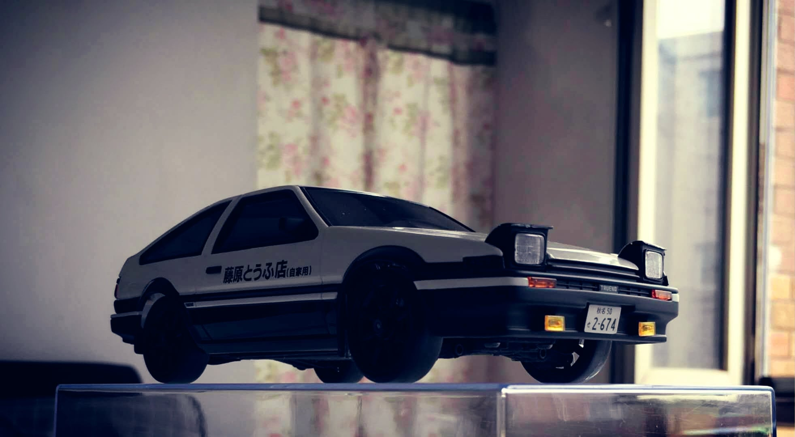
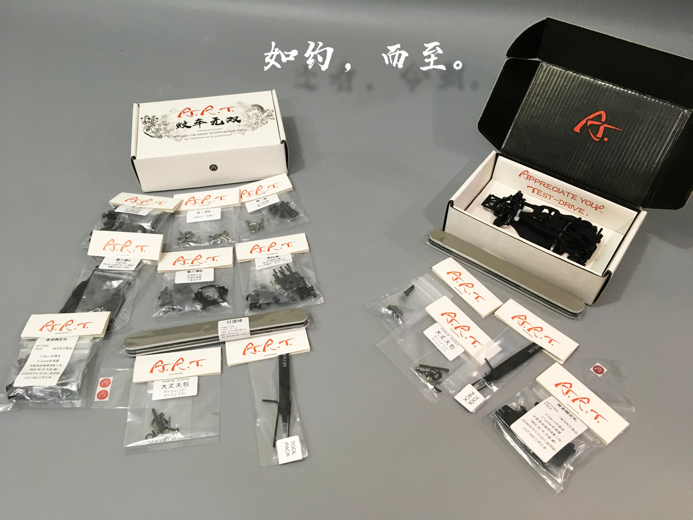
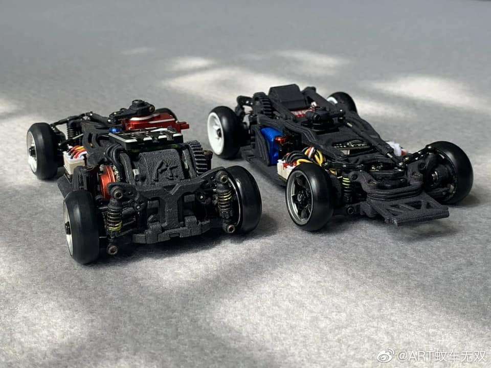

# DriftART

{ width="500" }

## Quick facts

- **Developed by:** *DriftART (Mr. Chen)*

- **Release:** *September 2019*

- **Origin:** *China*

- **Status:** *Discontinued*

- **Production:** *Batch ~200 units exclusively sold in China*

- **Scale:** *1/28*

- **Body mounting:** *MINI-Z*

- **Materials:** *Nylon 3D Printed*

---

## Adjustability

### At-a-glance

- **Wheelbase:** ✅

- **Track width:** Front ✅ / Rear ❌

- **Camber:** Front ✅ / Rear ✅

- **Camber gain:** Front ❌ / Rear ❌

- **Caster:** ✅

- **Ackermann quick adjustment:** ✅

- **Toe:** Front ✅ / Rear ✅ (2°/4° by replacing rear arms mount)

- **Ride height:** Front ✅ / Rear ✅

- **Front shocks:** preload ✅ / angle ❌

- **Rear shocks:** preload ✅ / angle ✅

- **Active systems:** ❌

- **Motor position:** mid ✅ / high ✅ / rear ✅

- **Belt tension/Pinion size:** ✅

- **Extendable dogbones:** ✅

- **Front knuckle KPI:** ❌

- **Steering linkage position on knuckle:** ❌

- **Steering rack linkage position:** ❌

### Details

- **Wheelbase adjustment method:** *slider / steps*

- **Wheelbase range:** *90/94 mm*

- **Track width range:** *Front - narrow/wide options (65-75mm), same as MINI-Z. Rear - only narrow.* 

- **Caster adjustment:** *0-5° by replacing front lower arms*

- **Ackermann adjustment:** *stepless*

- **Rear toe behavior:** *static*

---

## Drivetrain

- **Gearbox type:** *helical gear-driven (nylon gears)*

- **Motor orientation:** *transverse*

- **Forces:** *pro-torque*

- **Reversible:** ✅ (Quick, using mortise and tenon joints)

- **Differential:** *Ball*

---

## Steering

- **Steering method:** *pivoted*

- **Steering system:** *wiper*

---

## Suspension

- **Front:** *double wishbone, independent, 2 shocks*

- **Rear:** *double wishbone, independent, 2 shocks*

- **Shocks type:** *friction shocks*

## Community ratings

## History & Development

When DriftART was introduced in September 2019, the small-scale RWD drift scene was still in its infancy. While several platforms had already appeared, the hobby remained in its experimental stage. Rather than simply building another drift chassis, Mr. Chen set out to pursue what he described as "the ultimate pursuit of design", focusing on elegant engineering solutions, realism and ease of maintenance.

Instead of relying on conventional fastening methods throughout the chassis, DriftART incorporated traditional Chinese mortise-and-tenon principles in several key areas. This allowed major components such as the gearbox and wheelbase adjustment mechanism to be assembled or reconfigured without tools, an unusual solution even by today's standards.

Another design goal was visual realism. Unlike most Mini-Z based drift chassis, whose lower deck often protruded below the side skirts of the body, DriftART was designed so the chassis could sit flush with the rocker panels, creating a far more realistic appearance.

{ width="500" }

Although only around 200 units were produced and sold exclusively within China, the first DriftART laid the foundation for what would become one of the most influential product families in the hobby. Every later DriftART chassis can trace its origins back to the ideas introduced by this first-generation design.

DriftART 1 Kit:

{ width="500" }

{ width="500" }

While few enthusiasts outside China ever had the opportunity to own the original DriftART, its design philosophy continued through [DriftART2](../driftart2/page.md), the platform that would ultimately establish the brand as one of the most influential names in small-scale RWD drifting. 

---
## Original demonstration videos

#### Quick Ackermann adjustment
<video controls style="max-width: 100%; height: auto;" preload="metadata">
  <source src="https://darol0o5.github.io/Guide/chassis/da/driftart/daqck-web.mp4" type="video/mp4">
</video>

#### Tool-free mortise-and-tenon assembly
<video controls style="max-width: 100%; height: auto;" preload="metadata">
  <source src="https://darol0o5.github.io/Guide/chassis/da/driftart/daqa.mp4" type="video/mp4">
</video>

#### Driving demonstration
<video controls style="max-width: 100%; height: auto;" preload="metadata">
  <source src="https://darol0o5.github.io/Guide/chassis/da/driftart/daact.mp4" type="video/mp4">
</video>

---

## Contribute

Have extra info or experience with this chassis? [Contribute here](../../../contribute/contribute.md)

---

## Sources / credits / reviews

Special thanks to Mr. Chen (DriftART) for providing historical information, images and videos of this unicorn chassis.

