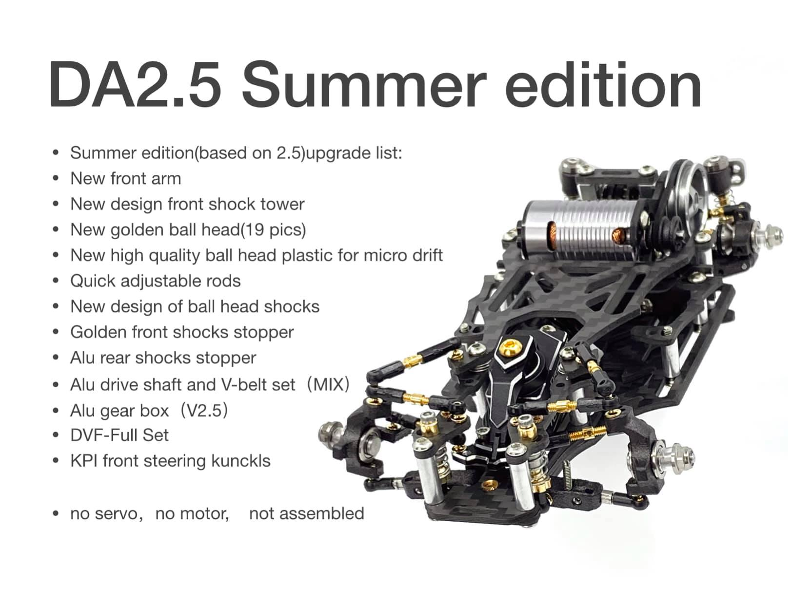
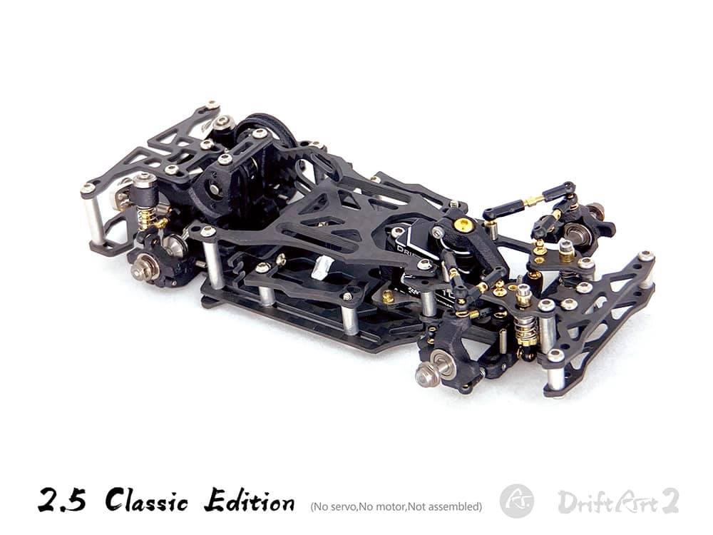
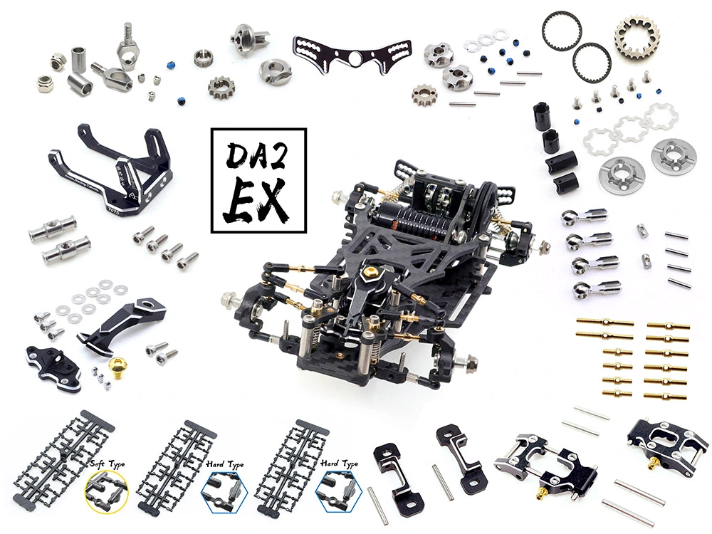

# DriftART2 Evolution

{ width="500" }

## Quick facts

- **Developed by:** *DriftART (Mr. Chen)*

- **Release:** *October 2020*

- **Origin:** *China*

- **Status:** *Discontinued*

- **Production:** *Batch*

- **Scale:** *1/24 - 1/28*

- **Body mounting:** *Magnet mounting / Kyosho*

- **Materials:** *3D printed nylon, carbon fiber, aluminum, injection molded plastic, stainless steel*

---

## Adjustability

### At-a-glance

- **Wheelbase:** ✅ 

- **Camber:** Front ✅ / Rear ✅ 

- **Toe:** Front ✅ / Rear ✅ (0~7°)

- **Caster:** ✅ 

- **Ackermann quick adjustment:** ✅ 

- **Ride height:** Front ✅ / Rear ✅ 

- **Track width:** Front ✅ / Rear ✅ 

- **Front shocks:** preload ✅ / angle ✅

- **Rear shocks:** preload ✅ / angle ✅

- **Active systems:** ✅ (upgrade parts)

- **Motor position:** mid ✅ / high ✅ / rear ✅

- **Servo position:** ✅

- **Pinion-Spur distance:** ✅

- **Front knuckle KPI hinge point:** ✅ (upgrade parts)

- **Front knuckle steering linkage hinge point:** ❌

- **Steering rack linkage hinge point:** ✅ (upgrade parts)

### Details

- **Wheelbase adjustment method:** *slider*

- **Wheelbase range:** *90–130+ mm (DA2.5CC and DA2.5SX 87.5mm-138mm)*

- **Track width range:** *~65~75 mm (optional wide arms upgrade for more up to 88mm)*

- **Caster adjustment:** *stepless*

- **Ackermann adjustment:** *stepless*

- **Rear toe behavior:** *static*

---

## Drivetrain

- **Gearbox type:** *belt-driven / (v-belt upgrade parts)*

- **Motor orientation:** *transverse*

- **Forces:** *anti-torque*

- **Reversible:** ✅

- **Differential:** *spool / open ball diff(upgrade)*

- **Extendable CVD:** ✅

- **Quick belt ratio adjustment:** *pulleys have 2 belt slots with different diameter, offering different ratio combinations* 

---

## Steering

- **Steering method:** *direct* (DVF-3D steering system optional upgrade)

- **Servo position:** *lower deck*

---

## Suspension

- **Front:** *multilink, independent, 2 shocks*

- **Rear:** *double wishbone, independent, 2 shocks*

- **Shocks type:** *friction shocks*

## Notes

Interesting facts:

- the kit comes with tools for assembly, including nails, tweezers, screwdriver etc.

- a few different spring sets are included

- DriftART2 had many versions, until it evolved to DriftART3

The DriftArt2 chassis...no it feels wrong calling it just a chassis, because it's not! It started as one, but it evolved in an ecosystem with improvements, op parts, experimental solutions and more. You could see two DriftART2 chassis and they could be totally different. And not just visually or updated materials. New systems were introduced, the way certain things work was revised. DriftART2 was born as a chassis, but it became a constantly evolving idea of chasing the ultimate design, hunger for more innovation and aiming for perfection. 

**Evolution chronology:**

- **February 2021:** some aluminum parts. Limited DriftART2 Spring Edition with 7075 aluminum gearbox and teasers of other future upgrades.

- **April 2021:** pre-assembled version and more teasers.

- **May-July 2021:** many updates were introduced and that led to the DriftART2.5 Summer Edition release.

{ width="500" }

- **October 2021:** DriftART2.5 Classic Edition release with simplified 3D steering system comparable to DVF, quick adjustable rods, Kpi steering knuckles, option to install break disks etc.

{ width="500" }

- **January 2022:** new servo seat with angle adjustment, piston shocks.

- **May 2022:** B.R.S body roll system, UX-CVD extendable steel CVD DA2.5CC Plus and DA2.5EX Editions. 

{ width="500" } 

- **August 2022:** RGB roll gearbox from 7075 aluminum

I am not even covering all the upgrades , as wide arms and others and it's still a lot as you can see.

- **January 2023:** the successor of DriftART2 was released :octicons-arrow-right-24: [DriftART3S](../driftart3/page.md)

---

## Contribute

Have extra info or experience with this chassis? [Contribute here](../../contribute/contribute.md)

---

## Sources / credits / reviews

