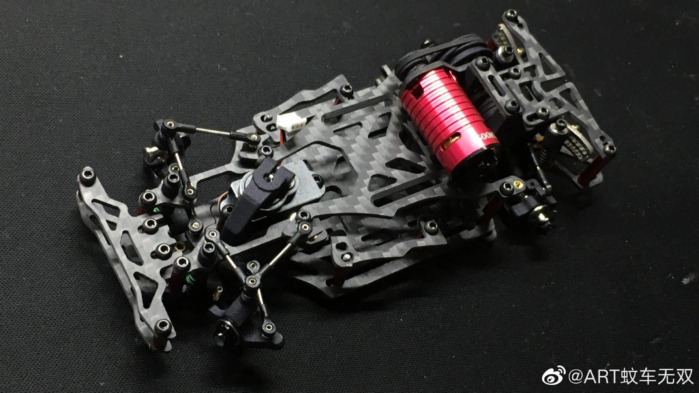
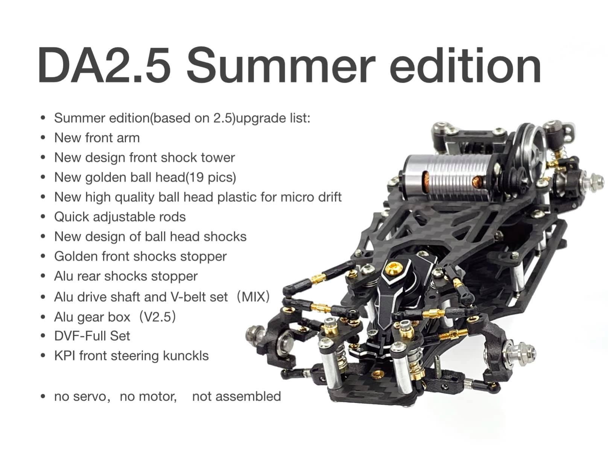
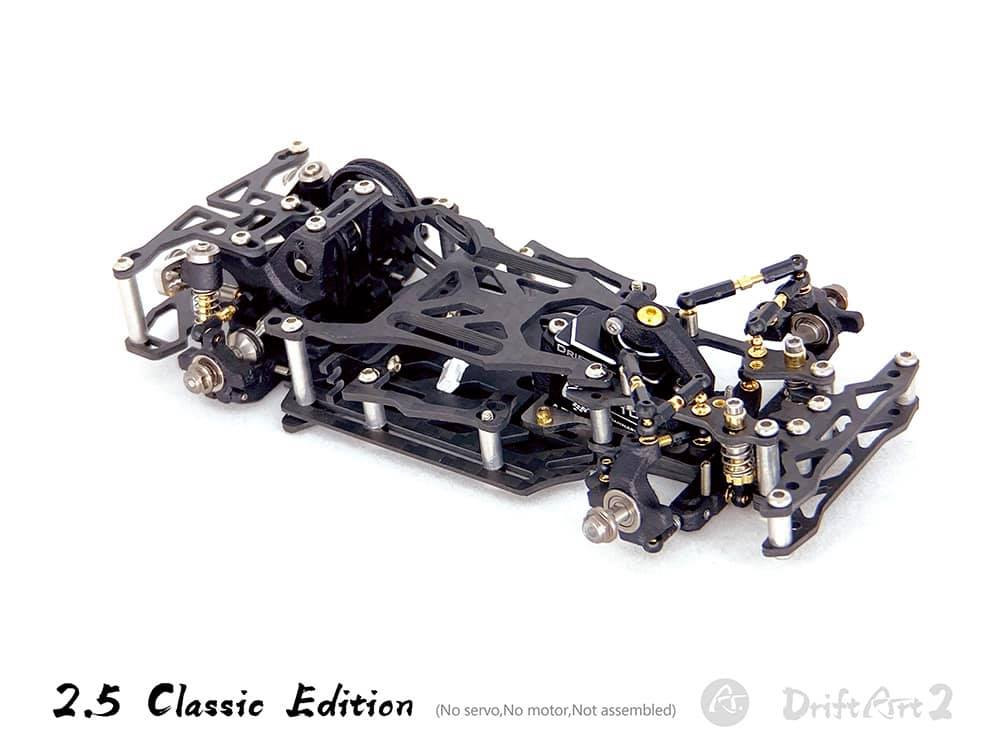
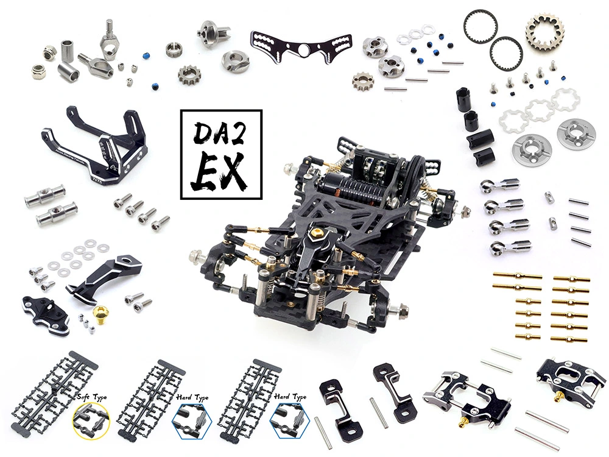

# DriftART 2

{ width="500" }

## Quick facts

- **Developed by:** *DriftART*

- **Initial Release:** *October 2020*

- **Origin:** *China*

- **Status:** *Discontinued*

- **Production:** *Batch*

- **Scale:** *1/24 - 1/28*

- **Body mounting:** *Magnet mounting / Kyosho*

- **Materials:** *3D printed nylon, carbon fiber, aluminum, injection molded plastic, stainless steel*

---

## Adjustability

### At-a-glance

- **Wheelbase:** ✅ 

- **Camber:** Front ✅ / Rear ✅ 

- **Toe:** Front ✅ / Rear ✅ (0~7°)

- **Caster:** ✅ 

- **Ackermann quick adjustment:** ✅ 

- **Ride height:** Front ✅ / Rear ✅ 

- **Track width:** Front ✅ / Rear ✅ 

- **Front shocks:** preload ✅ / angle ✅

- **Rear shocks:** preload ✅ / angle ✅

- **Active systems:** ✅ (with optional parts or upgraded versions)

- **Motor position:** mid ✅ / high ✅ / rear ✅

- **Servo position:** ✅

- **Pinion-Spur distance:** ✅

- **Front knuckle KPI hinge point:** ✅ (upgrade parts)

- **Front knuckle steering linkage hinge point:** ❌

- **Steering rack linkage hinge point:** ✅ (upgrade parts)

### Details

- **Wheelbase adjustment method:** *slider*

- **Wheelbase range:** *90–130+ mm (DA2.5CC and DA2.5SX 87.5mm-138mm)*

- **Track width range:** *65-75 mm (optional wide arms upgrade for up to 88 mm)*

- **Caster adjustment:** *stepless*

- **Ackermann adjustment:** *stepless*

- **Rear toe behavior:** *static*

---

## Drivetrain

- **Gearbox type:** *belt-driven (v-belt)*

- **Motor orientation:** *transverse*

- **Forces:** *anti-torque*

- **Reversible:** ✅

- **Differential:** *spool / ball diff(optional part)*

- **Extendable CVD:** ✅

- **Quick belt ratio adjustment:** *pulleys have 2 belt slots with different diameter, offering different ratio combinations* 

---

## Steering

- **Steering method:** *direct* (optional DVF-3D steering system)

- **Servo position:** *lower deck*

---

## Suspension

- **Front:** *multilink, independent, 2 shocks*

- **Rear:** *double wishbone, independent, 2 shocks*

- **Shocks type:** *friction shocks*

## Community ratings

## History & Development

When DriftArt2 was introduced in late 2020, the small-scale RWD drift scene had already become one of the fastest-growing and most competitive periods in the hobby's history. New production chassis such as [DRZv2](../../atomic/drz2/page.md), [BMR-X](../../bm-racing/bmrx/page.md), [GLD](../../gld/page.md) and [TRCv2](../../trc/trc2/page.md) had rapidly expanded the market, each exploring different approaches to small-scale RWD drifting.

Several mechanisms departed noticeably from contemporary designs, reflecting DriftArt's willingness to rethink established engineering solutions. This philosophy extended to the drivetrain, becoming the first known production small-scale RWD drift chassis to introduce a belt-driven transmission, an approach later adopted by several other manufacturers.

Owners quickly recognised both the strengths and demands of the platform. The chassis earned widespread praise for its manufacturing quality, versatility and engineering, while also developing a reputation as one of the most demanding production kits of its era to assemble, making it better suited to experienced hobbyists than complete beginners. The belt-driven transmission was frequently discussed as a trade-off, offering a noticeably quieter driving experience than conventional gear-driven layouts at the expense of drivetrain free-roll when off throttle. Whether this was considered an advantage or a disadvantage largely depended on individual driving style and personal preference.

DriftArt's long-term significance extended well beyond the original chassis itself. Unlike many contemporary upgrade parts of the period, which primarily replaced existing parts with CNC equivalents, DriftArt modules frequently introduced entirely new functionality, alternative suspension concepts and revised mechanical systems. Successive generations continued to build upon these ideas, creating an upgrade ecosystem that remained relevant across multiple generations instead of becoming obsolete with each new release.

Over the following years, each new DriftArt generation continued to build the brand's reputation within the small-scale RWD drift community. Consistent product support, functional upgrades and long-term platform development established DriftArt as one of the hobby's most widely recommended chassis families, a reputation that continues to this day.

**Evolution chronology:**

- **February 2021:** Introduction of the first optional 7075 aluminum components, including the Spring Edition gearbox, together with teasers of future upgrades.

- **April 2021:** Introduction of a factory pre-assembled version alongside previews of additional upcoming upgrades.

- **May-July 2021:** Introduction of numerous mechanical updates, ultimately leading to the release of DriftART2.5 Summer Edition.

{ width="500" }

- **October 2021:** Introduction of DriftART2.5 Classic Edition featuring the simplified 3D steering system, quick-adjust rods, KPI steering knuckles and optional brake disc installation.

{ width="500" }

- **January 2022:** Introduction of a new adjustable servo mount and piston shocks.

- **May 2022:** B.R.S body roll system, UX-CVD extendable steel CVD DA2.5CC Plus and DA2.5EX Editions. 

{ width="500" } 

- **August 2022:** RGB roll gearbox from 7075 aluminum

The timeline above highlights only the major milestones. Numerous additional optional parts, revisions and compatibility updates were introduced throughout the platform's lifespan.

- **January 2023:** DriftART 2 reached the end of its development cycle and was succeeded by :octicons-arrow-right-24: [DriftART3S](../driftart3/page.md)

---

## Contribute

Have extra info or experience with this chassis? [Contribute here](../../../contribute/contribute.md)

---

## Sources / credits / reviews

- DriftART official product photos, promotional materials and release announcements.
- Chan RC / DriftART community posts and release updates.
- Community discussions and owner experiences from ChanRC (All 1/24 & 1/28 Drifting GROUP), Micro RC RWD Drift Group and Small Scale Drifters.
- Personal discussions with experienced DriftART owners and builders.

