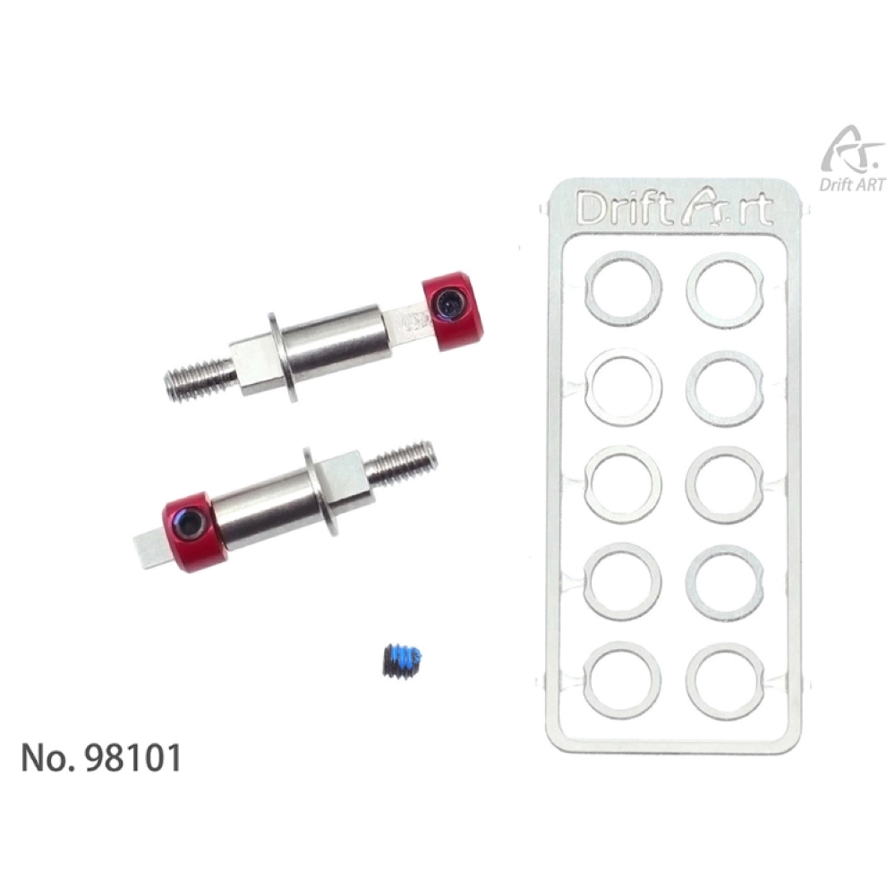
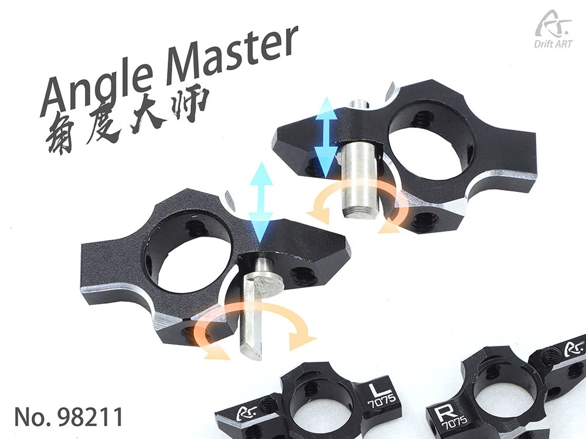
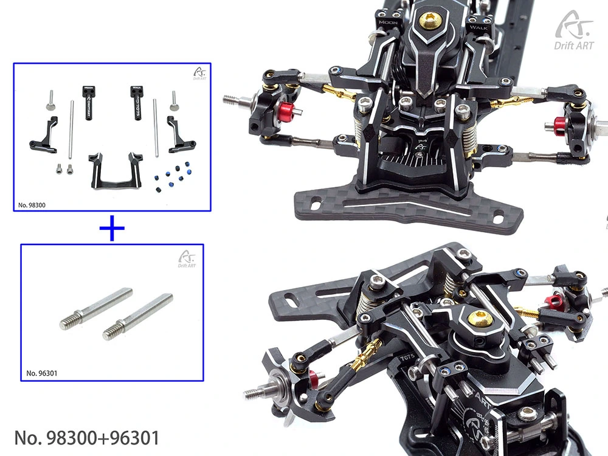
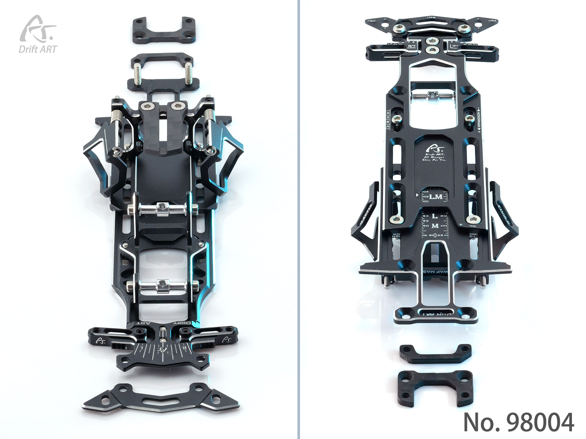

# DrifART3S

{ width="500" }

## Quick facts

- **Developed by:** *DriftART*

- **Release:** *January 2023*

- **Origin:** *China*

- **Status:** *Discontinued*

- **Production:** *Batch*

- **Scale:** *1/24 - 1/28*

- **Body mounting:** *Magnet mounting / Kyosho*

- **Materials:** *3D printed nylon, carbon fiber, injection molded plastic, aluminum, stainless steel*

---

## Adjustability

### At-a-glance

- **Wheelbase:** ✅

- **Camber:** Front ✅ / Rear ✅ 

- **Toe:** Front ✅ / Rear ✅

- **Caster:** ✅

- **Ackermann quick adjustment:** ✅

- **Ride height:** Front ✅ / Rear ✅

- **Track width:** Front ✅ / Rear ✅

- **Front shocks:** preload ✅ / angle ✅

- **Rear shocks:** preload ✅ / angle ✅

- **Active systems:** ❌ (✅ B.R.S body roll system available as upgrade part)

- **Motor position:** mid ✅ / high ✅ / rear ✅

- **Servo position:** ✅

- **Pinion-Spur distance:** ✅

- **Front knuckle KPI hinge point:** ❌ (✅ available with Angle Master upgrade)

- **Front knuckle steering linkage hinge point:** ❌ (✅ available with Angle Master upgrade)

- **Steering rack linkage hinge point:** ✅

### Details

- **Wheelbase adjustment method:** *slider*

- **Wheelbase range:** *86–120 mm*

- **Track width range:** *~60~78 mm* (upgrade parts for more than enough width also available)

- **Caster adjustment:** *stepless*

- **Ackermann adjustment:** *stepless*

- **Rear toe behavior:** *static*

---

## Drivetrain

- **Gearbox type:** *belt-driven (v-belt upgrade parts)*

- **Motor orientation:** *transverse*

- **Forces:** *anti-torque*

- **Reversible:** ✅

- **Differential:** *Spool / Ball diff(upgrade)*

---

## Steering

- **Steering method:** *direct*

- **Steering system:** *DVF 3D-steering system*

- **Servo position:** *lower deck*

---

## Suspension

- **Front:** *multi-link, independent, 2 shocks(double wishbone via Moonwalk upgrade)*

- **Rear:** *double wishbone, independent, 2 shocks*

- **Shocks type:** *friction shocks*

## Notes

The consistent releasing of upgrades and innovations became the trademark of DriftART.

The DA3S kit is also offered as factory assembled version.

Some of the upgrades to mention are:

{ width="500" }

- **Offset Master** makes it possible to reduce the effect of wheels offset, achieving less scrub radius. It can reduce offset 2 down to 0

{ width="500" }

- **Angle Master** has multiple ballhead screw slots, allowing much more control over steering geometry, such as KPI, scrub radius and maximum steering angle

{ width="500" }

- **Moonwalk** changes the front suspension from multilink to double wishbone. It allows the caster and camber angles to be adjusted by sliding the upper arms rods instead of using threaded rods, which is way faster 

{ width="500" } 

- **DA4 Conversion kit came out in July 2024

The successor of DA3S is the current DriftART kit: [DriftART4](../driftart4/page.md)

---

## Contribute

Have extra info or experience with this chassis? [Contribute here](../../contribute/contribute.md)

---

## Sources / credits / reviews

