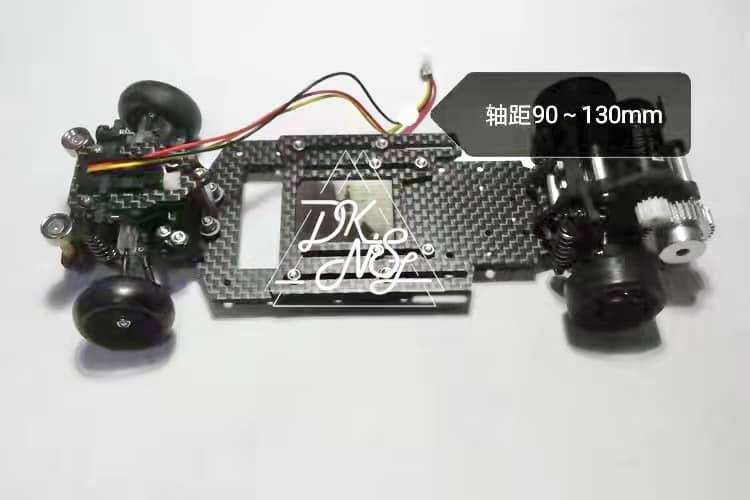

# DKMK2

{ width="500" }

## Quick facts

- **Developed by:** *DK NSL*

- **Release:** *January–February 2020*

- **Origin:** *China*

- **Status:** *Discontinued*

- **Production:** *Batch*

- **Scale:** *1/24-1/28*

- **Body mounting:** *Magnet mounting / Mini-Z*

- **Materials:** *Carbon fiber, injection molded plastic, brass*

---

## Adjustability

### At-a-glance

- **Wheelbase:** ✅

- **Track width:** Front ✅ / Rear ❌

- **Camber:** Front ✅ / Rear ✅

- **Camber gain:** Front ❌ / Rear ✅

- **Caster:** ✅

- **Ackermann quick adjustment:** ✅

- **Toe:** Front ✅ / Rear ✅(0° or 2° via toe block)

- **Ride height:** Front ✅ / Rear ✅

- **Front shocks:** preload ✅ / angle ✅ 

- **Rear shocks:** preload ✅ / angle ✅ 

- **Active systems:** ❌

- **Motor position:** mid ❌ / high ✅ / rear ✅

- **Belt tension/Pinion size:** ✅

- **Extendable dogbones:** ❌

- **Front knuckle KPI:** ❌

- **Steering linkage position on knuckle:** ❌

- **Steering rack linkage position:** ❌

### Details

- **Wheelbase adjustment method:** *steps*

- **Wheelbase range:** *90–120 mm*

- **Track width range:** *68-?? mm*

- **Caster adjustment:** *stepless*

- **Ackermann adjustment:** *stepless*

- **Rear toe behavior:** *static*

---

## Drivetrain

- **Gearbox type:** *gear-driven*

- **Motor orientation:** *transverse*

- **Forces:** *anti-torque*

- **Reversible:** ✅

- **Differential:** *Spool*

---

## Steering

- **Steering method:** *direct*

- **Servo position:** *upper deck*

---

## Suspension

- **Front:** *double wishbone, independent, 2 shocks*

- **Rear:** *double wishbone, independent, 2 shocks*

- **Shocks type:** *friction shocks*

## Community ratings

## History & Development

**DK MK1**

{ width="500" }

Very little information is available about the original DK chassis, but a reliable source confirmed that it was never officially released and remained the designer's personal chassis. DKMK2 became the first publicly available model in the series.

Although only a handful of production chassis were available at the time of its release, DKMK2 remained on the market throughout one of the fastest periods of growth in small-scale RWD drifting. During its lifetime, many of the platforms that would go on to shape the hobby were introduced.

One of the most distinctive characteristics of DKMK2 was its exceptionally smooth suspension movement. The friction dampers used PTFE tubing to reduce friction between the shaft and damper body, allowing the suspension to move exceptionally freely and visibly demonstrate body roll, squat and lift. This behavior became one of the features most frequently noticed in contemporary driving videos and community discussions.

The combination of a relatively high motor position and the exceptionally free-moving suspension suggests that visible weight transfer was an intentional part of the chassis design philosophy.

<video controls style="max-width: 100%; height: auto;" preload="metadata">
  <source src="https://darol0o5.github.io/Guide/chassis/dk/dkmk2/dk.mp4" type="video/mp4">
</video>

Contemporary community feedback was strongly positive. DKMK2 was frequently praised for its large steering angle, planted handling, and remarkably smooth suspension behavior, with some experienced drivers considering it one of the standout chassis released in 2020. Its strong early reputation also led to it becoming a common point of comparison for several subsequent Chinese RWD chassis.

DKMK2 was later succeeded by the [DKMK3](../dkmk3/page.md).

---

## Contribute

Have extra info or experience with this chassis? [Contribute here](../../../contribute/contribute.md)

---

## Sources / credits / reviews
Chen (Drift Art), Jack Nares, DriftaHolics RC, Bilibili community discussions and video from DK NSL