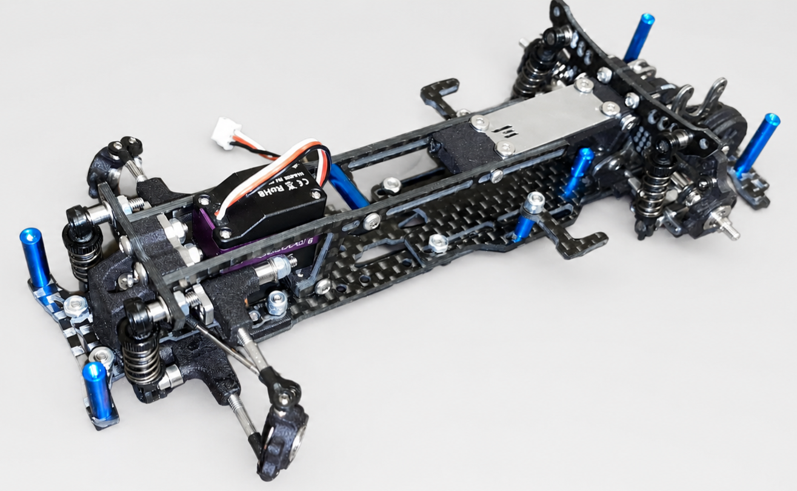
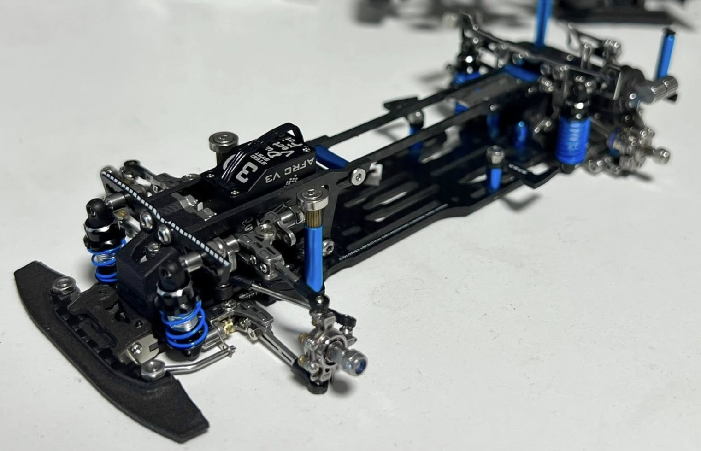
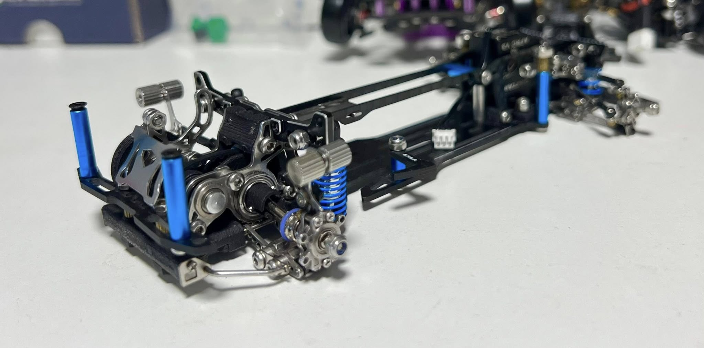
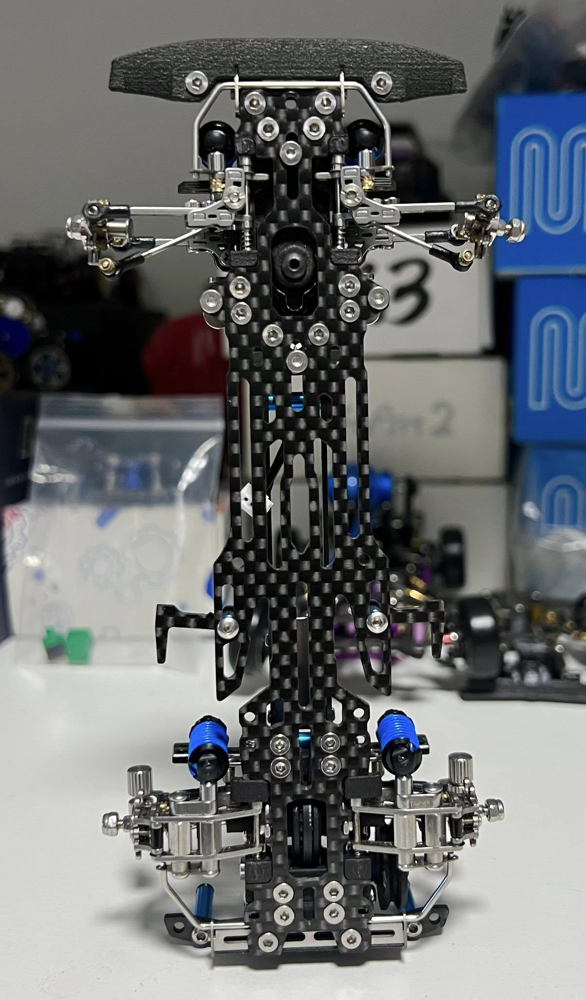
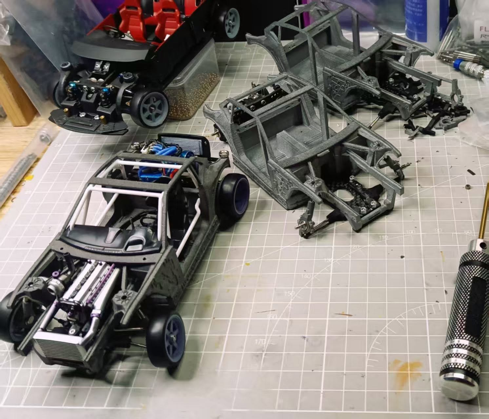

# DKMK3

{ width="500" }

## Quick facts

- **Developed by:** *NSL*

- **Release:** *Late 2021 - early 2022*

- **Origin:** *China*

- **Status:** *Available*

- **Production:** *Batch*

- **Scale:** *1/24*

- **Body mounting:** *Magnet mounting*

- **Materials:** *Plastic*

---

## Adjustability

### At-a-glance

- **Wheelbase:** ✅

- **Camber:** Front ✅ / Rear ✅

- **Toe:** Front ✅ / Rear ✅

- **Caster:** ✅

- **Ackermann quick adjustment:** ✅

- **Ride height:** Front ✅ / Rear ✅

- **Track width:** Front ✅ / Rear ❌ (not confirmed)

- **Front shocks:** preload ✅ / angle ✅

- **Rear shocks:** preload ✅ / angle ✅

- **Active systems:** ❌

- **Motor position:** mid ✅ / high ✅ / rear ✅

- **Servo position:** ✅

- **Pinion-Spur distance:** ✅

- **Front knuckle KPI hinge point:** ❌

- **Front knuckle steering linkage hinge point:** ❌

- **Steering rack linkage hinge point:** ❌

### Details

- **Wheelbase adjustment method:** *slider / steps*

- **Wheelbase range:** *??–?? mm*

- **Track width range:** *??–?? mm*

- **Caster adjustment:** *shims*

- **Ackermann adjustment:** *stepless*

- **Rear toe behavior:** *static*

---

## Drivetrain

- **Gearbox type:** *belt-driven / v-belt*

- **Motor orientation:** *transverse*

- **Forces:** *anti-torque*

- **Reversible:** ✅

- **Differential:** *spool*

---

## Steering

- **Steering method:** *direct*

- **Servo position:** *lower deck*

---

## Suspension

- **Front:** *double wishbone, independent, 2 shocks*

- **Rear:** *double wishbone, independent, 2 shocks*

- **Shocks type:** *friction shocks*

## Notes

Many upgrades have been released. Some of them to note are: 
- anti roll bar (swaybar)
- straight rear bridge (solid axle)
  
Thanks to "TC Emre Yurdakul", we have these nice images of highly upgraded MK3. Only missing the realistic brakes kit. The shocks are from MA Racing D24.

{ width="500" }
{ width="500" }
{ width="500" }

**Below is realistic Toyota Supra A90 chassis variant of the DKMK3**

{ width="500" }

TC Emre Yurdakul once organized a group buy for the A90 variant,which would have been produce if at lease 50 pre-orders were secured.

---

## Contribute

Have extra info or experience with this chassis? [Contribute here](../../contribute/contribute.md)

---

## Sources / credits / reviews

