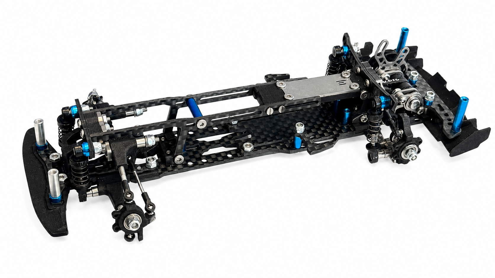

# DKMK3

{ width="500" }

## Quick facts

- **Developed by:** *DK NSL*

- **Release:** *December 2021*

- **Origin:** *China*

- **Status:** *Currently unavailable*

- **Production:** *Batch*

- **Scale:** *1/24*

- **Body mounting:** *Magnet mounting*

- **Materials:** *Plastic, carbon fiber, aluminum*

---

## Adjustability

### At-a-glance

- **Wheelbase:** ✅

- **Track width:** Front ✅ / Rear ❌ (not confirmed)

- **Camber:** Front ✅ / Rear ✅

- **Camber gain:** Front ❌ / Rear ✅

- **Caster:** ✅

- **Ackermann quick adjustment:** ✅

- **Toe:** Front ✅ / Rear ✅

- **Ride height:** Front ✅ / Rear ✅

- **Front shocks:** preload ✅ / angle ✅

- **Rear shocks:** preload ✅ / angle ✅

- **Active systems:** ❌

- **Motor position:** mid ✅ / high ✅ / rear ✅

- **Belt tension/Pinion size:** ✅

- **Extendable dogbones:** ❌

- **Front knuckle KPI:** ❌

- **Steering linkage position on knuckle:** ❌

- **Steering rack linkage position:** ❌

### Details

- **Wheelbase adjustment method:** *slider / steps*

- **Wheelbase range:** *94–125 mm*

- **Track width range:** *72–88 mm*

- **Caster adjustment:** *shims*

- **Ackermann adjustment:** *stepless*

- **Rear toe behavior:** *static*

---

## Drivetrain

- **Gearbox type:** *belt-driven (v-belt)*

- **Motor orientation:** *transverse*

- **Forces:** *anti-torque*

- **Reversible:** ✅

- **Differential:** *spool / solid axle (optional)*

---

## Steering

- **Steering method:** *direct*

---

## Suspension

- **Front:** *double wishbone, independent, 2 shocks*

- **Rear:** *double wishbone, independent, 2 shocks (optional solid axle)*

- **Shocks type:** *friction shocks*

## Community ratings

## History & Development

Following the success of [DKMK2](../dkmk2/page.md), DK NSL began developing its successor in early 2021. According to the designer, DKMK3 underwent several months of development, numerous design revisions and extensive testing before the prototype completed its final test phase in June 2021. The chassis changed substantially during development, with the designer later remarking that the earliest concepts looked nothing like the final production version.

Unlike DKMK2, whose reputation primarily spread through driving videos after its release, DKMK3's development was documented publicly throughout 2021. Prototype demonstrations, engineering discussions and testing videos allowed the community to follow the project from its final testing stages through manufacturing preparation and ultimately to its commercial release in December 2021. Production itself was delayed for several months while parts were manufactured and inventory was prepared for the first batch.

Throughout its production, and even several years after its initial release, DK NSL continued expanding the platform with optional upgrades, including a straight rear axle conversion, an anti-roll system and numerous additional optional parts. One notable production change occurred after roughly the first hundred kits, when the finish of the laser-cut steel parts was revised from the original cut surface to a polished appearance.

Owners consistently praised the chassis for its exceptionally smooth suspension and natural driving feel. The absence of conventional printed instructions initially discouraged some builders, but owners generally agreed that the official video guides were sufficient once the assembly process was underway.

Community feedback also identified several minor shortcomings. Some builders reported that the rod ends required extra care during their initial installation, with opinions ranging from merely time-consuming to prone to cracking if threaded carelessly. Others mentioned occasional fitting adjustments, such as cleaning a few holes, shimming rear components or lightly sanding individual parts to achieve completely free suspension movement. Despite these minor issues, the overall build quality and driving experience were widely regarded as excellent. Continued optional upgrades, limited-production conversion kits and the announcement of a limited Collector Edition several years after launch reflected the platform's lasting popularity within the small-scale drift community.

---

Thanks to TC Emre Yurdakul for providing these photographs of a fully optioned DKMK3. The only currently missing optional component is the realistic brake kit. The shock absorbers are from the [MA Racing D24](../../mar/d24/page.md).

{ width="500" }
{ width="500" }
{ width="500" }

**Below is the official Toyota Supra A90 conversion kit developed for the DKMK3 platform.**

{ width="500" }

TC Emre Yurdakul organized an international group buy for the official A90 conversion kit, with production contingent on securing at least 50 pre-orders.

---

## Contribute

Have extra info or experience with this chassis? [Contribute here](../../../contribute/contribute.md)

---

## Sources / credits / reviews
DK NSL's Bilibili channel, TC Emre Yurdakul, Community discussions

