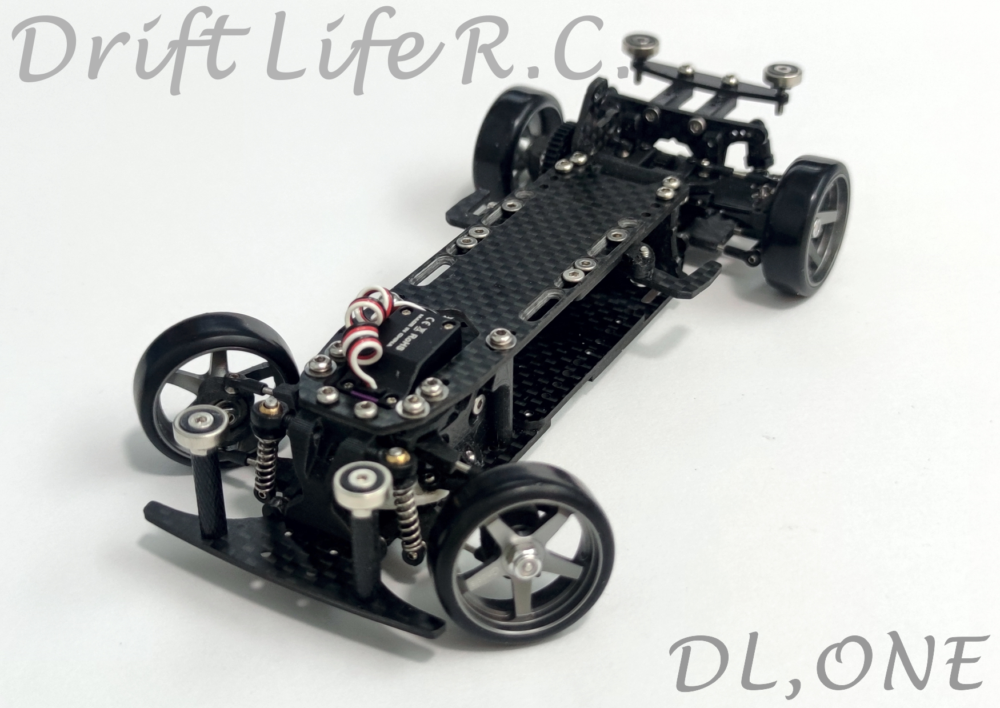

# Drift Life One

{ width="500" }

## Quick facts

- **Developed by:** *R.C. Drift Life*

- **Release:** *July 2022*

- **Origin:** *China*

- **Status:** *Discontinued*

- **Production:** *Batch*

- **Scale:** *1/24-1/28*

- **Body mounting:** *Magnet mounting*

- **Materials:** *carbon fiber, 3D printed plastic*

---

## Adjustability

### At-a-glance

- **Wheelbase:** ✅

- **Camber:** Front ✅ / Rear ✅

- **Toe:** Front ✅ / Rear ✅

- **Caster:** ✅ 

- **Ackermann quick adjustment:** ✅

- **Ride height:** Front (Not confirmed) / Rear ✅

- **Track width:** Front ✅ / Rear ✅

- **Front shocks:** preload (Not confirmed) / angle ✅

- **Rear shocks:** preload ✅ / angle ✅ 

- **Active systems:** ❌

- **Motor position:** mid ❌ / high ✅ / rear ❌

- **Servo position:** ✅

- **Pinion-Spur distance:** ✅

- **Front knuckle KPI hinge point:** ❌

- **Front knuckle steering linkage hinge point:** ❌

- **Steering rack linkage hinge point:** ✅

### Details

- **Wheelbase adjustment method:** *steps*

- **Wheelbase range:** *90+ mm*

- **Track width range:** *?? mm*

- **Caster adjustment:** *stepless*

- **Ackermann adjustment:** *stepless*

- **Rear toe behavior:** *adjustable*

---

## Drivetrain

- **Gearbox type:** *gear-driven*

- **Motor orientation:** *transverse*

- **Forces:** *anti-torque*

- **Reversible:** ❌

- **Differential:** *spool*

---

## Steering

- **Steering method:** *direct*

- **Servo position:** *lower deck*

---

## Suspension

- **Front:** *double wishbone, independent, 2 shocks*

- **Rear:** *multi-link, independent, 2 shocks*

- **Shocks type:** *friction shocks*

## Notes

---

## Contribute

Have extra info or experience with this chassis? [Contribute here](../../contribute/contribute.md)

---

## Sources / credits / reviews

