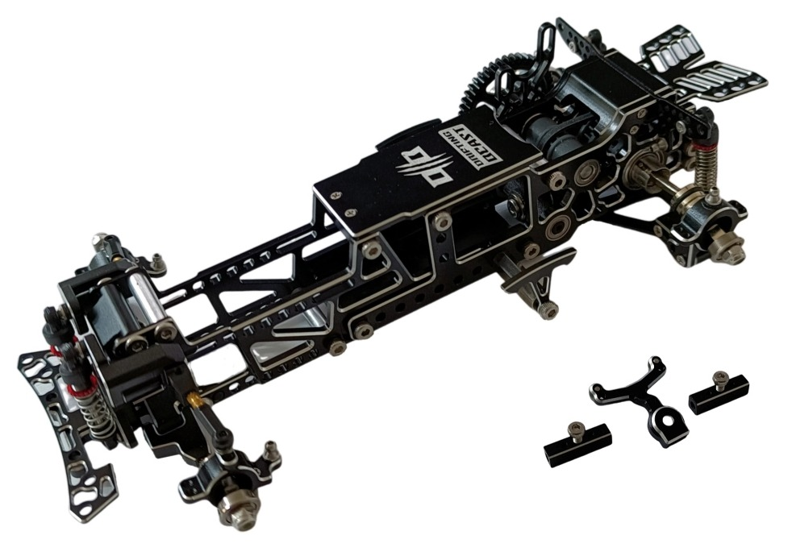

# Drifting Beast

{ width="500" }

## Quick facts

- **Developed by:** *Drifting Beast*

- **Release:** *April 2022*

- **Origin:** *China*

- **Status:** *Discontinued*

- **Production:** *Batch*

- **Scale:** *1/24*

- **Body mounting:** *Magnet mounting*

- **Materials:** *Nylon, Steel, Aluminum*

---

## Adjustability

### At-a-glance

- **Wheelbase:** ✅

- **Track width:** Front ✅ / Rear ✅

- **Camber:** Front ✅ / Rear ❌ (✅ with optional camber linkage)

- **Camber gain:** Front ✅ / Rear ❌ (✅ with optional camber linkage)

- **Caster:** ✅

- **Ackermann quick adjustment:** ✅

- **Toe:** Front ✅ / Rear ✅

- **Ride height:** Front ✅ / Rear ✅

- **Front shocks:** preload ✅ / angle ✅ 

- **Rear shocks:** preload ✅ / angle ✅ 

- **Active systems:** ❌

- **Motor position:** mid ❌ / high ✅ / rear ❌

- **Belt tension/Pinion size:** ✅

- **Extendable dogbones:** ❌ (Promised, but not released)

- **Front knuckle KPI:** ✅

- **Steering linkage position on knuckle:** ❌

- **Steering rack linkage position:** ✅ 

### Details

- **Wheelbase adjustment method:** *steps*

- **Wheelbase range:** *98–120 mm*

- **Track width range:** *??-?? mm*

- **Caster adjustment:** *stepless*

- **Ackermann adjustment:** *stepless*

- **Rear toe behavior:** *static*

---

## Drivetrain

- **Gearbox type:** *gear-driven / belt-driven (v-belt) mix*

- **Motor orientation:** *transverse*

- **Forces:** *pro-torque / anti-torque*

- **Reversible:** ❌

- **Differential:** *spool*

---

## Steering

- **Steering method:** *direct*

---

## Suspension

- **Front:** *double wishbone, independent, cantilever, 2 shocks*

- **Rear:** *articulated rear axle with flex-bridge, 2 shocks*

- **Shocks type:** *friction shocks*

## Community ratings

## History & Development

The Drifting Beast, commonly known as DB, was developed in China by AL Model (阿兰玩模型AL) and first shown publicly in March 2022. The designer presented it as his own project, with early prototype footage quickly drawing attention for its unusual skeletal construction and rear suspension layout. The planned release was delayed by COVID-related supply disruptions, but after the remaining components arrived, DB officially went on sale on 28 April 2022.

A defining feature of the chassis was its unusual configurable rear suspension. The straight-bridge arrangement was designed to keep the rear wheel geometry consistent during chassis roll, maintaining a stable contact angle instead of introducing camber and toe changes. Alternative rear components allowed a more articulated configuration in which the wheel geometry could change with chassis movement, giving owners two distinctly different approaches to rear-end behavior.

Initial community response was notably enthusiastic, with the unusual construction and suspension frequently attracting attention in early discussions. Some users immediately compared the chassis with contemporary designs such as DKMK3 and DWX, while others highlighted its lightweight construction and lack of suspension spacers. Its unconventional appearance also led to comparisons with larger-scale competition chassis. Later feedback described DB as relatively approachable for newcomers compared with some similarly priced RWD platforms, while the designer himself emphasized stability and predictable behavior over pursuing the most aggressive possible setup.

The platform continued to evolve after release. New rear suspension components and metal option parts appeared during 2023, eventually leading to an upgraded configuration incorporating the available DB upgrades. Telescopic rear dogbones had also been announced as a future option to simplify rear track-width adjustment, but appear never to have reached production. The chassis also developed a visible presence in the Chinese small-scale drift scene, with DB becoming associated with a dedicated drift venue in Beijing and eventually lending its name to the DB Cup, held there at the end of 2023.

{ width="500" }

---

## Contribute

Have extra info or experience with this chassis? [Contribute here](../../contribute/contribute.md)

---

## Sources / credits / reviews
AL Model, Bilibili, GТ55Racing, Facebook

