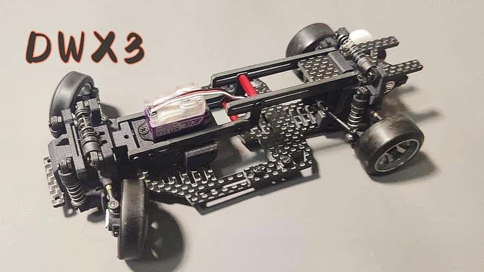
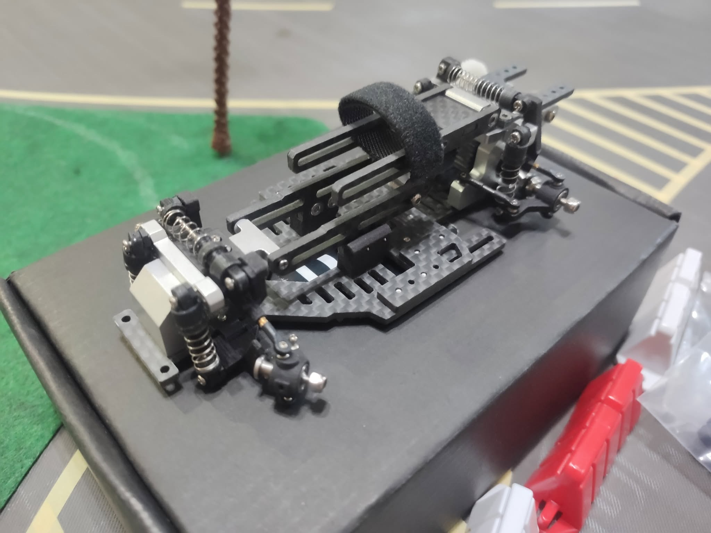
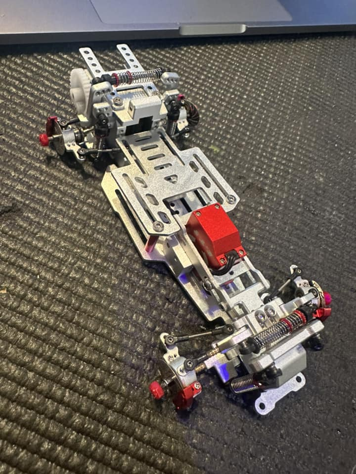

# DWX2 & DWX3

{ width="500" }

## Quick facts

- **Developed by:** *DWX*

- **Release:** *December 2020*

- **Origin:** *China*

- **Status:** *Discontinued*

- **Production:** *Batch*

- **Scale:** *1/24-1/28*

- **Body mounting:** *Magnet mounting (not included)*

- **Materials:** *DWX2 - 3D printed fiberglass nylon. Carbon fiber and aluminum parts after DWX3

---

## Adjustability

### At-a-glance

- **Wheelbase:** ✅

- **Camber:** Front ✅ / Rear ✅

- **Toe:** Front ✅ / Rear ✅

- **Caster:** ✅

- **Ackermann quick adjustment:** ✅

- **Ride height:** Front ✅  / Rear ✅ 

- **Track width:** Front ✅ / Rear ✅

- **Front shocks:** preload ✅ / angle ✅

- **Rear shocks:** preload ✅ / angle ✅

- **Active systems:** ✅

- **Motor position:** mid ✅ / high ❌ / rear ✅

- **Servo position:** ✅

- **Pinion-Spur distance:** ✅

- **Front knuckle KPI hinge point:** ❌ (✅ upgrade parts)

- **Front knuckle steering linkage hinge point:** ❌(✅ upgrade parts)

- **Steering rack linkage hinge point:** ✅

### Details

- **Wheelbase adjustment method:** *slider / steps*

- **Wheelbase range:** *90–120 mm*

- **Track width range:** *69+ mm*

- **Caster adjustment:** *slider /steps*

- **Ackermann adjustment:** *stepless*

- **Rear toe behavior:** *adjustable/dynamic*

---

## Drivetrain

- **Gearbox type:** *gear-driven*

- **Motor orientation:** *transverse*

- **Forces:** *anti-torque*

- **Reversible:** ❌

- **Differential:** *spool*

---

## Steering

- **Steering method:** *direct*

- **Servo position:** *upper deck*

---

## Suspension

- **Front:** *double wishbone, independent / shock-coupled, 2 or 3 shocks optional*

- **Rear:** *multi-link, independent / shock-coupled , 2 or 3 shocks optional*

- **Shocks type:** *friction shocks*

## Notes

**DWX3**
{ width="500" }
**DWX3S**
{ width="500" }
**DWX All metal**
{ width="500" }

---

## Contribute

Have extra info or experience with this chassis? [Contribute here](../../contribute/contribute.md)

---

## Sources / credits / reviews

