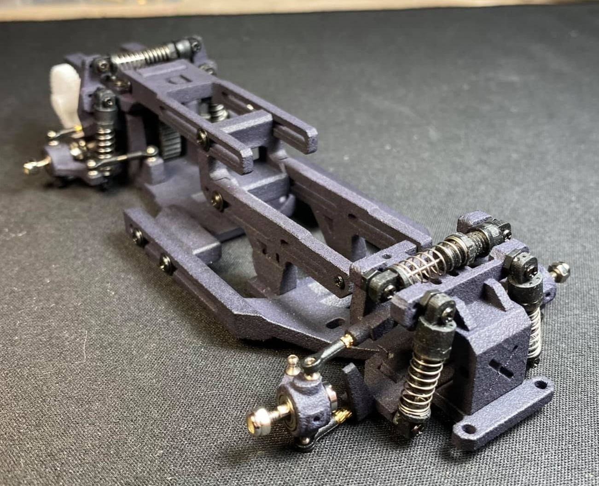
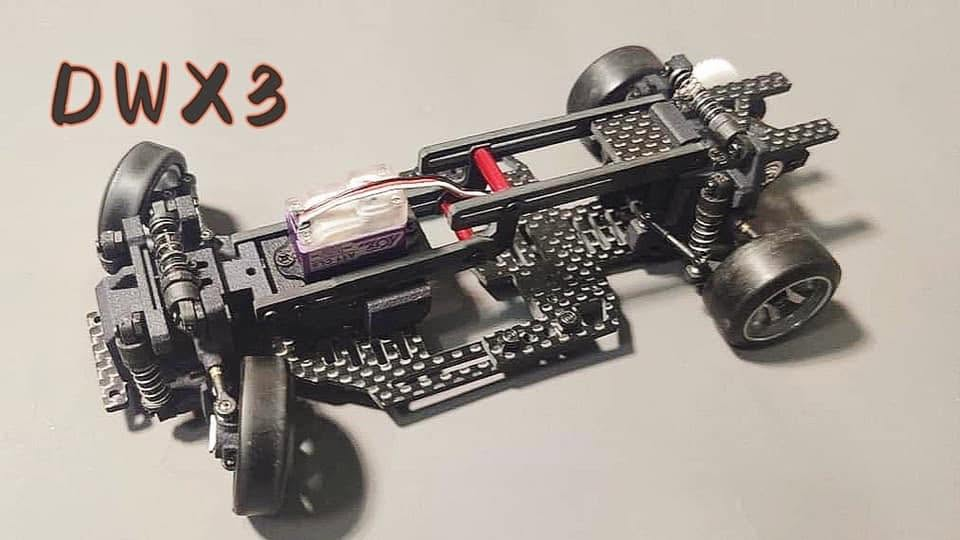
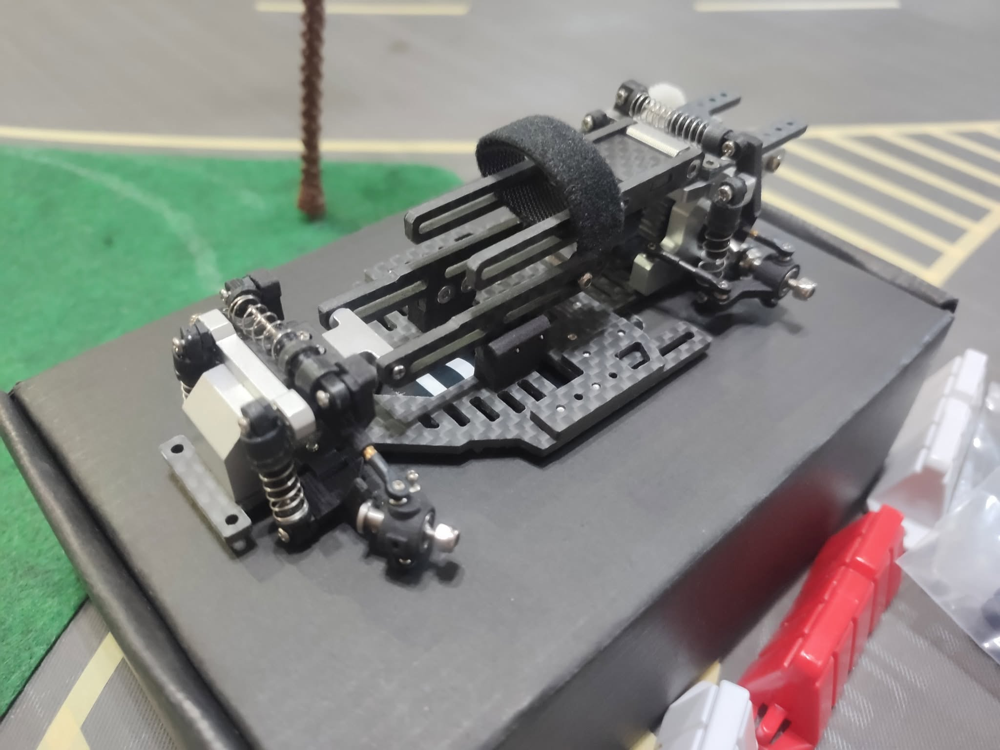
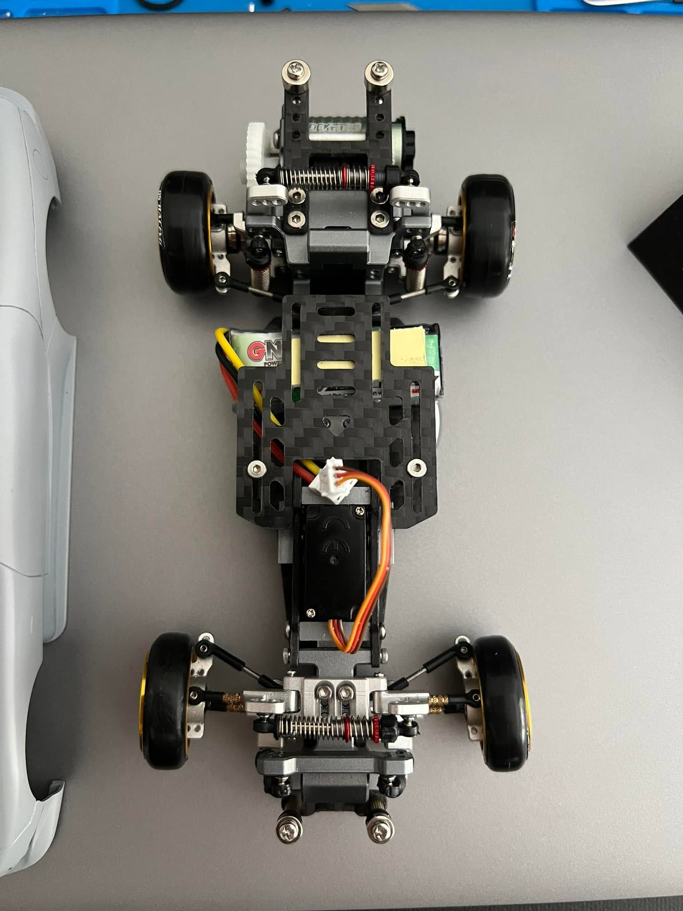
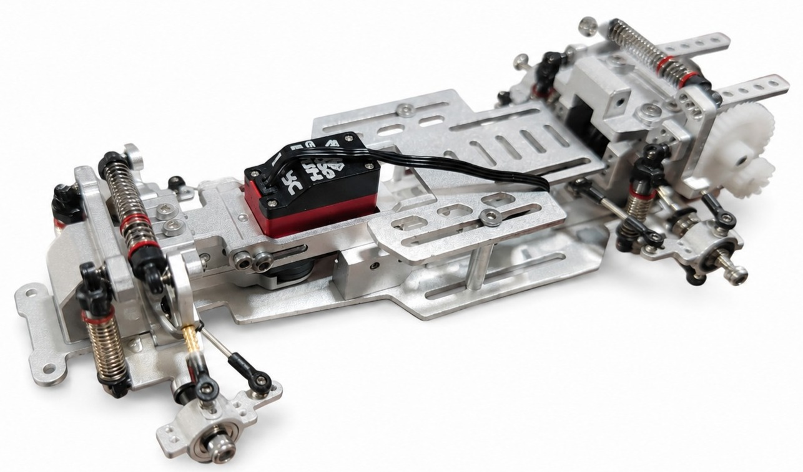
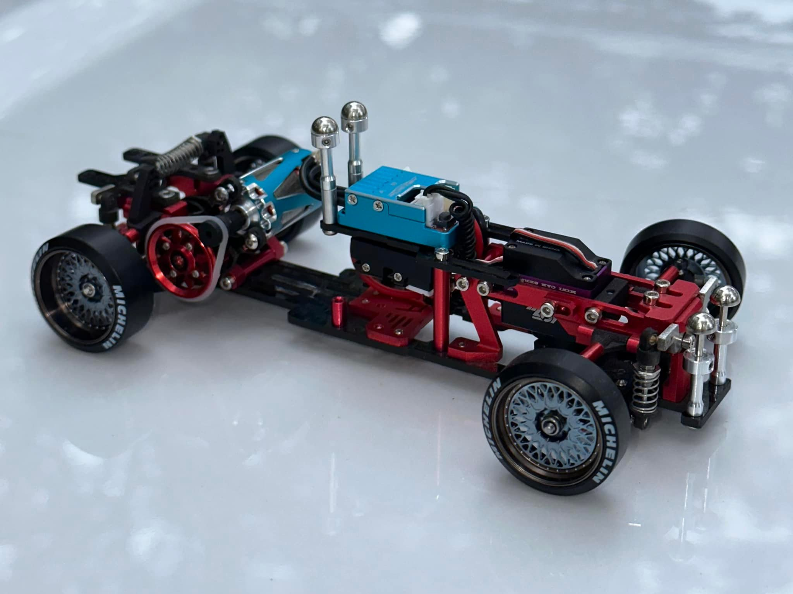
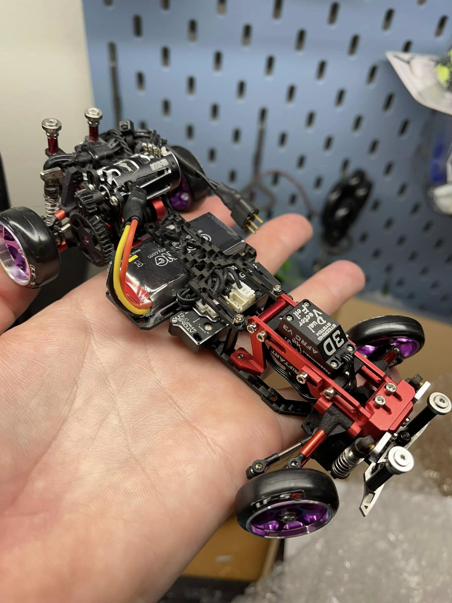
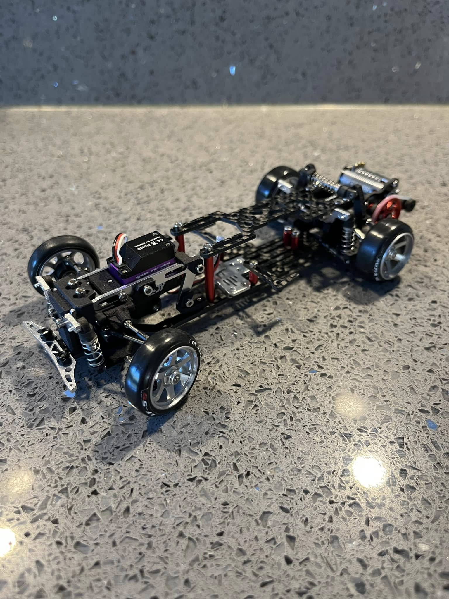

# DWX / DWX3 / DWX-F

{ width="500" }

## Quick facts

- **Developed by:** *DWX*

- **Release:** *June 2020*

- **Origin:** *China*

- **Status:** *Discontinued*

- **Production:** *Batch*

- **Scale:** *1/24-1/28*

- **Body mounting:** *Magnet mounting (not included)*

- **Materials:** *DWX: 3D printed fiberglass-reinforced nylon. Carbon fiber upgrades for DWX3 and aluminum after DWX3s*

---

## Adjustability

### At-a-glance

- **Wheelbase:** ✅

- **Track width:** Front ✅ / Rear ✅

- **Camber:** Front ✅ / Rear ✅

- **Camber gain:** Front ❌ / Rear ❌

- **Caster:** ✅

- **Ackermann quick adjustment:** ✅

- **Toe:** Front ✅ / Rear ✅

- **Ride height:** Front ✅  / Rear ✅ 

- **Front shocks:** preload ✅ / angle ✅

- **Rear shocks:** preload ✅ / angle ✅

- **Active systems:** ✅

- **Motor position:** mid ✅ / high ❌ / rear ✅

- **Belt tension/Pinion size:** ✅

- **Extendable dogbones:** ❌

- **Front knuckle KPI:** ❌ (✅ upgrade parts)

- **Steering linkage position on knuckle:** ❌(✅ upgrade parts)

- **Steering rack linkage position:** ✅

### Details

- **Wheelbase adjustment method:** *slider / steps*

- **Wheelbase range:** *90–120 mm*

- **Track width range:** *69+ mm*

- **Caster adjustment:** *slider*

- **Ackermann adjustment:** *stepless*

- **Rear toe behavior:** *adjustable/dynamic*

---

## Drivetrain

- **Gearbox type:** *gear-driven / belt drive(option parts)*

- **Motor orientation:** *transverse*

- **Forces:** *pro-torque / anti-torque depending on drivetrain layout*

- **Reversible:** ✅

- **Differential:** *spool*

---

## Steering

- **Steering method:** *direct*

---

## Suspension

- **Front:** *double wishbone, independent / shock-coupled, 2 or 3 shocks optional*

- **Rear:** *multi-link, independent / shock-coupled , 2 or 3 shocks optional*

- **Shocks type:** *friction shocks*

## Community ratings

## History & Development

The DWX platform entered the small-scale RWD drift scene near the end of the first major wave of chassis releases. By then, the growing number of available chassis had made the community far more demanding of new releases. DWX quickly established a strong reputation thanks to its smooth handling, predictable weight transfer and exceptional adjustability.

The original DWX was built almost entirely from fiberglass-reinforced nylon and featured a unique six-shock suspension layout, producing noticeable body roll that became one of the chassis' most recognizable characteristics. Unlike many contemporary platforms, it did not include a dedicated Mini-Z body mounting system. The chassis was sold largely pre-assembled, making it an accessible option for beginners, while experienced owners frequently praised its forgiving driving characteristics and competitive performance. Over time, it came to be regarded by many enthusiasts as one of the most underrated small-scale RWD drift chassis of its era.

Development continued through a series of incremental revisions. Early updates replaced many of the original printed structural components with carbon-fibre parts, while later revisions gradually introduced aluminum components, beginning with the front bulkhead and rear gearbox before expanding to suspension arms, knuckles and other structural parts. This evolution eventually culminated in the alloy upgrade kit and limited Final Edition, which featured extensive use of aluminum components.

The most commonly reported weak points of the early versions were the printed servo horn and, less frequently, broken differential U-cups. Orlandoo Hunter shocks became one of the most popular community upgrades, while an optional belt-drive conversion provided an alternative to the standard gear-driven drivetrain.

For most of its production life, the platform retained its distinctive six-shock suspension layout, which became one of the defining characteristics of the DWX series.

The final known revision of the platform appeared as the DWX-F. Compared to the late DWX3-F versions, it introduced a narrower chassis and a redesigned front end architecture, replacing the characteristic three-shock front layout with a conventional two-shock arrangement. The drivetrain also adopted helical gears in place of the previous straight-cut gear set. Despite these changes, the overall chassis architecture, drivetrain concept and adjustability remained largely unchanged, marking the final evolution of the original DWX platform before development moved on to the completely new [DWX JUAN](../ju-an/page.md).

**DWX3**

{ width="500" }

**DWX3S**

{ width="500" }

**DWX3-F Carbon Version**

{ width="500" }

**DWX3-F Alloy Chassis Version**

{ width="500" }

**DWX-F**

Belt driven

{ width="500" }

Helical gears
{ width="500" }

**DWX-F China market version**

{ width="500" }

---

## Contribute

Have extra info or experience with this chassis? [Contribute here](../../../contribute/contribute.md)

---

## Sources / credits / reviews
Jack Nares, Chan RC, Bilibili, Community discussions

