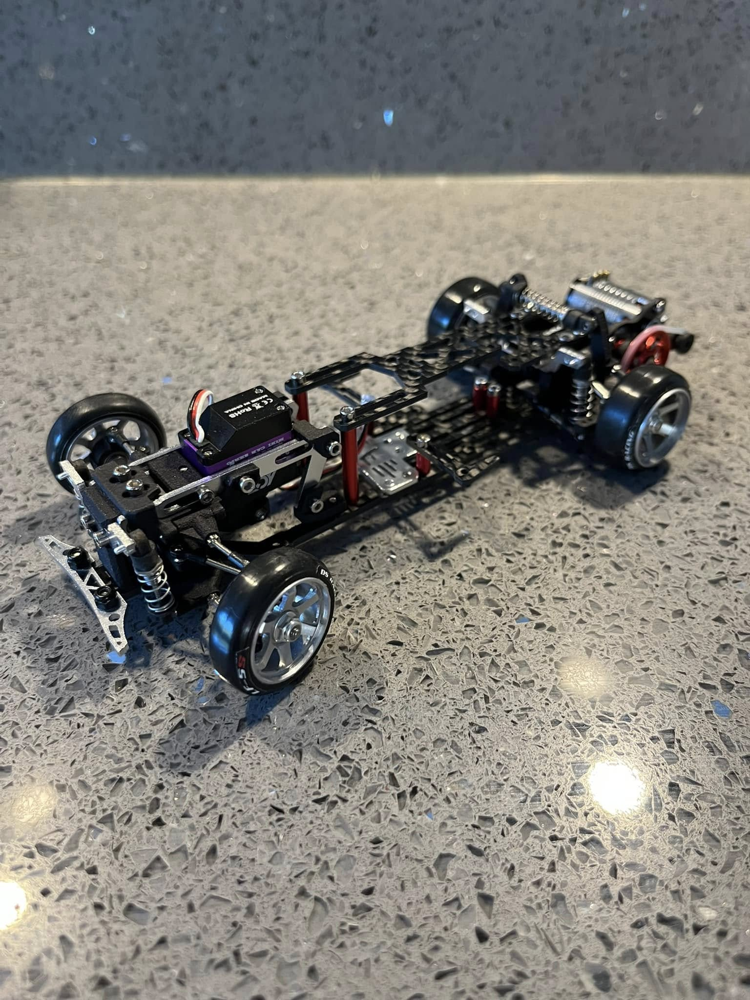

# DWX-F

{ width="500" }

## Quick facts

- **Developed by:** *DWX*

- **Release:** *February 2022*

- **Origin:** *China*

- **Status:** *Discontinued*

- **Production:** *Batch*

- **Scale:** *1/24-1/28*

- **Body mounting:** *Magnet mounting/MINI-Z*

- **Materials:** *Carbon fiber, aluminum, plastic*

---

## Adjustability

### At-a-glance

- **Wheelbase:** ✅

- **Camber:** Front ✅ / Rear ✅

- **Toe:** Front ✅ / Rear ✅

- **Caster:** ✅

- **Ackermann quick adjustment:** ✅

- **Ride height:** Front ✅ / Rear ✅

- **Track width:** Front ✅ / Rear ✅

- **Front shocks:** preload ✅ / angle ✅

- **Rear shocks:** preload ✅ / angle ✅

- **Active systems:** ✅

- **Motor position:** mid ✅ / high ✅ / rear ✅

- **Servo position:** ✅

- **Pinion-Spur distance:** ✅

- **Front knuckle KPI hinge point:** ❌

- **Front knuckle steering linkage hinge point:** ✅

- **Steering rack linkage hinge point:** ✅

### Details

- **Wheelbase adjustment method:** *slider / steps*

- **Wheelbase range:** *90–120 mm*

- **Track width range:** *68+ mm*

- **Caster adjustment:** *stepless*

- **Ackermann adjustment:** *stepless*

- **Rear toe behavior:** *adjustable/dynamic*

---

## Drivetrain

- **Gearbox type:** *optional - gear-driven / belt-driven / mixed*

- **Motor orientation:** *transverse*

- **Forces:** *pro-torque / anti-torqu - depending on gearbox choices*

- **Reversible:** ✅

- **Differential:** *spool*

---

## Steering

- **Steering method:** *direct*

- **Servo position:** *upper deck*

---

## Suspension

- **Front:** *double wishbone, independent, 2 shocks*

- **Rear:** *multi-link, shock-coupled , 2 or 3 shock options*

- **Shocks type:** *friction shocks*

## Notes

**DWX-F China market version

{ width="500" }

---

## Contribute

Have extra info or experience with this chassis? [Contribute here](../../contribute/contribute.md)

---

## Sources / credits / reviews

