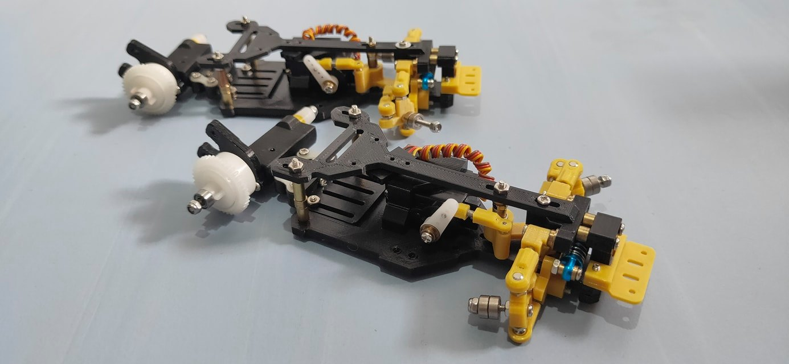

# K-EP Fenrir

{ width="500" }

## Quick facts

- **Developed by:** *K-Enhance Project(Al Kautsar Kilimanjaro)*

- **Release:** *January 2021*

- **Origin:** *Indonesia*

- **Status:** *Discontinued*

- **Production:** Pre-order*

- **Scale:** *1/24-1/28*

- **Body mounting:** *Magnet mounting/MINI-Z?*

- **Materials:** *PLA*

---

## Adjustability

### At-a-glance

- **Wheelbase:** ✅

- **Camber:** Front ✅ / Rear ❌

- **Toe:** Front ✅ / Rear ❌

- **Caster:** ✅

- **Ackermann quick adjustment:** ❌Stage I / ✅Stage II

- **Ride height:** Front ✅/ Rear ❌

- **Track width:** Front ✅ / Rear ✅

- **Front shocks:** preload ✅ / angle ❌

- **Rear shocks:** preload ✅ / angle ❌

- **Active systems:** ❌

- **Motor position:** mid ❌ / high ✅ / rear ✅

- **Servo position:** ❌

- **Pinion-Spur distance:** ❌

- **Front knuckle KPI hinge point:** ❌

- **Front knuckle steering linkage hinge point:** ❌

- **Steering rack linkage hinge point:** ❌

### Details

- **Wheelbase adjustment method:** *slider*

- **Wheelbase range:** *90–108 mm /96-112 mm (depending on rear bridge option)*

- **Track width range:** *74–?? mm*

- **Caster adjustment:** *shims*

- **Ackermann adjustment:** *steering linkages length*

- **Rear toe behavior:** *static*

---

## Drivetrain

- **Gearbox type:** *gear-driven(plastic gears)*

- **Motor orientation:** *transverse*

- **Forces:** *anti-torque*

- **Reversible:** ❌

- **Differential:** *straight axle / open differential optional*

---

## Steering

- **Steering method:** *direct Stage I / bellcrank Stage II*

- **Servo position:** *upper deck Stage I / lower deck Stage II*

---

## Suspension

- **Front:** *double wishbone, independent(monoshock coupled), 1 shock*

- **Rear:** *pivot-mounted flex bridge(rear axle module is attached trough bearing, which allows it to rotate around the axis, enhancing body roll effect)*

- **Shock type:** *friction shock*

## Notes

The predecessor of Fenrir is [K-EP Slimmer](../slimmer/page.md)

# K-EP Fenrir stage 2: 

{ width="500" }

Changes:

- monoshock is now inside the bulkhead, installed on the lower arms

- servo is placed on the lower deck, steering system changed to bellcrank

- stepless Ackermann adjustment

- thin upper deck

# **Sleipnir**

After designing rear gearbox with double wishbone independent suspension, K-EP evolved to [K-EP Sleipnir](../sleipnir/page.md)

---

## Contribute

Have extra info or experience with this chassis? [Contribute here](../../contribute/contribute.md)

---

## Sources / credits / reviews

