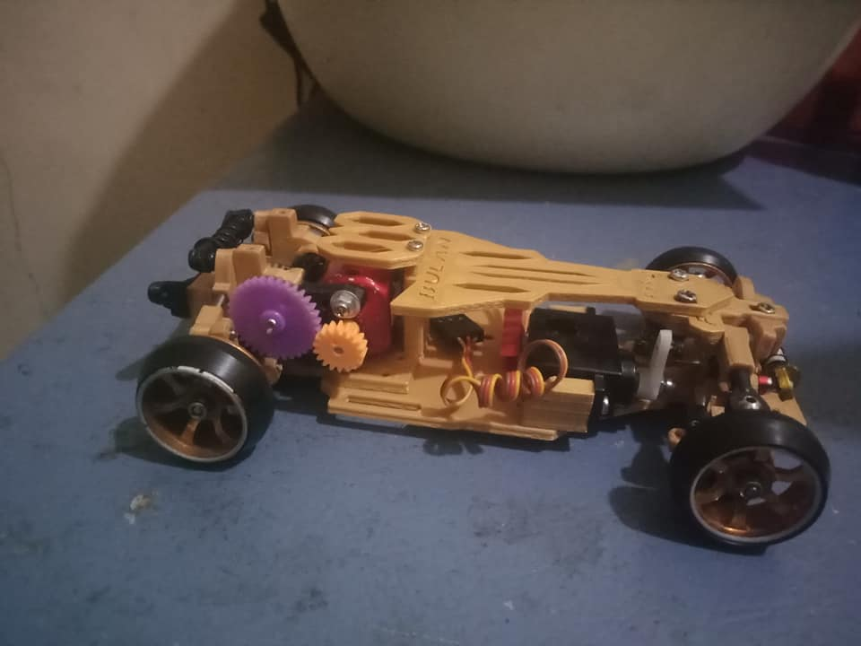

# Bulan FXR-2

{ width="500" }

## Quick facts

- **Developed by:** *Bulan Racing (Febrian Ekha Junior)*

- **Release:** *November 2020*

- **Origin:** *Indonesia*

- **Status:** *Discontinued*

- **Production:** *Pre-order*

- **Scale:** *1/28-1/24*

- **Body mounting:** *Magnet mounting*

- **Materials:** *FDM 3D printed*

---

## Adjustability

### At-a-glance

- **Wheelbase:** ✅

- **Camber:** Front ✅ / Rear ✅

- **Toe:** Front ✅ / Rear ❌

- **Caster:** ✅

- **Ackermann quick adjustment:** ✅

- **Ride height:** Front ✅ / Rear ✅

- **Track width:** Front ✅ / Rear ❌

- **Front shocks:** preload ✅ / angle ❌

- **Rear shocks:** preload ✅ / angle ❌

- **Active systems:** ❌

- **Motor position:** mid ✅ / high ❌ / rear ✅
(4 position GB design existed with rear, high-rear, high-mid and mid configurations, right before the next evolution called "Tsunami-X")

- **Servo position:** ❌

- **Pinion-Spur distance:** ✅

- **Front knuckle KPI hinge point:** ❌

- **Front knuckle steering linkage hinge point:** ✅

- **Steering rack linkage hinge point:** ✅

### Details

- **Wheelbase adjustment method:** *steps(FRX-2 EVO - stepless)*

- **Wheelbase range:** *94–105 mm (FRX-2 EVO RR 90-115 mm/MR 98-115 )*

- **Track width range:** *??–?? mm*

- **Caster adjustment:** *stepless*

- **Ackermann adjustment:** *stepless*

- **Rear toe behavior:** *static*

---

## Drivetrain

- **Gearbox type:** *gear-driven*

- **Motor orientation:** *transverse*

- **Forces:** *anti-torque*

- **Reversible:** ✅ (both FRX-2 and FXR-2 EVO seen with reversible setups, although not confirmed when it was implemented)

- **Differential:** *modified WLtoys K9X9*

---

## Steering

- **Steering method:** *pivoted*

- **Steering system:** *bellcrank*

- **Servo position:** *lower deck*

---

## Suspension

- **Front:** *double wishbone, independent, monoshock-coupled*

- **Rear:** *double wishbone, independent, monoshock-coupled or dual shock configurations*

- **Shocks type:** *friction shocks*

## Notes

{ width="500" }
#input info about FRX-2 EVO here

#Add some photos

---

## Contribute

Have extra info or experience with this chassis? [Contribute here](../../contribute/contribute.md)

---

## Sources / credits / reviews

