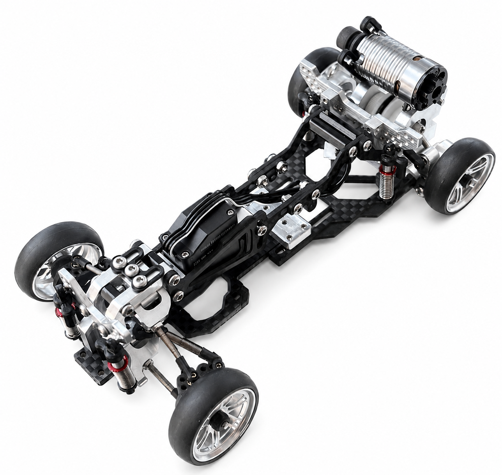
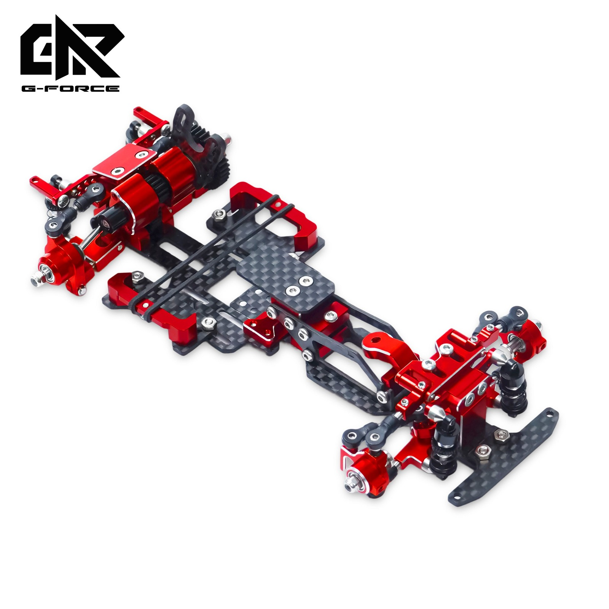

# G-Force D1

{ width="500" }

## Quick facts

- **Developed by:** *G-Force*

- **Release:** *October 2022*

- **Origin:** *Thailand*

- **Status:** *Discontinued*

- **Production:** *Low number*

- **Scale:** *1/24*

- **Body mounting:** *Magnet mounting/MINI-Z*

- **Materials:** *Plastic / Plastic & Carbon fiber / Aluminum + Carbon fiber*

---

## Adjustability

### At-a-glance

- **Wheelbase:** ✅

- **Camber:** Front ✅ / Rear ✅

- **Toe:** Front ✅ / Rear ✅(not confirmed)

- **Caster:** ✅

- **Ackermann quick adjustment:** ❌(not confirmed)

- **Ride height:** Front ✅ / Rear ✅

- **Track width:** Front ✅ / Rear ❌

- **Front shocks:** preload ✅ / angle ✅

- **Rear shocks:** preload ✅ / angle ✅

- **Active systems:** ❌

- **Motor position:** mid ✅ / high ✅ / rear ✅

- **Servo position:** ✅

- **Pinion-Spur distance:** ✅

- **Front knuckle KPI hinge point:** ✅

- **Front knuckle steering linkage hinge point:** ✅

- **Steering rack linkage hinge point:** ✅

### Details

- **Wheelbase adjustment method:** *slider*

- **Wheelbase range:** *94–116 mm*

- **Track width range:** *unknown*

- **Caster adjustment:** *stepless*

- **Ackermann adjustment:** *switching ballhead positions(not confirmed if stepless adjustment is available)*

- **Rear toe behavior:** *static*

---

## Drivetrain

- **Gearbox type:** *belt-driven*

- **Motor orientation:** *transverse*

- **Forces:** *anti-torque*

- **Reversible:** ✅

- **Differential:** *spool*

---

## Steering

- **Steering method:** *direct*

- **Servo position:** *bulkhead mounted / upper deck*

- *Adjustable tilt angle*

---

## Suspension

- **Front:** *double wishbone, independent, 2 shocks*

- **Rear:** *double wishbone, independent, 2 shocks*

- **Shocks type:** *friction shocks*

## Community ratings

## History & Development

G-Force D1 has been promoted with 3 versions to choose from: 

- D1 Lite: All plastic
- D1-R: Plastic and carbon fiber
- D1 Pro: Aluminum and carbon fiber, as for the first batch, the customers were given the options to choose the anodizing color of the aluminum parts

I've not found trusted number for amount of D1 kits produced yet, but the kit was known to have some issues, inclucind QC.

The community put the author under pressure for taking too long to solve some cases and the brand quickly lost the trust for a while. 
But at the end, G-Force kept their word and saved their name. Later, their journey continued with new kit, produced by NEXX Racing, called [G-Force TT24](../g-forcett24/page.md)
  

---

## Contribute

Have extra info or experience with this chassis? [Contribute here](../../contribute/contribute.md)

---

## Sources / credits / reviews

