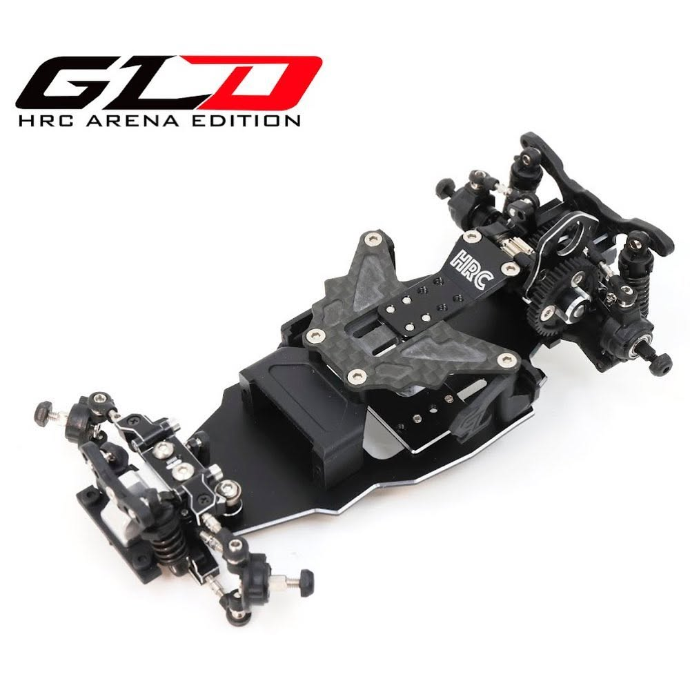
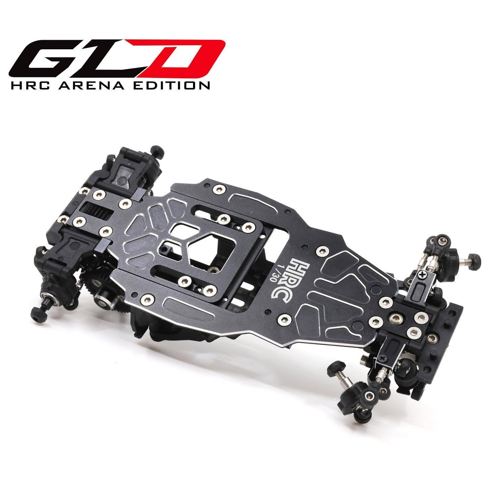
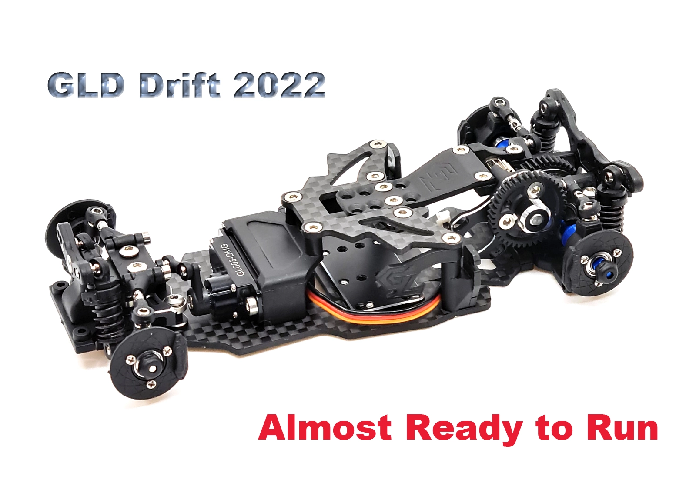
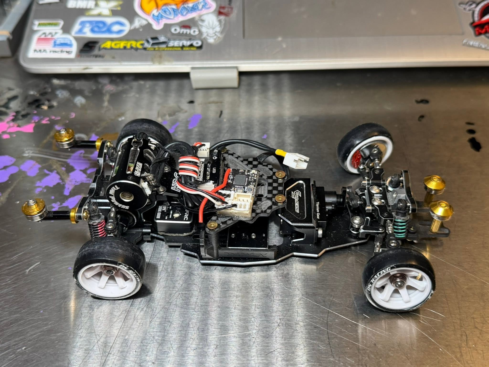

# HRC Arena & GL Racing GLD

{ width="500" }

## Quick facts

- **Developed by:** *HRC Arena with GL Racing*

- **Release:** *July 2020*

- **Origin:** *Hong Kong*

- **Status:** *Available (2022 edition)*

- **Production:** *Mass*

- **Scale:** *1/28*

- **Body mounting:** *Kyosho MINI-Z*

- **Materials:** *Injection molded plastic, aluminum, carbon fiber*

---

## Adjustability

### At-a-glance

- **Wheelbase:** ❌ (✅ conversion kit and 2022 Edition)

- **Track width:** Front ✅ / Rear ✅ (Upgrade parts)

- **Camber:** Front ✅ / Rear ✅

- **Camber gain:** Front ❌ / Rear ❌

- **Caster:** ❌ (✅ upgrade part and 2022 edition)

- **Ackermann quick adjustment:** ❌

- **Toe:** Front ✅ / Rear ✅ (via optional toe blocks)

- **Ride height:** Front ✅ / Rear ✅

- **Front shocks:** preload ❌ (✅ with optional shock set) / angle ✅

- **Rear shocks:** preload ❌ (✅ with optional shock set) / angle ✅

- **Active systems:** ❌

- **Motor position:** mid ✅ / high ✅ / rear ❌

- **Belt tension/Pinion size:** ✅

- **Extendable dogbones:** ❌

- **Front knuckle KPI:** ❌

- **Steering linkage position on knuckle:** ❌

- **Steering rack linkage position:** ❌

### Details

- **Wheelbase adjustment method:** *steps (with conversion or 2022 edition)*

- **Wheelbase range:** *fixed 94 mm / 90-106 mm(with conversion or 2022 edition)*

- **Track width range:** *65-?? mm (depending on wheel and optional parts)*

- **Caster adjustment:** *stepless (only with optional caster mount)*

- **Ackermann adjustment:** *adjusting linkages length*

- **Rear toe behavior:** *static*

---

## Drivetrain

- **Gearbox type:** *gear-driven*

- **Motor orientation:** *transverse*

- **Forces:** *anti-torque*

- **Reversible:** ❌

- **Differential:** *Ball / Aluminum solid axle (optional)*

---

## Steering

- **Steering method:** *pivoted*

- **Steering system:** *slide rack*

- **Servo Type:** *Low profile - 8mm(eg. A06CLS)*

---

## Suspension

- **Front:** *double wishbone, independent, 2 shocks*

- **Rear:** *double wishbone, independent, 2 shocks*

- **Shocks type:** *friction shocks*

## Community ratings

## History & Development

GLD was developed jointly by HRC Arena and GL Racing and entered production in mid-2020 after a 3D-printed development chassis completed final testing. Expectations were high, particularly because GL Racing was already an established manufacturer within the Mini-Z-sized RC market.

The initial release, however, quickly attracted criticism for inconsistent material quality and manufacturing defects. Early owners reported problems such as off-centre gears, tight or misaligned knuckles, damaged ball cups and excessive play. HRC later publicly acknowledged a serious quality gap compared with earlier GL Racing products and supplied replacement aluminium pinion gears to affected owners.

Over the following months, HRC introduced a wide range of corrective and performance-oriented upgrades. Many of these developments reflected feedback from early users and included revised aluminium suspension arms, front bulkhead, rear solid axle, gearbox and adjustable chassis conversions. Together, they addressed many of the platform's original shortcomings, including steering limitations, suspension play, component flex and drivetrain durability.

In 2021, HRC Arena also released a limited edition of just 30 pre-built chassis, each featuring a numbered chassis plate and a selection of the most important performance upgrades.

{ width="500" }

{ width="500" }

A revised GLD 2022 version later incorporated several features that had previously required optional parts, including an adjustable wheelbase chassis and updated steering components. Community opinion remained divided: upgraded examples were often praised for stable handling, Mini-Z body compatibility and straightforward assembly, while the original quality problems left the platform with a reputation it never fully escaped.

{ width="500" }

Today, GLD is generally remembered as an important early-generation platform. While its initial quality-control issues affected its long-term reputation, later revisions and HRC-developed upgrades helped it mature into a capable chassis that still has dedicated supporters today.

**GLD with optional upgrades by John Stangle**

{ width="500" }

---

## Contribute

Have extra info or experience with this chassis? [Contribute here](../../contribute/contribute.md)

---

## Sources / credits / reviews
HRC Mini-Z Arena, Facebook community, GT55Racing 