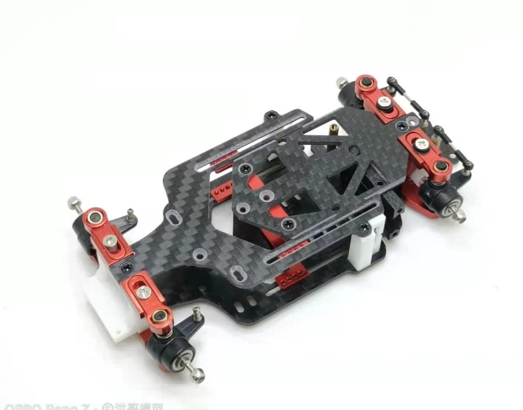

# HGD1

{ width="500" }

## Quick facts

- **Developed by:** *Unknown. Some retailers refer to it as an HGMX Racing product, but there is no public conformation that such a brand exists*

- **Release:** *October 2019*

- **Origin:** *China*

- **Status:** *Available*

- **Production:** *Mass*

- **Scale:** *1/28(1/24 with upgrade)*

- **Body mounting:** *Magnet mounting/MINI-Z*

- **Materials:** *aluminum, carbon fiber*

---

## Adjustability

### At-a-glance

- **Wheelbase:** ✅

- **Camber:** Front ✅ / Rear ✅

- **Toe:** Front ✅ / Rear ✅

- **Caster:** ❌

- **Ackermann quick adjustment:** ❌

- **Ride height:** Front ✅ / Rear ✅

- **Track width:** Front ✅ / Rear ✅ 

- **Front shocks:** preload ❌ / angle ❌

- **Rear shocks:** preload ❌ / angle ❌

- **Active systems:** ❌

- **Motor position:** mid ✅ / high ❌ / rear ❌

- **Servo position:** ❌

- **Pinion-Spur distance:** ✅

- **Front knuckle KPI hinge point:** ❌

- **Front knuckle steering linkage hinge point:** ✅

- **Steering rack linkage hinge point:** ❌

### Details

- **Wheelbase adjustment method:** *2mm steps*

- **Wheelbase range:** *86–116 mm*

- **Track width range:** *theoretically adjustable, but limited by camber adjustment (available optional wide 1:24 conversion kit)*

- **Caster adjustment:** *static (5° positive caster arms option part) *

- **Ackermann adjustment:** *steering linkages length*

- **Rear toe behavior:** *dynamic*

---

## Drivetrain

- **Gearbox type:** *gear-driven*

- **Motor orientation:** *longitudinal*

- **Forces:** *torque-steer*

- **Reversible:** ❌

- **Differential:** *straight axle (Mini-Q / Mini-Z ball differential compatible)*

---

## Steering

- **Steering method:** *direct*

- **Servo position:** *lower deck*

---

## Suspension

- **Front:** *pivoted knuckle, independent, spring-based*

- **Rear:** *pivoted knuckle with toe linkage, independent, spring-based*

- **Shocks type:** *spring-based friction damper*

## Notes

**Some upgrade parts to be mentioned:**
- servo horn compatible with AFRC D2114 and A11CLS servos
- steel gear set, including pinion, spur and straight axle
- 5 degree caster upper arms
- 1/24 conversion(wide kit)
- upgrade upper deck
  

**Cheaper option with some plastic parts also available as HGV1**

{ width="500" }

---

## Contribute

Have extra info or experience with this chassis? [Contribute here](../../contribute/contribute.md)

---

## Sources / credits / reviews

