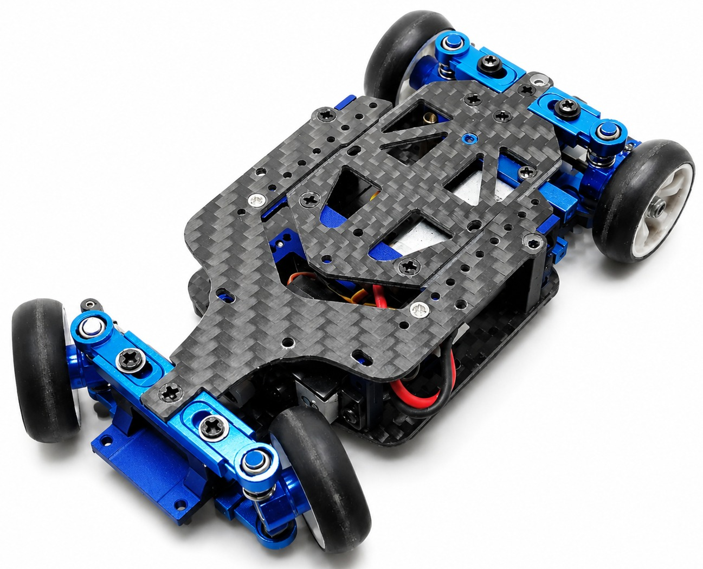
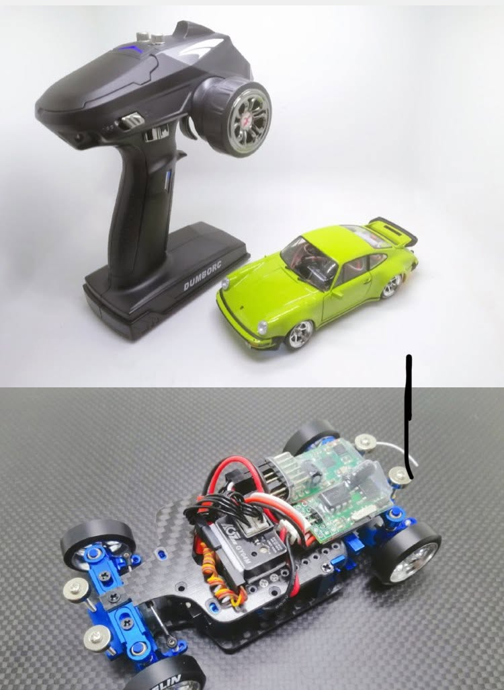
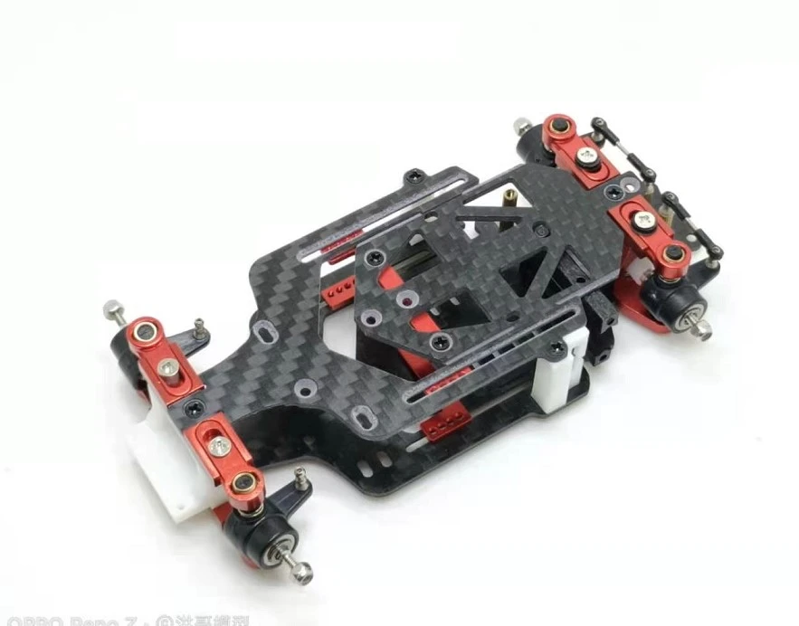

# HGD1

{ width="500" }

## Quick facts

- **Developed by:** *Unknown. Some retailers refer to it as an HGMX Racing product, but there is no public conformation that such a brand exists*

- **Release:** *October 2019*

- **Origin:** *China*

- **Status:** *Available*

- **Production:** *Mass*

- **Scale:** *1/28(1/24 with upgrade)*

- **Body mounting:** *Magnet mounting/MINI-Z*

- **Materials:** *aluminum, carbon fiber*

---

## Adjustability

### At-a-glance

- **Wheelbase:** ✅

- **Track width:** Front ✅ / Rear ✅

- **Camber:** Front ✅ / Rear ✅

- **Camber gain:** Front ❌ / Rear ❌

- **Caster:** ❌

- **Ackermann quick adjustment:** ❌

- **Toe:** Front ✅ / Rear ✅

- **Ride height:** Front ✅ / Rear ✅ 

- **Front shocks:** preload ❌ / angle ❌

- **Rear shocks:** preload ❌ / angle ❌

- **Active systems:** ❌

- **Motor position:** mid ✅ / high ❌ / rear ❌

- **Belt tension/Pinion size:** ✅

- **Extendable dogbones:** ❌
- 
- **Front knuckle KPI:** ❌

- **Steering linkage position on knuckle:** ✅

- **Steering rack linkage position:** ❌

### Details

- **Wheelbase adjustment method:** *2mm steps*

- **Wheelbase range:** *86–116 mm*

- **Track width range:** *theoretically adjustable, but limited by camber adjustment (available optional wide 1:24 conversion kit)*

- **Caster adjustment:** *static (5° positive caster arms option part) *

- **Ackermann adjustment:** *steering linkages length*

- **Rear toe behavior:** *dynamic*

---

## Drivetrain

- **Gearbox type:** *gear-driven*

- **Motor orientation:** *longitudinal*

- **Forces:** *torque-steer*

- **Reversible:** ❌

- **Differential:** *straight axle (Mini-Q / Mini-Z ball differential compatible)*

---

## Steering

- **Steering method:** *direct*

- **Servo position:** *lower deck*

---

## Suspension

- **Front:** *pivoted knuckle, independent, spring-based*

- **Rear:** *pivoted knuckle with toe linkage, independent, spring-based*

- **Shocks type:** *spring-based friction damper*

## Community ratings

## History & Development

When the HGD1 appeared in late 2019, the small-scale RWD drift scene was beginning to expand rapidly. While manufacturers were introducing increasingly diverse chassis concepts, it followed a different philosophy. Rather than pushing the boundaries of chassis design, HGD1 focused on lowering the barrier to entry by offering a practical, easy-to-own platform aimed at making small-scale RWD drifting accessible to a wider audience.

Unlike most competitors at the time, the HGD1 was widely available through major Chinese marketplaces in Kit, ARTR and fully assembled RTR packages, often including electronics, a transmitter, a body shell and even working lights. This allowed newcomers to enter the hobby without researching component compatibility or assembling a chassis entirely from scratch.

Mechanically, the chassis remained very simple. It used spring-based suspension with limited damping, direct steering and a longitudinal gear-driven drivetrain. Although it lacked many of the innovative engineering solutions introduced by some competing platforms, it offered a generous wheelbase adjustment range, compatibility with numerous body styles and a selection of optional upgrade parts.

Despite receiving only minor updates, the HGD1 remained widely available for years after its initial release and can still be found through various retailers today, making it one of the longest continuously available first-generation RWD drift chassis from the early growth of the hobby.

---

**Some upgrade parts to be mentioned:**
- servo horn compatible with AFRC D2114 and A11CLS servos
- steel gear set, including pinion, spur and straight axle
- 5 degree caster upper arms
- 1/24 conversion(wide kit)
- upgrade upper deck
  
---

**HGD1 RTR example**

{ width="500" }

---

**Cheaper version with some plastic parts also available as HGV1**

{ width="500" }

---

## Contribute

Have extra info or experience with this chassis? [Contribute here](../../contribute/contribute.md)

---

## Sources / credits / reviews

