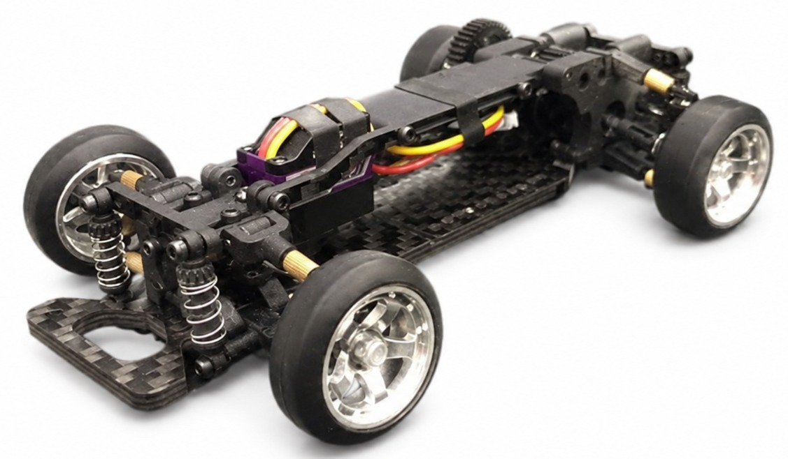
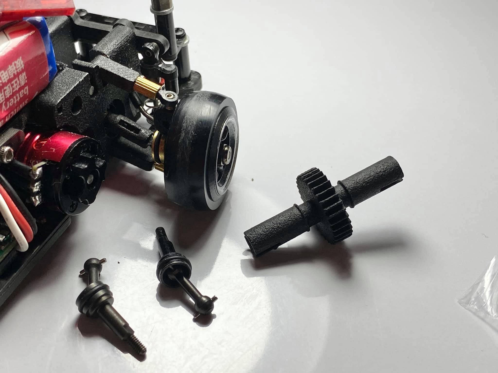
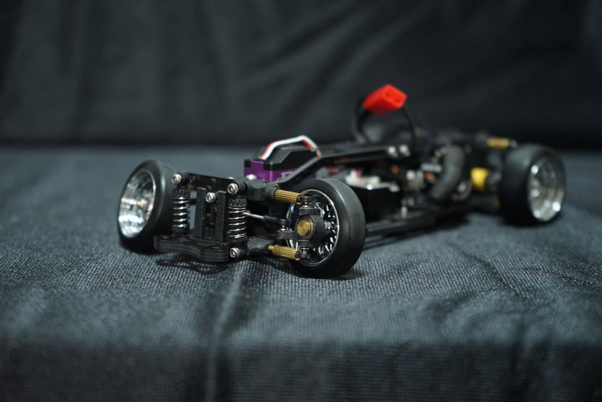
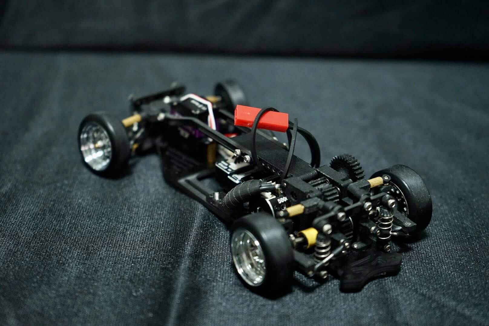
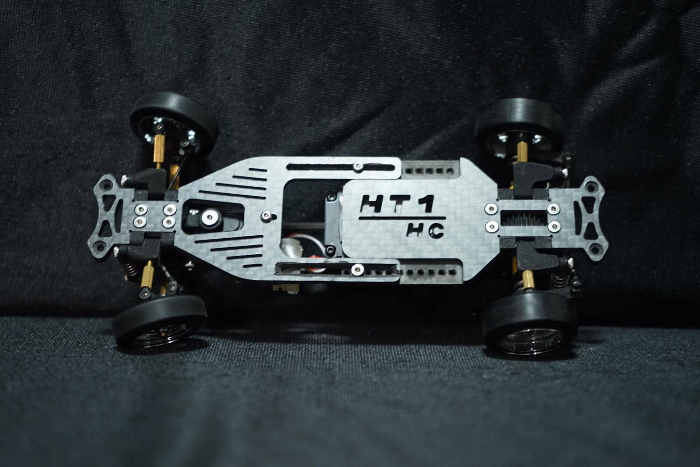

# HT1

{ width="500" }

## Quick facts

- **Developed by:** *Hammer Toy*

- **Release:** *December 2020*

- **Origin:** *China*

- **Status:** *Discontinued*

- **Production:** *Batch*

- **Scale:** *1/24-1/28*

- **Body mounting:** *Magnet mounting/MINI-Z*

- **Materials:** *Carbon fiber, nylon, brass*

---

## Adjustability

### At-a-glance

- **Wheelbase:** ✅

- **Camber:** Front ✅ / Rear ✅

- **Toe:** Front ✅  / Rear ✅ 

- **Caster:** ✅ 

- **Ackermann quick adjustment:** ❌

- **Ride height:** Front ✅ / Rear ✅ 

- **Track width:** Front ✅ / Rear ✅

- **Front shocks:** preload ✅ / angle ✅

- **Rear shocks:** preload ✅ / angle ✅

- **Active systems:** ✅

- **Motor position:** mid ✅ / high ❌ / rear ❌

- **Servo position:** ❌

- **Pinion-Spur distance:** ✅

- **Front knuckle KPI hinge point:** ❌

- **Front knuckle steering linkage hinge point:** ❌ 

- **Steering rack linkage hinge point:** ❌

### Details

- **Wheelbase adjustment method:** *slider / steps*

- **Wheelbase range:** *90–120 mm*

- **Track width range:** *70+ mm*

- **Caster adjustment:** *stepless*

- **Ackermann adjustment:** *linkages length*

- **Rear toe behavior:** *dynamic*

---

## Drivetrain

- **Gearbox type:** *gear-driven*

- **Motor orientation:** *transverse*

- **Forces:** *pro-torque*

- **Reversible:** ❌

- **Differential:** *spool*

---

## Steering

- **Steering method:** *direct*

- **Servo position:** *upper deck*

---

## Suspension

- **Front:** *double wishbone, independent, 2 shocks*

- **Rear:** *multi-link, independent, 2 shocks*

- **Shocks type:** *friction shocks*

## Community ratings

## History & Development

Released in late 2020, the Hammer Toy HT1 was a budget-oriented chassis frequently compared to the [DKMK2](../dk/dkmk2/page.md) due to its overall layout and construction. Early reactions were generally positive, with owners praising its simple construction, adjustability and driving characteristics, while others questioned whether it offered enough innovation over existing platforms.

The first production version featured a 3D printed rear drivetrain with extendable plastic telescopic driveshafts. While owners generally described the chassis as easy to drive and capable of excellent performance, durability quickly became its biggest criticism. Reports of broken rear driveshafts appeared shortly after release, prompting both community-designed replacement parts and an official drivetrain revision.

{ width="500" }

Hammer Toy later revised the rear drivetrain around metal CVD components, a new one-piece spool and related gearbox changes. While this addressed the failures of the original telescopic plastic driveshafts, the spool U-cups subsequently became the reported weak point. Further updates also improved the chassis layout, steering geometry and suspension components, and an updated version was previewed during 2021. However, it remains unclear whether this revised chassis ever reached production.

{ width="500" }
{ width="500" }
{ width="500" }

Despite its generally positive driving impressions, community discussion around the HT1 declined rapidly after its initial release, and by 2022 only occasional references to the platform remained.

---

## Contribute

Have extra info or experience with this chassis? [Contribute here](../../contribute/contribute.md)

---

## Sources / credits / reviews

Hammer Toy, Jack Nares, ChanRC

