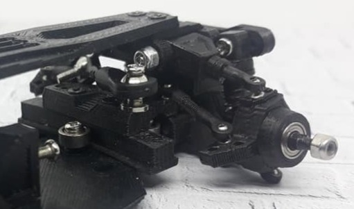
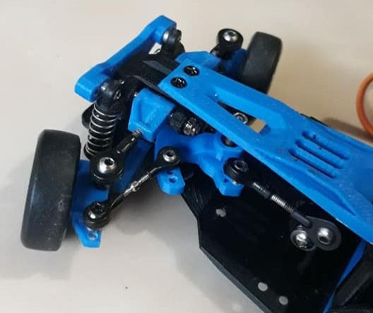
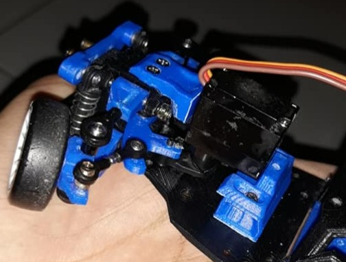
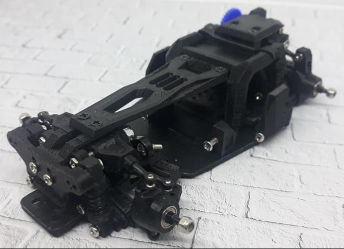
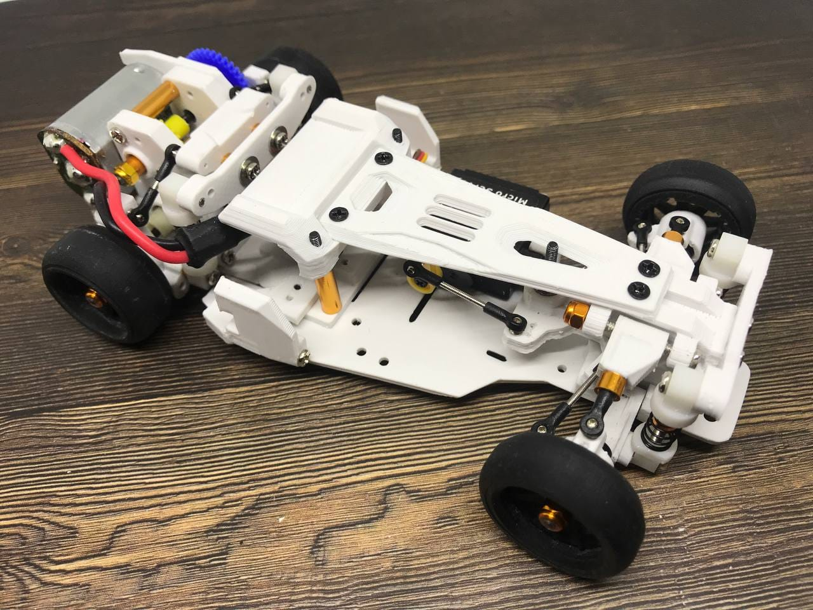
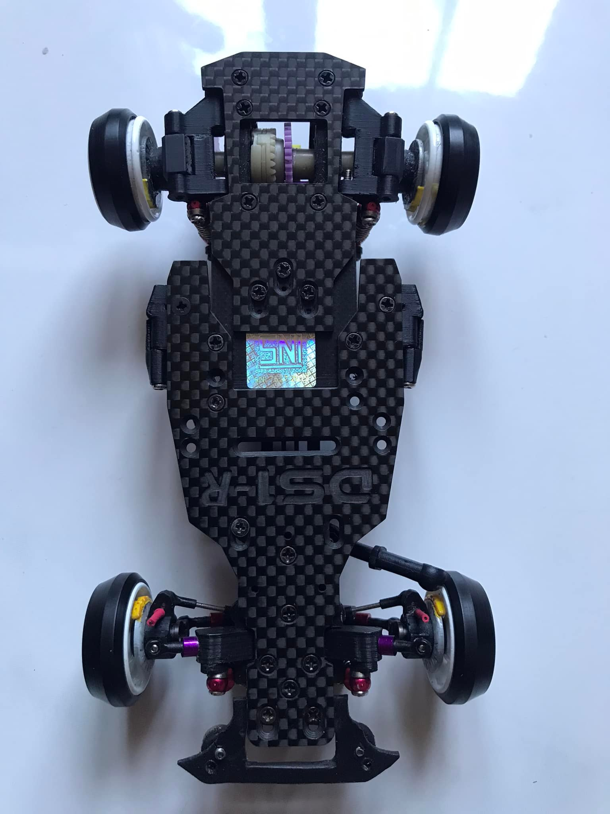

# Leya DS1 & DS1-R

{ width="500" }

## Quick facts

- **Developed by:** *Leya / *Muh. Ahkam Akhmad*

- **Release:** *March 2020*

- **Origin:** *Indonesia*

- **Status:** *Discontinued*

- **Production:** *Pre-order*

- **Scale:** *1/28*

- **Body mounting:** *Kuosho MINI-Z*

- **Materials:** *FDM 3D printed*

---

## Adjustability

### At-a-glance

- **Wheelbase:** ✅

- **Camber:** Front ✅ / Rear ✅

- **Toe:** Front ✅ / Rear ✅ (optional toe blocks)

- **Caster:** ✅

- **Ackermann quick adjustment:** ❌(not confirmed)

- **Ride height:** Front ✅ / Rear ✅

- **Track width:** Front ✅ / Rear ❌

- **Front shocks:** preload ✅(adjustable shock tower height) / angle ✅

- **Rear shocks:** preload ✅(adjustable shock tower height) / angle ✅

- **Active systems:** ❌

- **Motor position:** mid ❌ / high ❌ / rear ✅

- **Servo position:** ✅

- **Pinion-Spur distance:** ✅

- **Front knuckle KPI hinge point:** ✅ 

- **Front knuckle steering linkage hinge point:** ✅

- **Steering rack linkage hinge point:** ✅

### Details

- **Wheelbase adjustment method:** *steps*

- **Wheelbase range:** *90–106 mm*

- **Track width range:** *xx–yy mm*

- **Caster adjustment:** *stepless by threaded screw*

- **Ackermann adjustment:** *not confirmed*

- **Rear toe behavior:** *static*

---

## Drivetrain

- **Gearbox type:** *gear-driven*

- **Motor orientation:** *transverse*

- **Forces:** *pro-torque*

- **Reversible:** ❌

- **Differential:** *WLtoys K9x9*

---

## Steering

- **Steering method:** *pivoted and optional upgrade direct*

- **Steering system:** *first stock option: slide rack
  later options: bellcrank and direct drive steering*

- **Servo position:** *lower deck or bulkhead/lower deck(for direct steering option)*

---

## Suspension

- **Front:** *double wishbone, independent, 2 shocks*

- **Rear:** *double wishbone, independent, 2 shocks*

- **Shocks type:** *friction shocks*

## Notes

DS(Drift Spectre) went through a few evolutions during its developement.
First known as DS1 was equiped with slide rack steering system.
Later, DS1-R(Revive) had optional disc brakes and 3 types of steering available:

**Sliding rack steering setup:**

{ width="500" }

**Bellcrank steering setup:**

{ width="500" }

**Direct drive steering setup:**

{ width="500" }

**Leya DS1-R Black Version**

{ width="500" }

**Later revision of DS1-R**

{ width="500" }

**Leya DS1-R special edition with carbon fiber motor mount and decks:**

{ width="500" }

With a few redesigns, such as reversible gearbox, the DS1 platform evolved to [Leya DS2](../ds2/page.md)

---

## Contribute

Have extra info or experience with this chassis? [Contribute here](../../contribute/contribute.md)

---

## Sources / credits / reviews

