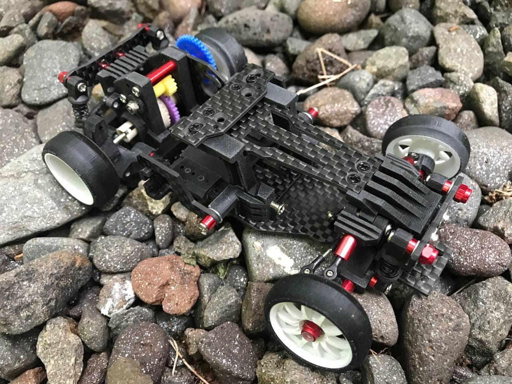

# Leya DS2 & DS2-R

{ width="500" }

## Quick facts

- **Developed by:** *Leya / *Muh. Ahkam Akhmad*

- **Release:** *August 2020*

- **Origin:** *Indonesia*

- **Status:** *Discontinued*

- **Production:** *Pre-order*

- **Scale:** *1/24-1/28*

- **Body mounting:** *Magnet mounting/MINI-Z*

- **Materials:** *FDM 3D printed, carbon fiber upgrades revision*

---

## Adjustability

### At-a-glance

- **Wheelbase:** ✅

- **Camber:** Front ✅ / Rear ✅

- **Toe:** Front ✅ / Rear (Not confirmed)

- **Caster:** ✅ (Not confirmed)

- **Ackermann quick adjustment:** ❌

- **Ride height:** Front ✅ / Rear ✅

- **Track width:** Front ✅ / Rear (Not confirmed)

- **Front shocks:** preload ✅ / angle ✅

- **Rear shocks:** preload ✅ / angle ✅

- **Active systems:** ❌

- **Motor position:** mid ✅ / high ❌ / rear ✅

- **Servo position:** ✅

- **Pinion-Spur distance:** ✅

- **Front knuckle KPI hinge point:** ✅

- **Front knuckle steering linkage hinge point:** ❌

- **Steering rack linkage hinge point:** ✅

### Details

- **Wheelbase adjustment method:** *slider / steps*

- **Wheelbase range:** *90–106 mm(not confirmed, DS2-R Carbon version documented case with 125mm wb)*

- **Track width range:** *??–?? mm*

- **Caster adjustment:** *not confirmed*

- **Ackermann adjustment:** *sliding rack holes / steering linkages length*

- **Rear toe behavior:** *static*

---

## Drivetrain

- **Gearbox type:** *gear-driven*

- **Motor orientation:** *longitudinal*

- **Forces:** *anti-torque*

- **Reversible:** ✅

- **Differential:** *WLtoys K9X9*

---

## Steering

- **Steering method:** *pivoted*

- **Steering system:** *sliding rack*

- **Servo position:** *lower deck*

---

## Suspension

- **Front:** *double wishbone, independent, 2 shocks*

- **Rear:** *double wishbone, independent, 2 shocks*

- **Shocks type:** *friction shocks*

## Notes

DS2 was born as evolution of the previous [DS1-R](../ds1-r/page.md) chassis

**Leya DS2-R Version with carbon fiber decks, shock towers, motor mount:**

{ width="500" }

The successor evolved went through a lof of redesign and innovations to be born as [Leya Supernova](../supernova/page.md)  

---

## Contribute

Have extra info or experience with this chassis? [Contribute here](../../contribute/contribute.md)

---

## Sources / credits / reviews

