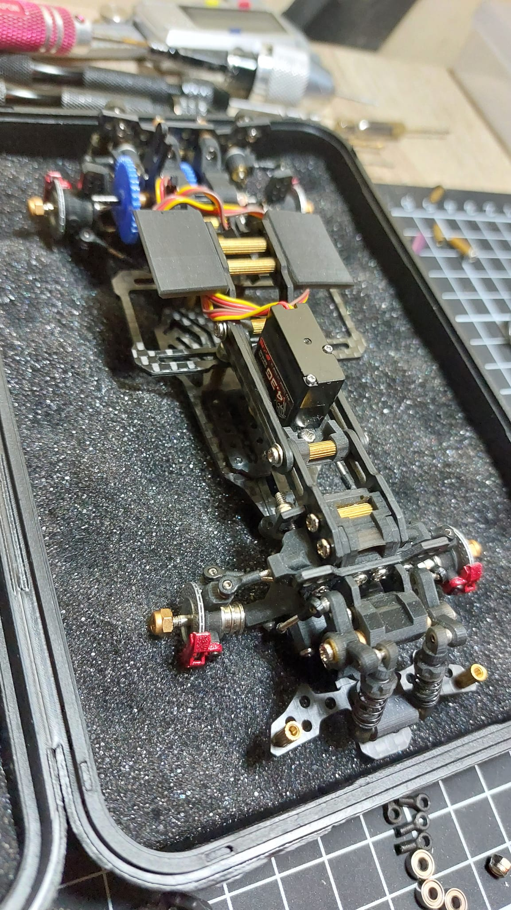

# Leya Supernova RR (Regained Reawakening) Kronoz

{ width="500" }

## Quick facts

- **Developed by:**  Leya / *Muh. Ahkam Akhmad*
- **Release:**  *July 2023* 
- **Origin:**  *Indonesia*  
- **Status:**  *Unknown* 
- **Production:**  *Pre-order* 
- **Scale:**  *1/24*
- **Body mounting:**  *Magnet mounting* 

---

## Adjustability

### At-a-glance
- **Wheelbase:** ✅ 
- **Camber:**  Front ✅ / Rear ✅  
- **Toe:**  Front ✅ / Rear ✅  
- **Caster:**  ✅  
- **Ackermann quick adjustment:**  ✅  
- **Ride height:**  Front ✅ / Rear ✅  
- **Track width:**  Front ✅ / Rear ✅ 
- **Front shocks:**  preload ✅  
- **Rear shocks:**  preload ✅ / angle ✅ 
- **Active systems:**  active rear toe ✅
- **Motor position:**  mid ✅ / high ✅ / rear ❌
- **Servo position:**  ✅
- **Pinion-Spur distance:**  ✅
- **Front Knuckle KPI hinge point:**  ❌
- **Front knuckle steering linkage hinge point:**  ✅
- **Steering rack linkage hinge point:**  ✅

### Details
- **Wheelbase adjustment method:**  *slider / steps*  
- **Wheelbase range:**  *96–116 mm*  
- **Caster adjustment:**  *stepless*  
- **Ackermann adjustment:**  *stepless*  
- **Rear toe behavior:**  *dynamic*  

---

## Drivetrain
- **Gearbox type:**  *gear-driven* (plastic gears)*
- **Motor orientation:**  *transverse*
- **Forces:**  *anti-torque* 
- **Reversible:**  ✅
- **Differential:**  *spool*  

---

## Steering
- **Steering method:**  *pivoted*
- **Steering type:**  *bellcrank / double bellcrank* 
- **Servo position:**  *upper deck*

---

##Suspension
- **Front:**  *double wishbone, independent, 2 cantilever shocks*
- **Rear:**  *double wishbone, independent, 2 direct-acting shocks*
- **Shocks type:**  *friction shocks*

## Notes

All arm & knuckle (hub), T Steering & Wiper Steering System, optional part, a couple of rod & optional spur gear & pinion set.

Included rotating brake discs with static calipers.

---

## Contribute

Have extra info or experience with this chassis? [Contribute here](../../../contribute/contribute.md)

---

## Sources / credits / reviews
