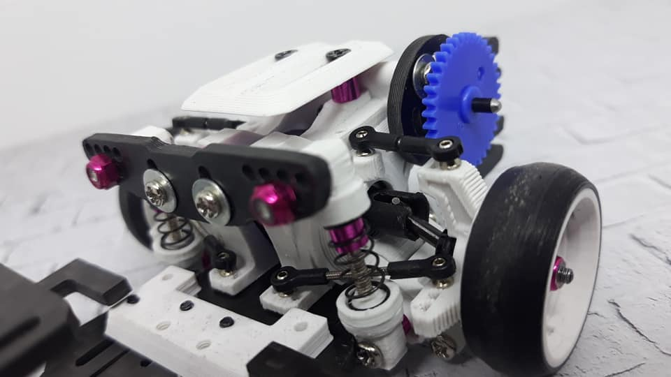
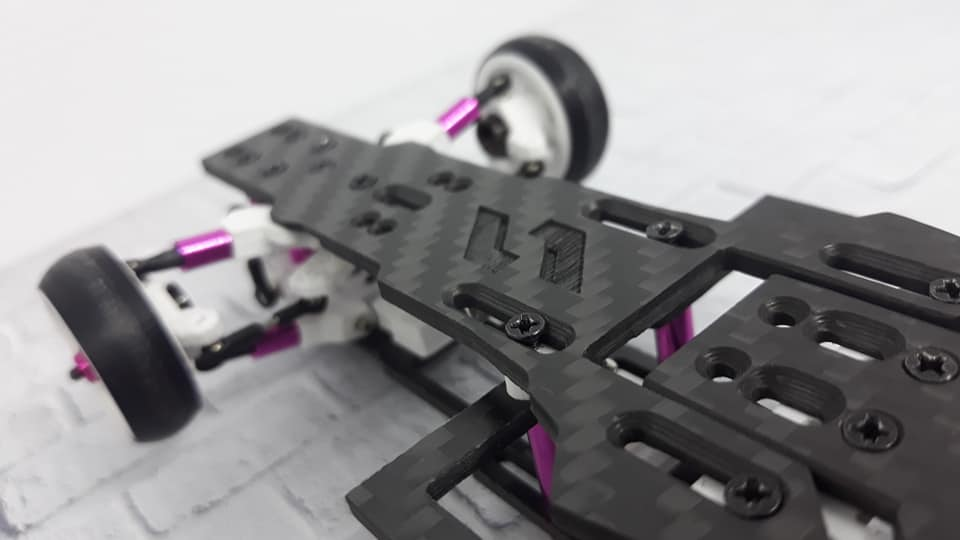
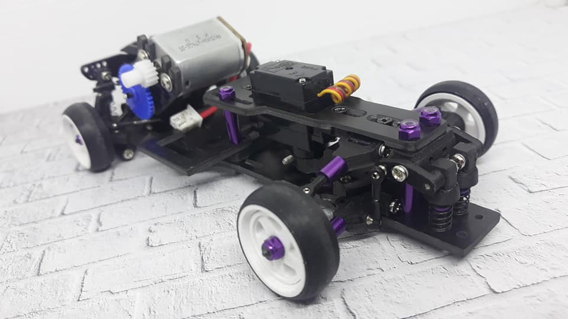

# Leya Supernova

{ width="500" }

## Quick facts

- **Developed by:** *Leya / *Muh. Ahkam Akhmad*

- **Release:** *December 2020*

- **Origin:** *Indonesia*

- **Status:** *Discontinued*

- **Production:** *Pre-order*

- **Scale:** *1/24-1/28*

- **Body mounting:** *Magnet mounting*

- **Materials:** *3D printed parts, carbon fiber, injection moded rod ends*

---

## Adjustability

### At-a-glance

- **Wheelbase:** ✅

- **Camber:** Front ✅ / Rear ✅

- **Toe:** Front ✅ / Rear ✅

- **Caster:** ✅

- **Ackermann quick adjustment:** ✅

- **Ride height:** Front ✅ / Rear ✅

- **Track width:** Front ✅ / Rear (not confirmed)

- **Front shocks:** preload ✅ / angle ❌

- **Rear shocks:** preload ✅ / angle ✅

- **Active systems:** ✅(active rear toe)

- **Motor position:** mid ✅ / high ✅ / rear ✅

- **Servo position:** ✅

- **Pinion-Spur distance:** ✅

- **Front knuckle KPI hinge point:** ❌

- **Front knuckle steering linkage hinge point:** ❌

- **Steering rack linkage hinge point:** ✅

### Details

- **Wheelbase adjustment method:** *slider*

- **Wheelbase range:** *86–118 mm*

- **Track width range:** *xx–yy mm*

- **Caster adjustment:** *stepless*

- **Ackermann adjustment:** *stepless*

- **Rear toe behavior:** *dynamic*

---

## Drivetrain

- **Gearbox type:** *gear-driven*

- **Motor orientation:** *transverse*

- **Forces:** *anti-torque*

- **Reversible:** ✅

- **Differential:** *WLtoys K9X9*

---

## Steering

- **Steering method:** *direct and pivoted options*

- **Servo position:** *upper deck*

---

## Suspension

- **Front:** *double wishbone, independent, 2 cantilever shocks*

- **Rear:** *multi-link, independent, 2 shocks*

- **Shocks type:** *friction shocks*

## Notes

Leya Supernova was different than the previus Leya products. 3 Steering types: Direct, Single bellcrank, Dual bellcrank.
It was more modern with narrow decks, introduced adjustable dynamic rear toe, stepless wheelbase adjustment and a lot of other rich in fine tuning option adjusments. Equipped with battery holders, upper and lower decks, motor mount and rear shock tower made of carbon fiber, it was lighter, faster, and prettier. 

**Dynamic rear toe and shocks adjustability options:**

{ width="500" }

**Stepless wheelbase adjustment sliders:**

{ width="500" }

**Noir(black) with purple spacers**

{ width="500" }
---

## Contribute

Have extra info or experience with this chassis? [Contribute here](../../contribute/contribute.md)

---

## Sources / credits / reviews

