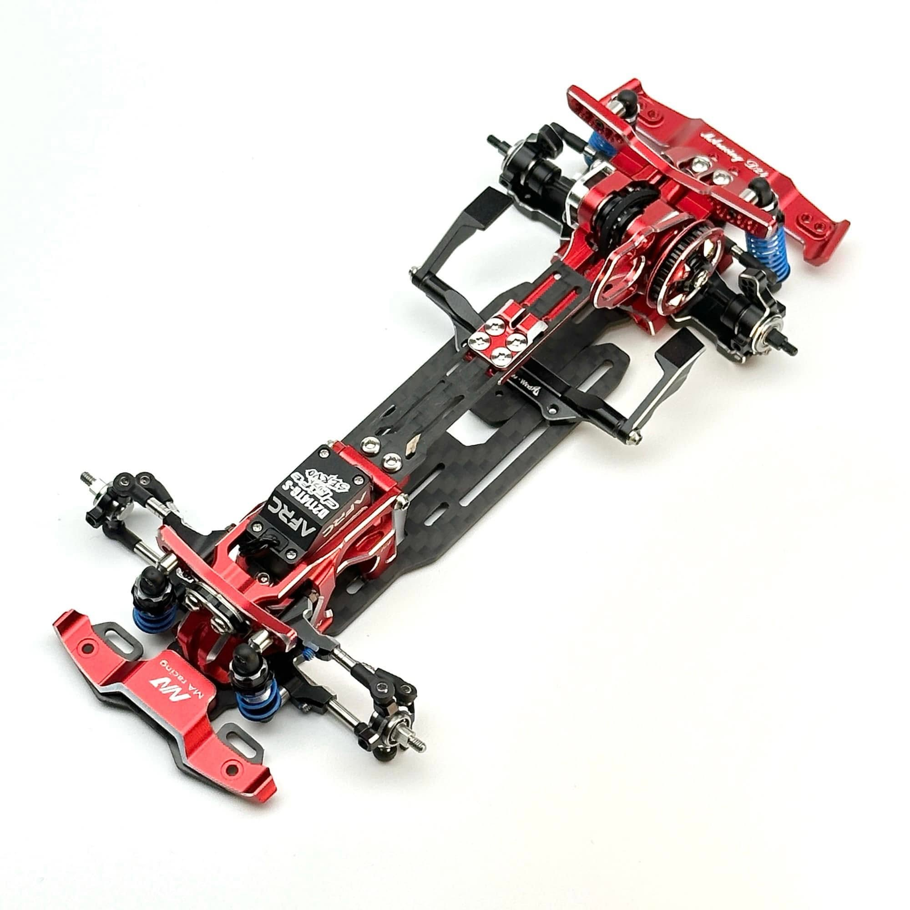
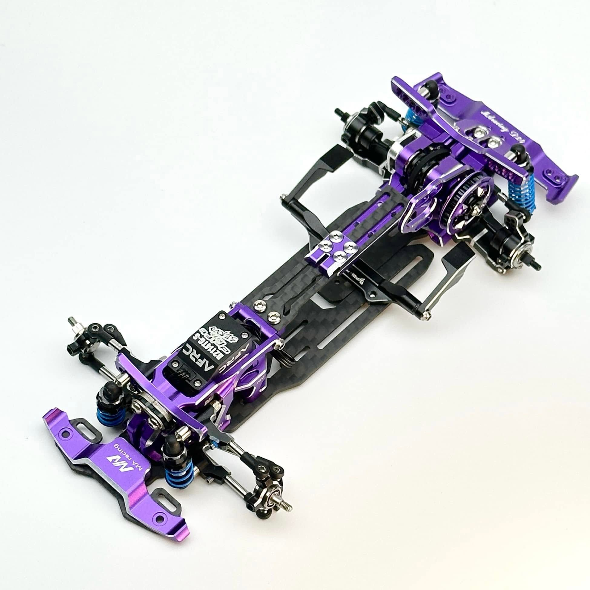
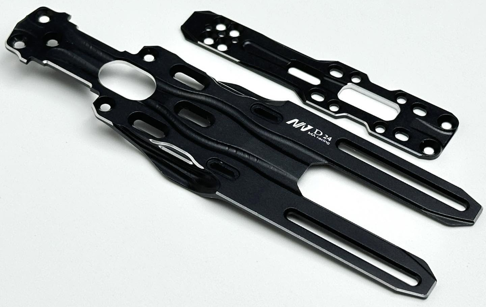
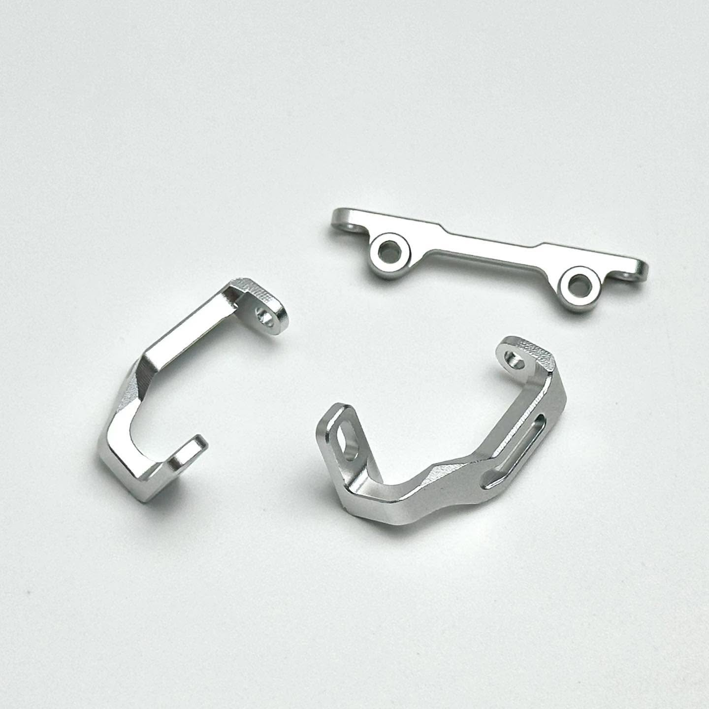
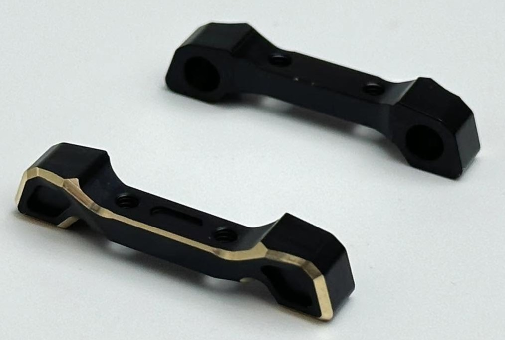
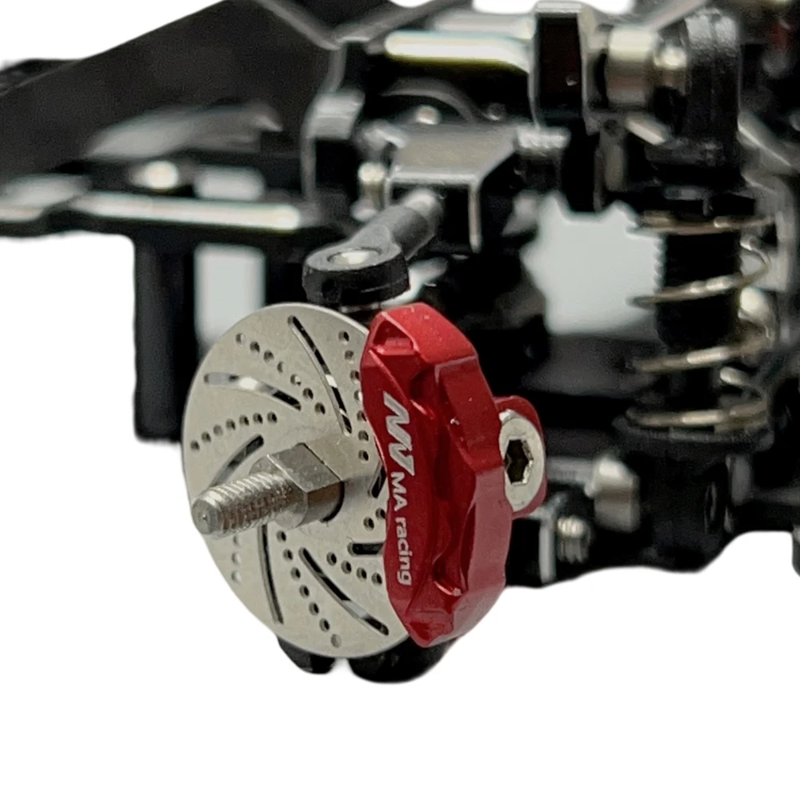

# MA Racing D24

{ width="500" }

## Quick facts

- **Developed by:** *MA Racing*

- **Release:** *January 2024*

- **Origin:** *China*

- **Status:** *Discontinued*

- **Production:** *Batch*

- **Scale:** *1/24*

- **Body mounting:** *Magnet mounting*

- **Materials:** *Aluminum, carbon fiber, injection molded plastic*

---

## Adjustability

### At-a-glance

- **Wheelbase:** ✅

- **Track width:** Front ✅ / Rear ✅

- **Camber:** Front ✅ / Rear ✅

- **Camber gain:** Front ✅ / Rear ✅

- **Caster:** ✅

- **Ackermann quick adjustment:** ✅

- **Toe:** Front ✅ / Rear ❌ (2° toe-in stock and 0° toe with optional part)

- **Ride height:** Front ✅ / Rear ✅

- **Front shocks:** preload ✅ / angle ✅

- **Rear shocks:** preload ✅ / angle ✅

- **Active systems:** ❌

- **Motor position:** mid ✅ / high ✅ / rear ✅

- **Belt tension/Pinion size:** ✅

- **Extendable dogbones:** ✅ 

- **Front KPI:** ❌

- **Steering linkage position on knuckle:** ✅

- **Servo inclination:** ❌

- **Steering rack linkage position:** ❌

### Details

- **Wheelbase adjustment method:** *slider*

- **Wheelbase range:** *98–120 mm*

- **Track width range:** *73-90+ mm*

- **Caster adjustment:** *shims*

- **Ackermann adjustment:** *stepless*

- **Rear toe behavior:** *static*

---

## Drivetrain

- **Gearbox type:** *belt-driven with v-belt*

- **Motor orientation:** *transverse*

- **Forces:** *anti-torque*

- **Reversible:** ✅

- **Differential:** *spool*

---

## Steering

- **Steering method:** *direct*

- **Servo position:** *lower deck*

---

## Suspension

- **Front:** *double wishbone, independent, 2 shocks*

- **Rear:** *double wishbone, independent, 2 shocks*

- **Shocks type:** *friction shocks*

---

## Community ratings

---

## History & Development

MA Racing had already established a reputation for exceptional quality with its original chassis, as well as its smaller sibling, the D32. This reputation played a significant role in the community's willingness to embrace the D24's premium price tag.

Having already raised the bar themselves, expectations among small-scale drifters were exceptionally high. D24 not only met those expectations but exceeded them, becoming one of the most praised and desirable chassis of its era — a reputation it continues to hold to this day.

Its stunning aesthetics, later enhanced by the introduction of red and purple editions, made the chassis even more desirable. MA also released a limited run of 30 black-and-green units, which have since become among the rarest D24 Variants. Combined with predictable handling and outstanding on-track performance, D24 delivered an experience that felt complete in every aspect.

MA Racing D24 proved that capturing the hearts of RC enthusiasts does not always require revolutionary new concepts. Sometimes, perfecting existing ideas through exceptional engineering, machining quality, fitment, and execution is enough. 

Among its many strengths, the suspension system stood out in particular. The full-metal shock construction with Teflon coating delivered exceptionally smooth operation and was regarded by many as one of the finest at the time. 

D24+ was released in January 2025 in red or purple with optional parts including aluminum chassis plate, body mount, copper rear lower arm mount for 0° toe and brakes kit with color matching calipers. The front upper arms design was updated. 

{ width="500" }
{ width="500" }
{ width="500" }
{ width="500" }
{ width="500" }

{ width="500" }

---

## Contribute

Have extra info or experience with this chassis? [Contribute here](../../../contribute/contribute.md)

---

## Sources / credits / reviews

Jack Nares
GT55Racing.com

