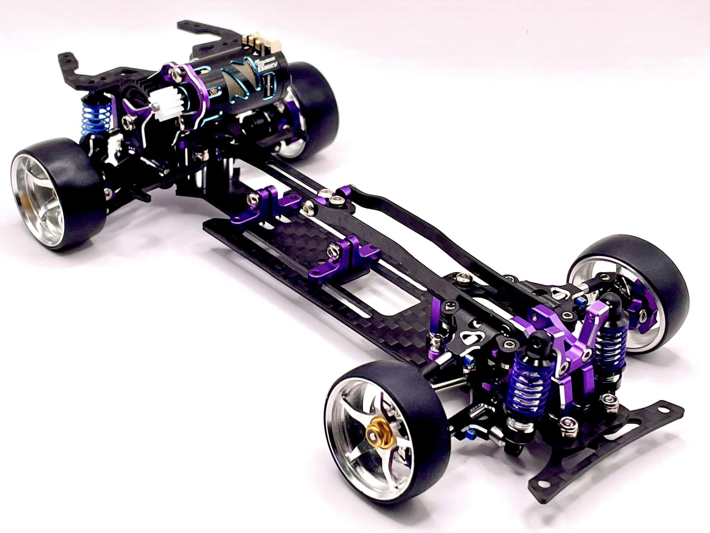

# MA Racing DLR8

{ width="500" }

## Quick facts

- **Developed by:** *MA Racing*

- **Release:** *July 2024*

- **Origin:** *China*

- **Status:** *Available  Discontinued*

- **Production:** *Batch*

- **Scale:** *1/24*

- **Body mounting:** *Magnetic posts*

- **Materials:** *Aluminum, stainless steel, carbon*

---

## Adjustability

### At-a-glance

- **Wheelbase:** ✅  

- **Camber:** Front ✅ / Rear ✅  

- **Toe:** Front ✅ / Rear ✅  

- **Caster:** ✅  

- **Ackermann quick adjustment:** ✅  

- **Ride height:** Front ✅ / Rear ✅  

- **Track width:** Front ✅ / Rear ✅  

- **Front shocks:** preload ✅ / angle ❌  

- **Rear shocks:** preload ✅ / angle ❌  

- **Active systems:** ❌  

- **Motor position:** front ❌ / mid-high ✅ / high ✅ / rear ❌  

- **Camber gain:** Front ✅ (shim ball studs on arms) / Rear ✅  

- **Belt tension/Pinion size:** ✅  

- **Front knuckle KPI hinge:** ❌  

- **Steering linkage position on knuckle:** ❌

- **Servo inclination:** ❌

- **Steering rack linkage position:** ❌

- **Extendable dogbones:** ❌ (Available as optional parts)  

### Details

- **Wheelbase adjustment method:** *slider*  

- **Wheelbase range:** *96–115 mm*  

- **Track width range:** *72–85 mm*  

- **Caster adjustment:** *stepless*  

- **Ackermann adjustment:** *stepless*  

- **Rear toe behavior:** *adjustable*  

---

## Drivetrain

- **Gearbox type:** *gear-driven / belt(OP)*  

- **Motor orientation:** *transverse*  

- **Forces:** *pro-torque (optional anti-toruqe)*  

- **Reversible gearbox:** ❌  

- **Differential:** *spool* 

---

## Steering

- **Steering method:** *pivoted*  

- **Steering type:** *bellcrank*  

- **Servo position:** *lower deck*  

---

## Suspension

- **Front:** *double wishbone, independent, 2 direct-acting shocks*  

- **Rear:** *double wishbone, independent, 2 direct-acting shocks*  

- **Shock type:** *friction shocks*  

---

## Community ratings

---

## History & Development

Following the success of the OG MA Racing chassis, D32 and D24, expectations for MA Racing's next platform were exceptionally high. Rather than continuing to refine the formula established by its predecessors, the company introduced a chassis that felt noticeably different from anything it had released before.

The DLR8 quickly drew comparisons to Yokomo MD1 platform in 1:10 scale. From its overall layout and high-CG gearbox design to its visual appearance, many hobbyists saw it as the closest thing to a "micro MD1" and eagerly anticipated its release.

Its most distinctive feature was the suspension architecture. Unlike conventional designs, all suspension arms were mounted through ball joints connected by turnbuckles. This allowed precise adjustment of arm movement while minimizing friction and binding. The concept was unusual for the scale and became one of the chassis' defining characteristics.

The drivetrain also departed from previous MA Racing designs. The mid-high motor position and internal idler gear configuration focused on pro-torque behavior, while an optional external gear allowed conversion to anti-torque operation. This gave drivers additional flexibility in tuning the chassis' handling characteristics.

Like other MA Racing products, manufacturing quality, fitment and overall execution were widely praised. However, the internal idler gear bearings proved to be a weak point on some early kits. Owners experiencing issues typically resolved them by replacing them with two 681X bearings.

The DLR8 demonstrated MA Racing's willingness to experiment with new concepts rather than simply refining existing designs. Its distinctive layout and suspension architecture made it one of the most recognizable chassis released by the company.

Some of the optional upgrade parts available for DLR8 included:

- Blue stainless steel upper deck

- Extendable dogbones

- Belt drive conversion

- Purple brake kit with matching calipers

- Copper rear arm mounts

---

## Contribute

Have additional info, corrections, or photos?  

[Contribute here](../../../contribute/contribute.md)

---

## Sources / credits / reviews

Steven Fest
Jack Nares
Dee Kühl