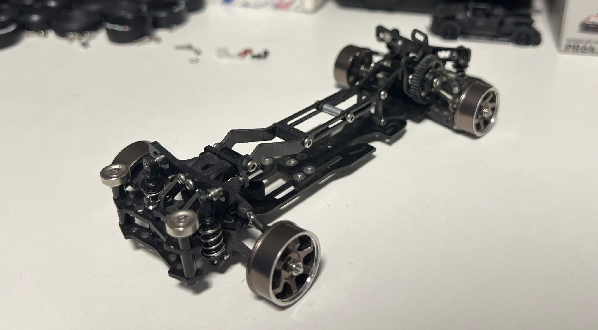
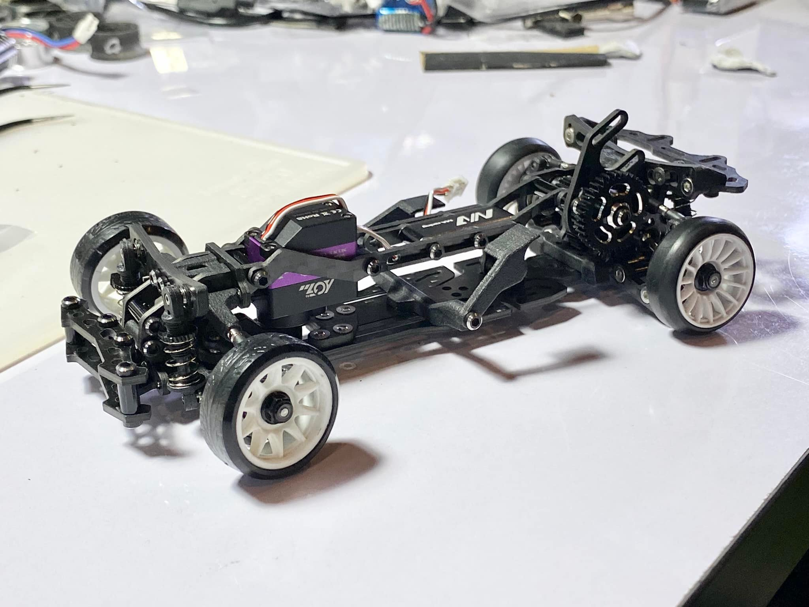
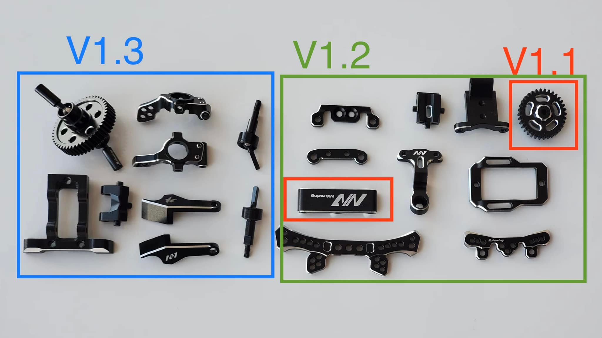
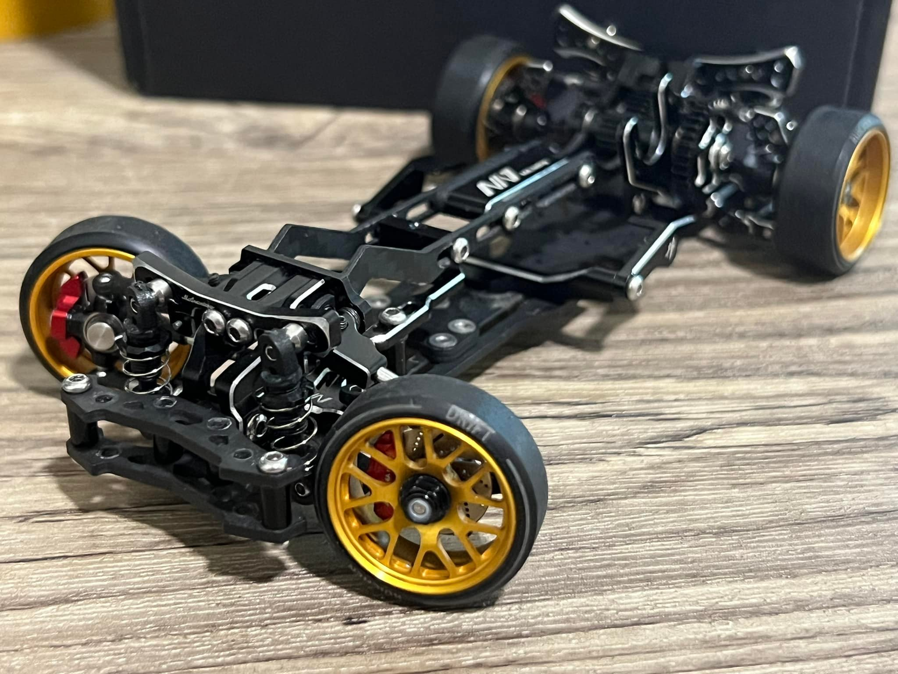
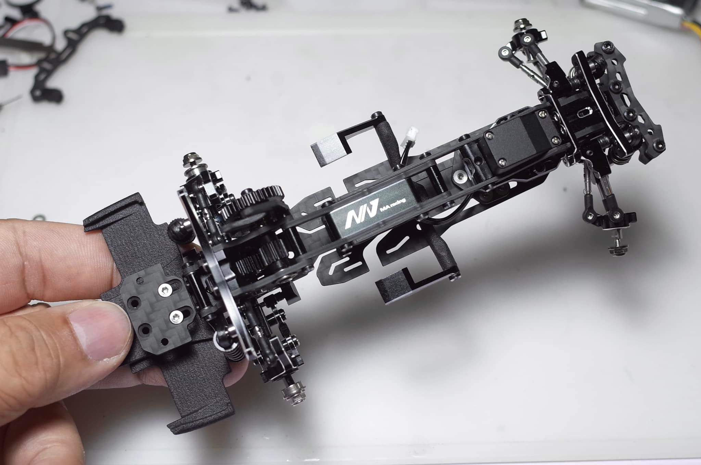

# MA Racing

{ width="500" }

## Quick facts

- **Developed by:** *MA Racing*

- **Release:** *December 2021*

- **Origin:** *China*

- **Status:** *Discontinued*

- **Production:** *Batch*

- **Scale:** *1/24*

- **Body mounting:** *Magnet mounting*

- **Materials:** *Aluminum, carbon fiber*

---

## Adjustability

### At-a-glance

- **Wheelbase:** ✅ 

- **Camber:** Front ✅  / Rear ✅ 

- **Toe:** Front ✅ / Rear ✅ (via toe blocks 0 or 2 degree)

- **Caster:** ✅

- **Ackermann quick adjustment:** ✅ 

- **Ride height:** Front ✅  / Rear ✅ 

- **Track width:** Front ✅ / Rear ✅

- **Front shocks:** preload ✅  / angle ✅ 

- **Rear shocks:** preload ✅ / angle ✅ 

- **Active systems:** ❌

- **Motor position:** mid ✅ / high ✅ / rear ✅ (Option parts)

- **Servo position:** ✅

- **Pinion-Spur distance:** ✅

- **Front knuckle KPI hinge point:** ❌

- **Front knuckle steering linkage hinge point:** ❌

- **Steering rack linkage hinge point:** ❌

### Details

- **Wheelbase adjustment method:** *slider*

- **Wheelbase range:** *98–120 mm*

- **Track width range:** *75–85 mm*

- **Caster adjustment:** *shims*

- **Ackermann adjustment:** *stepless*

- **Rear toe behavior:** *static*

---

## Drivetrain

- **Gearbox type:** *gear-driven*

- **Motor orientation:** *transverse*

- **Forces:** *anti-torque*

- **Reversible:** ✅

- **Differential:** *spool*

---

## Steering

- **Steering method:** *direct*

- **Servo position:** *upper deck + lower deck bracket after v1.2*

---

## Suspension

- **Front:** *double wishbone, independent, 2 shocks*

- **Rear:** *double wishbone, independent, 2 shocks*

- **Shocks type:** *friction shocks*

## Notes

One catchy teaser of the bearing mounted arms, promoting an easy way to get smoothly working suspension, the anticipation of the chassis was already high.  

**MA Racing V1** released in December 2021 in China.
{ width="500" }

**MA Racing v1.1 upgrade** was the first step of the platform's evolution with upgraded spur gear and branded aluminum upper deck plate.
{ width="500" }

High precision, top-notch quality aluminum upgrades were being thrown at the already good base in short period.

{ width="500" }

This rapid developement led to v1.2 in february, and v1.3 in may 2022. 

{ width="500" } 

**V1.4** Special American version dropped in July 2022.  
{ width="500" }

The final form of the evolution, **"MA Racing V1.5"** arrived in october 2022 and was considered by many to be the highest-quality chassis of its the time, rising the bar for the competitors across the small-scale drift scene.
{ width="500" }

---

## Contribute

Have extra info or experience with this chassis? [Contribute here](../../contribute/contribute.md)

---

## Sources / credits / reviews

