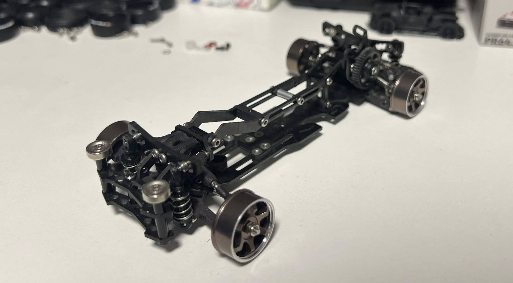
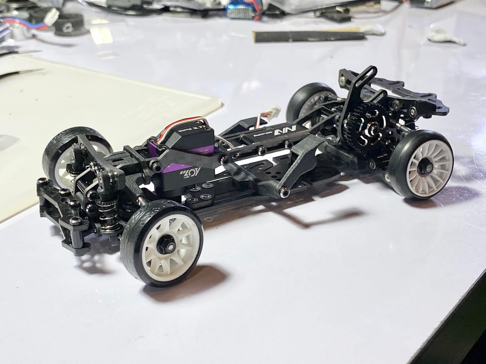
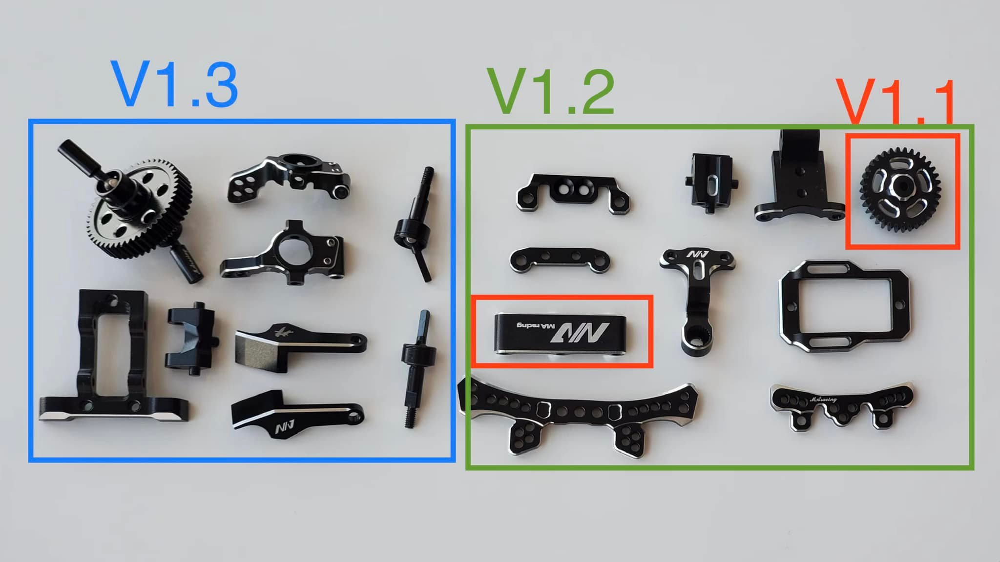
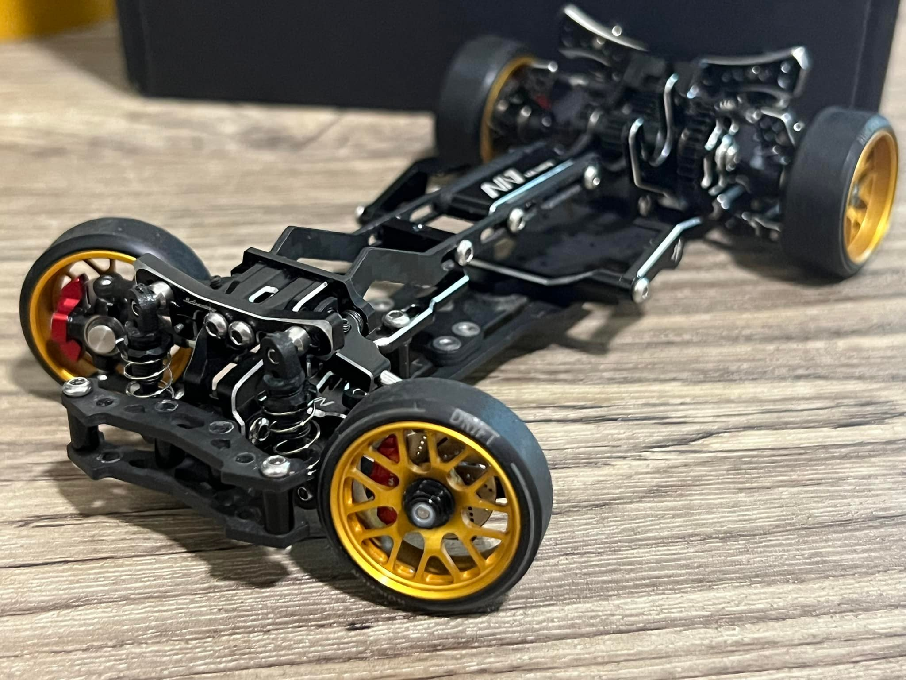
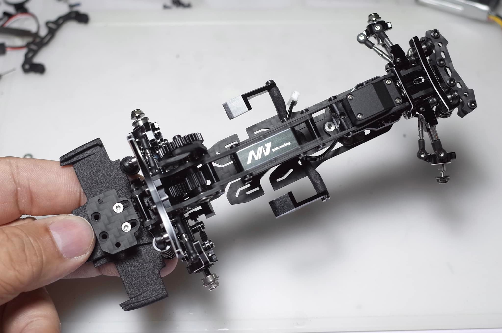
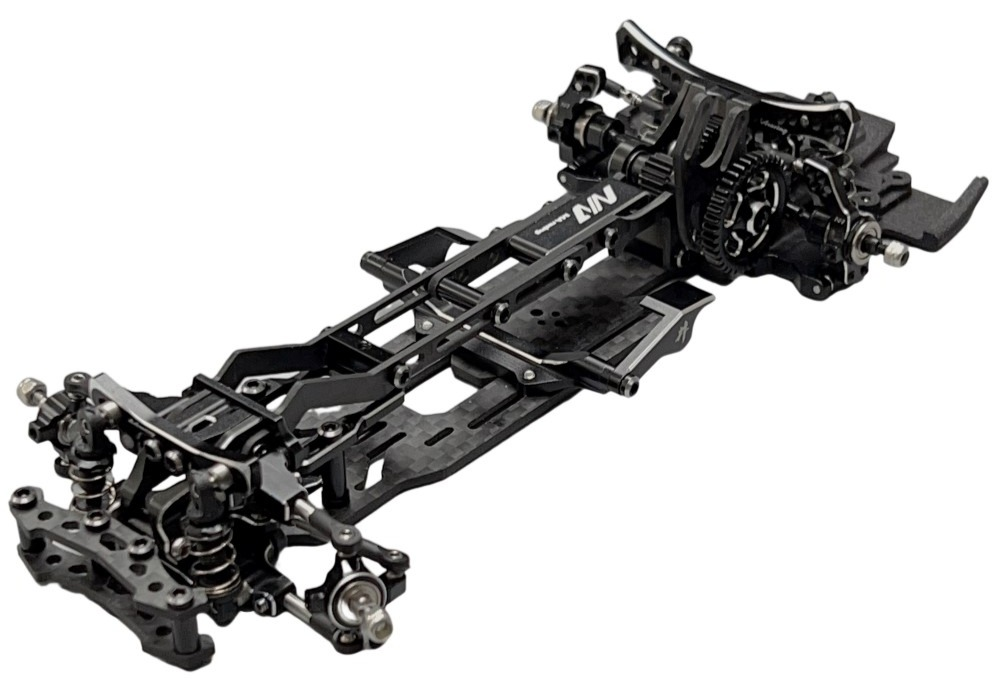

# MA Racing

{ width="500" }

## Quick facts

- **Developed by:** *MA Racing*

- **Release:** *December 2021*

- **Origin:** *China*

- **Status:** *Discontinued*

- **Production:** *Batch*

- **Scale:** *1/24*

- **Body mounting:** *Magnet mounting*

- **Materials:** *Aluminum, carbon fiber, (before V1.2, most parts were only 3D printed nylon and carbon fiber)*

---

## Adjustability

### At-a-glance

- **Wheelbase:** ✅

- **Track width:** Front ✅ / Rear ✅ (v1.5) 

- **Camber:** Front ✅  / Rear ✅ 

- **Camber gain:** Front ❌ / Rear ✅

- **Caster:** ✅

- **Ackermann quick adjustment:** ✅

- **Toe:** Front ✅ / Rear ✅ (via toe blocks 0 or 2 degree) 

- **Ride height:** Front ✅  / Rear ✅ 

- **Front shocks:** preload ✅  / angle ✅ 

- **Rear shocks:** preload ✅ / angle ✅ 

- **Active systems:** ❌

- **Motor position:** mid ✅ / high ✅ / rear ✅ (Option parts)

- **Belt tension/Pinion size:** ✅

- **Extendable dogbones:** ❌ (✅ option parts)

- **Front KPI:** ❌

- **Steering linkage position on knuckle:** ❌

- **Servo inclination:** ❌

- **Steering rack linkage position:** ❌

### Details

- **Wheelbase adjustment method:** *slider*

- **Wheelbase range:** *98–120 mm*

- **Track width range:** *75–85 mm*

- **Caster adjustment:** *shims*

- **Ackermann adjustment:** *stepless*

- **Rear toe behavior:** *static*

---

## Drivetrain

- **Gearbox type:** *gear-driven*

- **Motor orientation:** *transverse*

- **Forces:** *anti-torque*

- **Reversible:** ✅

- **Differential:** *spool*

---

## Steering

- **Steering method:** *direct*

- **Servo position:** *upper deck + lower deck bracket after v1.2*

---

## Suspension

- **Front:** *double wishbone, independent, 2 shocks*

- **Rear:** *double wishbone, independent, 2 shocks (optional straight bridge upgrade)*

- **Shocks type:** *friction shocks*

---

## Community ratings

---
## History & Development

The original MA Racing platform was the company's first chassis and marked the beginning of what would become one of the most respected names in small-scale drifting. From the outset, the developer's goal was to create a high-quality all-aluminum 1/24 RWD chassis. Rather than delaying the release until every CNC component was complete, the platform was introduced in stages while aluminum components and optional upgrades continued to be developed.

The platform quickly earned an exceptional reputation for its machining quality, precise fitment and suspension smoothness. Owners consistently praised the clean carbon-fiber machining, quiet gear drivetrain and precise assembly, with many considering MA Racing among the highest-quality chassis available during its production. Several experienced builders regarded it as matching or surpassing contemporary platforms such as [DKMK3](../../dk/dkmk3/page.md) and [DriftART2](../../da/driftart2/page.md) in manufacturing quality and overall refinement.

Assembly was generally described as detailed but highly enjoyable. Builders frequently noted that the supplied PDF instructions, precise machining and generous selection of shims allowed the chassis to be assembled with virtually no corrective fitting. Compared with several competing kits, the gearbox and suspension were often described as easier to build despite the platform's complexity.

Community criticism remained limited, focusing primarily on the premium purchase price, initially limited spare-parts availability and the ongoing debate surrounding some design changes introduced in the later revisions. Even so, the platform established the design philosophy and reputation that would later be reflected in platforms such as the D32, [D24](../d24/page.md) and [DLR8](../dlr8/page.md).

---

## Evolution

Unlike many platforms that were replaced by completely new generations, the original MA Racing chassis evolved gradually through both complete kits and upgrade packages. Existing owners could progressively update their chassis as new aluminum components became available, making the boundaries between individual revisions less distinct than their version numbers might suggest.

**MA Racing V1 — December 2021**

{ width="500" }

The first production version established the mechanical foundation of the MA Racing platform. It relied primarily on 3D-printed nylon and carbon fiber components, while already incorporating unusually elaborate details such as bearing-supported front suspension arms. The developer's intended all-aluminum configuration had not yet been completed, making V1 the starting point of a platform designed to evolve through later upgrade stages.

---

**MA Racing V1.1**

{ width="500" }

The first CNC upgrades appeared, including an aluminum spur gear and the branded aluminum upper deck. These parts were available as part of the developing chassis specification and as upgrades for existing owners.

---

**MA Racing V1.2 — February 2022**

{ width="500" }

V1.2 expanded the use of machined aluminum with a new servo arm and mount, front shock tower and additional front-end components.

---

**MA Racing V1.3 — May 2022**

{ width="500" }

V1.3 continued the transition toward the developer's intended all-aluminum configuration. New components included aluminum rear knuckles, spool, telescopic CVDs and battery retainers.

During this period, MA Racing also introduced optional upgrades including:

- CNC brake calipers and discs
- Rear motor mount
- Rear straight-bridge suspension
- Flysky GMR receiver case
- Chamfered aluminum M2 screws

---

**MA Racing V1.4 — July 2022**

{ width="500" }

V1.4 was commonly used to describe the platform after the remaining major aluminum suspension components became available, including the front knuckles, front and rear arms, toe blocks, battery holder and other CNC parts. It represented the completion of the original transition from a mixed carbon-and-nylon chassis into a nearly full-aluminum configuration.

The designation did not always identify a completely separate production kit. Existing V1.3 owners could reach what was considered V1.4 specification by installing the newly released components, and complete chassis were also offered in the updated configuration.

---

**MA Racing V1.5 — October 2022**

{ width="500" }

V1.5 was the final and most substantial revision of the original platform. It introduced a redesigned main chassis, an integrated battery-retention system, mounting provisions for the GT55 V4 gyro, telescopically adjustable rear lower arms, additional gear-ratio options and metal front and rear gearbox plates.

The miniature bearings previously supporting the front suspension-arm pivots were replaced by precisely located polymer inserts. The change was intended to reduce play, improve consistency and simplify assembly. Although some community members initially regarded the removal of the bearings as a possible downgrade, completed builds demonstrated that the revised arms retained exceptionally smooth movement.

Owners who compared the revisions generally described V1.5 as easier to assemble, more durable and more adjustable, rather than fundamentally superior in driving performance to a properly prepared V1.3 or V1.4. It completed the development of the original MA Racing chassis before the company shifted its attention to subsequent platforms.

---

## Contribute

Have extra info or experience with this chassis? [Contribute here](../../../contribute/contribute.md)

---

## Sources / credits / reviews

Thanks to TC Emre Yurdakul and Nares Jack Vacharaksa for providing valuable info about MA's history.

