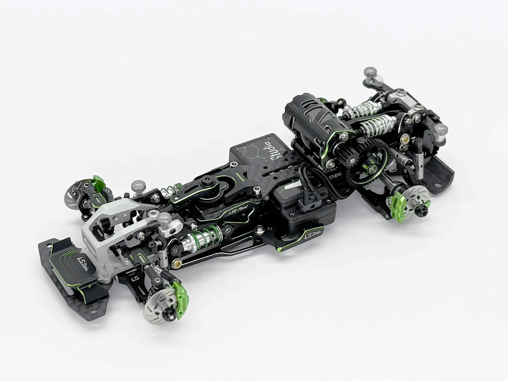

# Chassis

{ width="500" }

## Quick facts

- **Developed by:** *LS Studios*

- **Release:** *January 2024*

- **Origin:** *China*

- **Status:** *Discontinued*

- **Production:** *Batch*

- **Scale:** *1/24-1/28*

- **Body mounting:** *Magnet mounting/MINI-Z*

- **Materials:** *materials*

---

## Adjustability

### At-a-glance

- **Wheelbase:** ✅

- **Track width:** ✅

- **Camber:** Front ✅ / Rear ✅

- **Camber gain:** Front ❌ / Rear ❌

- **Caster:** ✅

- **Ackermann quick adjustment:** ✅

- **Toe:** Front ✅ / Rear ❌ -3

- **Ride height:** Front ✅ / Rear ✅

- **Front shocks:** preload ✅ / angle ✅

- **Rear shocks:** preload ✅ / angle ✅

- **Active systems:** ❌

- **Motor position:** mid ✅ / mid-high ✅ / rear ✅

- **Belt tension/Pinion size:** ✅

- **Extendable dogbones:** ❌

- **Front knuckle KPI:** ❌

- **Steering linkage position on knuckle:** ❌

- **Steering rack linkage position:** ❌

### Details

- **Wheelbase adjustment method:** *slider*

- **Wheelbase range:** *84–110 mm*

- **Track width range:** *Front 66–77(up to 83 mm with op parts) mm / Rear 66-80 mm*

- **Caster adjustment:** *stepless*

- **Ackermann adjustment:** *stepless*

- **Rear toe behavior:** *static*

---

## Drivetrain

- **Gearbox type:** *gear-driven / belt-driven(optional)*

- **Motor orientation:** *transverse*

- **Forces:** *anti-torque*

- **Reversible:** ✅

- **Differential:** *Spool / Ball (optional)*

---

## Steering

- **Steering method:** *pivoted*

- **Steering system:** *dual wiper*

- **Servo position:** *lower deck*

---

## Suspension

- **Front:** *double wishbone, independent, 2 longitudinal cantilever shocks*

- **Rear:** *double wishbone, independent, 2 longitudinal cantilever shocks / horizontal shocks (with optional parts)*

- **Shocks type:** *friction shocks*

---

## Community ratings

---

## History & Development

Following the original LSD, the NLSD became LS Studio's second chassis platform. While building upon the experience gained from the LSD, it introduced a substantially redesigned platform that would define the company's distinctive engineering philosophy.

The NLSD quickly became recognizable thanks to its distinctive appearance and unique engineering. Unlike most contemporary chassis, its design could be identified at a glance, while the zero-slop dual wiper-crank steering system and exceptional machining quality made it one of the most precisely manufactured kits of its time.

The community praised the chassis for its outstanding machining quality, extensive use of 5-axis CNC manufacturing and virtually zero mechanical play. Although its premium price placed it beyond the reach of many hobbyists, it was widely regarded as a showcase of what uncompromising engineering could achieve.

The platform later evolved into the LSD Plaid. More importantly, the NLSD reinforced LS Studio's reputation as a manufacturer willing to prioritize engineering quality over production cost, proving that there was a market for ultra-premium small-scale drift chassis.

LSD Plaid - March 2025
{ width="500" }

---

## Contribute

Have extra info or experience with this chassis? [Contribute here](../../contribute/contribute.md)

---

## Sources / credits / reviews

