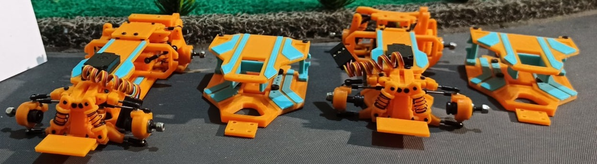

# PWK V2

{ width="500" }

## Quick facts

- **Developed by:** *Pur Woko*

- **Release:** *January 2020*

- **Origin:** *Indonesia*

- **Status:** *Discontinued*

- **Production:** *Batch*

- **Scale:** *1/28(could do 1/24 with the adjustable WB chassis)*

- **Body mounting:** *Kyosho / holes for DIY magnetic posts*

- **Materials:** *FDM 3D Printed*

---

## Adjustability

### At-a-glance

- **Wheelbase:** ✅(with the adjustable chassis. Slim deck version is fixed 94mm)

- **Camber:** Front ✅ / Rear ✅

- **Toe:** Front ✅ / Rear ❌(✅ V2SE)

- **Caster:** ❌

- **Ackermann quick adjustment:** ❌

- **Ride height:** Front ✅ / Rear ✅

- **Track width:** Front ✅ / Rear ❌

- **Front shocks:** preload ❌(✅ preload clips can be applied) / angle ❌

- **Rear shocks:** preload ❌(✅ preload clips can be applied) / angle ✅

- **Active systems:** ✅(V2SE Active rear toe)

- **Motor position:** mid ❌ / high ✅(MR version) / rear ✅(RR version)

- **Servo position:** ❌ 

- **Pinion-Spur distance:** ✅

- **Front knuckle KPI hinge point:** ✅

- **Front knuckle steering linkage hinge point:** ✅

- **Steering rack linkage hinge point:** ❌

### Details

- **Wheelbase adjustment method:** *steps*

- **Wheelbase range:** *90–110 mm(fixed 94mm for slim deck)*

- **Track width range:** *??–?? mm*

- **Caster adjustment:** *static*

- **Ackermann adjustment:** *steering linkages length/position*

- **Rear toe behavior:** *static / dynamic V2SE*

---

## Drivetrain

- **Gearbox type:** *gear-driven*

- **Motor orientation:** *transverse*

- **Forces:** *anti-torque*

- **Reversible:** ❌

- **Differential:** *unknown*

---

## Steering

- **Steering method:** *direct*

- **Servo position:** *upper deck*

---

## Suspension

- **Front:** *double wishbone, independent, 2 shocks*

- **Rear:** *double wishbone / multi-link(V2SE), independent, 2 shocks*

- **Shocks type:** *friction shocks*

## Notes
PWK V2 was an evolution of the original PWK platform with the most noticeable changes being:

- rear motor layout
- anti-torque gearbox

That resulted in rear biased weight center and pro-squat torque reaction, creating a much more suitable foundation for the active rear toe system introduced late in the V2SE.

---

**PWK V2SE RR SD & PWK V2SE MR kits** 

{ width="500" }

The V2SE, SD and RR/MR gave more options for different styles:

- active rear toe was impressive back then, especially for small scale 3D printed kit
- the narrow decks are modern even today. Upgrade that aged like a fine wine
- rear motor or high motor options
- the kit came with slim deck chassis and adjustable wheelbase chassis

---

## Contribute

Have extra info or experience with this chassis? [Contribute here](../../contribute/contribute.md)

---

## Sources / credits / reviews

