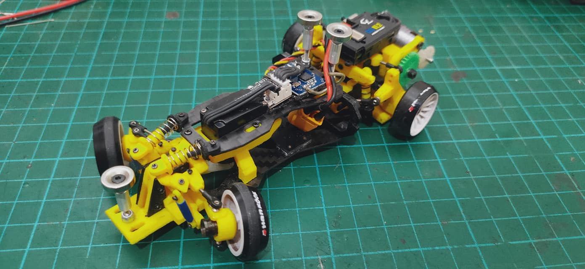

# PWK V3SE

{ width="500" }

## Quick facts

- **Developed by:** *Pur Woko*

- **Release:** *September 2020*

- **Origin:** *Indonesia*

- **Status:** *Discontinued*

- **Production:** *Batch*

- **Scale:** *1/28-1/24*

- **Body mounting:** *Kyosho / Holes for DIY magnetic posts*

- **Materials:** *FDM 3D Printed*

---

## Adjustability

### At-a-glance

- **Wheelbase:** ✅

- **Camber:** Front ✅ / Rear ✅

- **Toe:** Front ✅ / Rear ✅

- **Caster:** ❌

- **Ackermann quick adjustment:** ✅

- **Ride height:** Front ✅ / Rear ✅

- **Track width:** Front ✅ / Rear ❌

- **Front shocks:** preload ❌(preload clips can be applied) / angle ❌

- **Rear shocks:** preload ❌(preload clips can be applied) / angle ✅

- **Active systems:** ✅(active rear toe)

- **Motor position:** mid ❌ / high ✅ / rear ✅

- **Servo position:** ✅

- **Pinion-Spur distance:** ✅

- **Front knuckle KPI hinge point:** ❌

- **Front knuckle steering linkage hinge point:** ✅

- **Steering rack linkage hinge point:** ❌

### Details

- **Wheelbase adjustment method:** *2mm steps*

- **Wheelbase range:** *90-110 (infered)*

- **Track width range:** *??–?? mm*

- **Caster adjustment:** *static*

- **Ackermann adjustment:** *slider*

- **Rear toe behavior:** *dynamic*

---

## Drivetrain

- **Gearbox type:** *gear-driven*

- **Motor orientation:** *transverse*

- **Forces:** *anti-torque*

- **Reversible:** ❌

- **Differential:** *unknown*

---

## Steering

- **Steering method:** *direct*

- **Servo position:** *upper deck*

---

## Suspension

- **Front:** *double wishbone, independent, cantilever 2 shocks*

- **Rear:** *multi-link, independent, 2 shocks*

- **Shocks type:** *friction shocks*

## Notes

**Upgrades to highlight:**

- quick Ackermann adjustment option added
- cantilever front shock system  

  
**Oha Shinosuke's PWK V3 SE with carbon decks**

{ width="500" }

---

## Contribute

Have extra info or experience with this chassis? [Contribute here](../../contribute/contribute.md)

---

## Sources / credits / reviews

