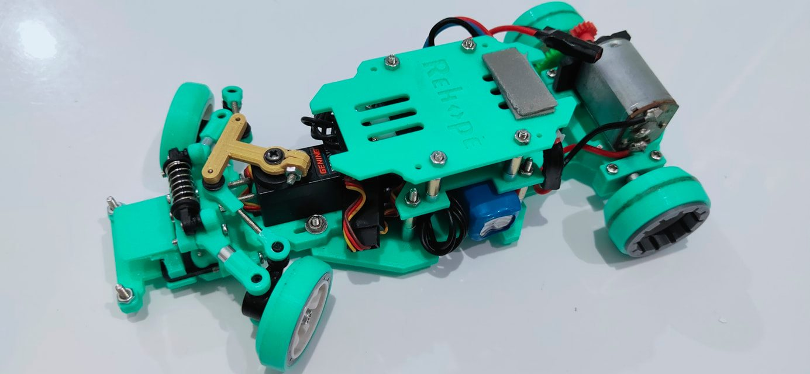
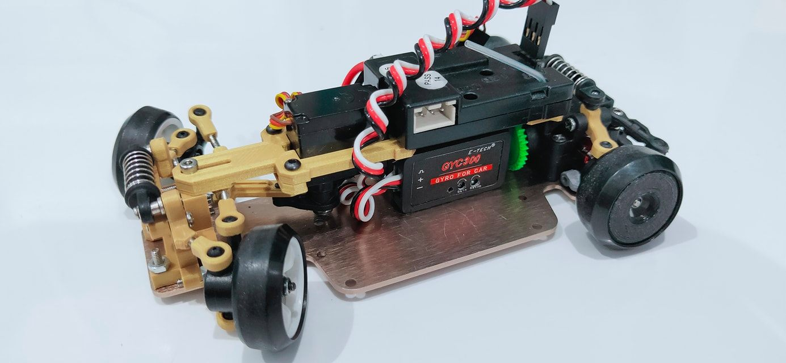
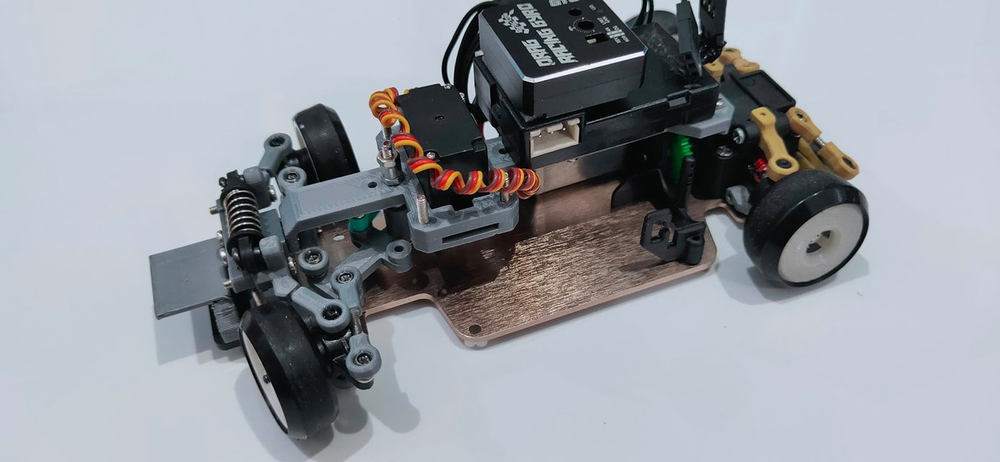

# K-EP Rehope Pro

{ width="500" }

## Quick facts

- **Developed by:** *K-Enhance Project(Al Kautsar Kilimanjaro)*

- **Release:** *August 2020*

- **Origin:** *Indonesia*

- **Status:** *Discontinued*

- **Production:** *Pre-Order*

- **Scale:** *1/24-1/28*

- **Body mounting:** *Magnetic posts, Kyosho mount?*

- **Materials:** *PLA*

---

## Adjustability

### At-a-glance

- **Wheelbase:** ✅ 

- **Camber:** Front ✅ / Rear ❌

- **Toe:** Front ✅ / Rear ❌

- **Caster:** ✅

- **Ackermann quick adjustment:** ❌ 

- **Ride height:** Front ✅ / Rear ❌

- **Track width:** Front ✅ / Rear ✅

- **Front shock:** preload ✅ 

- **Active systems:** ❌

- **Motor position:** mid ❌ / high ✅ / rear ❌

- **Servo position:** ❌

- **Front knuckle KPI hinge point:** ❌

- **Front knuckle steering linkage hinge point:** ❌

- **Steering rack linkage hinge point:** ❌

- **Extendable dogbones:** ❌

### Details

- **Wheelbase adjustment method:** *slider*

- **Wheelbase range:** *94-110 mm*

- **Track width range:** *70-75 mm*

- **Front width adjustment method:** *stepless*

- **Rear width adjustment method:** *spacers*

- **Caster adjustment:** *shims*

- **Ackermann adjustment:** *steering linkages*

- **Rear toe behavior:** *static*

- **Rear toe adjustment method:** *fixed*

---

## Drivetrain

- **Gearbox type:** *direct drive(plastic gears)*

- **Motor orientation:** *transverse*

- **Forces:** *pro-torque(later updated gearbox design to anti-torque)*

- **Reversible:** ❌

- **Differential:** *straight axle*

---

## Steering

- **Steering method:** *direct*

- **Servo position:** *lower deck*

---

## Suspension

- **Front:** *double wishbone, independent(monoshock coupled)*

- **Rear:** *Flex Bridge*

- **Shocks type:** *friction shock*

## Notes

**K-Enhance Project was born as Wltoys K9 front end conversion:**

{ width="500" }

**Then Al Kautsar named the first evolution: Rehope**

{ width="500" }

Third version of rehope was designed, but never released for public.

The creator wanted to use narrow body Nissan Silvia CSP311 '66, but the chassis was too wide, so he had to make the chassis narrower.

That's why he designed [K-EP Slimmer](../slimmer/page.md) 

---

## Contribute

Have extra info or experience with this chassis? [Contribute here](../../contribute/contribute.md)

---

## Sources / credits / reviews

