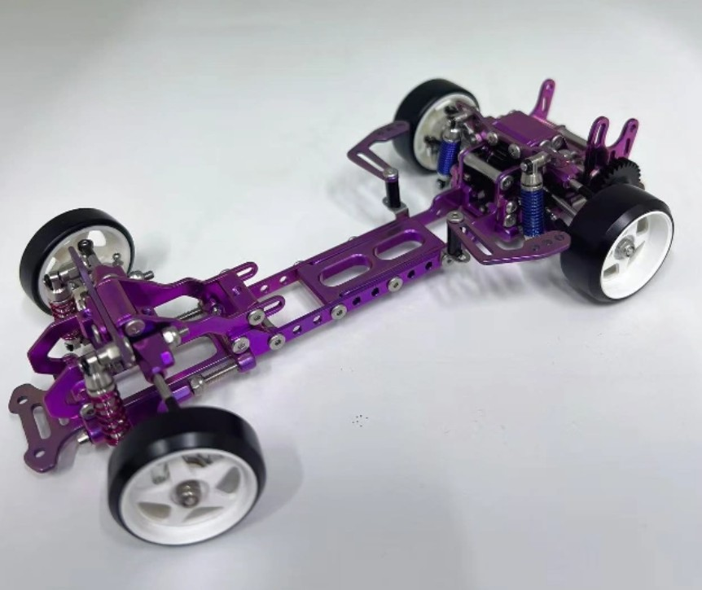

# Rhino Racing RTS

{ width="500" }

## Quick facts

- **Developed by:** *Rhino Racing*
- **Release:** *March 2024*
- **Origin:** *China*
- **Status:** *Available*
- **Production:** *Batch*
- **Scale:** *1/24*
- **Body mounting:** *Magnet mounting*
- **Materials:** *Stainless steel & injection molded plastic (titanium OP)*

---

## Adjustability

### At-a-glance
- **Wheelbase:** ✅
- **Camber:** Front ✅ / Rear ✅
- **Toe:** Front ✅ / Rear ✅
- **Caster:** ✅
- **Ackermann quick adjustment:** ✅
- **Ride height:** Front ✅ / Rear ✅
- **Track width:** Front ✅ / Rear ✅
- **Front shocks:** preload ✅ / angle ✅
- **Rear shocks:** preload ✅ / angle ✅
- **Active systems:** ❌
- **Motor position:** mid ❌ / high ✅ / rear ✅
- **Servo position:** ✅
- **Pinion-Spur distance:** ✅
- **Front knuckle KPI hinge point:** ❌
- **Front knuckle steering linkage hinge point:** ❌
- **Steering rack linkage hinge point:** ✅

### Details
- **Wheelbase adjustment method:** *slider + steps*
- **Wheelbase range:** *93–129 mm*
- **Track width range:** *69–85 mm*
- **Caster adjustment:** *stepless*
- **Ackermann adjustment:** *stepless*
- **Rear toe behavior:** *adjustable*

---

## Drivetrain
- **Gearbox type:** *gear-driven (mixed gears)*
- **Motor orientation:** *transverse*
- **Forces:** *anti-torque*
- **Reversible:** ❌
- **Differential:** *spool*

---

## Steering
- **Steering method:** *direct*
- **Servo position:** *bulkhead mounted*

---

## Suspension
- **Front:** *double wishbone, independent, 2 shocks*
- **Rear:** *multi-link, independent, 2 shocks*
- **Shocks type:** *friction shocks*

## Notes

Available upgrade parts.

Full limited edition titanium kit, labeled as TC4, is available as well:

{ width="500" }

---

## Contribute

Have extra info or experience with this chassis? [Contribute here](../../contribute/contribute.md)

---

## Sources / credits / reviews
