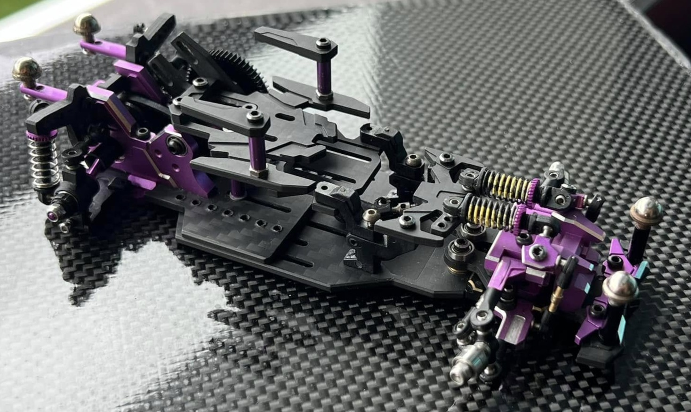
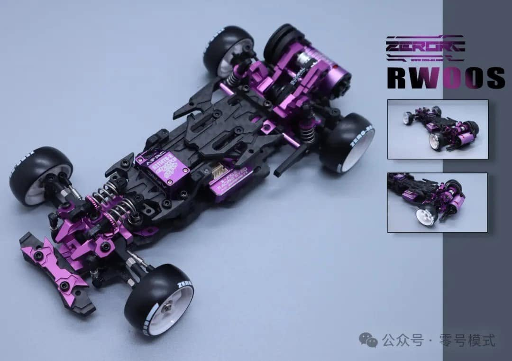
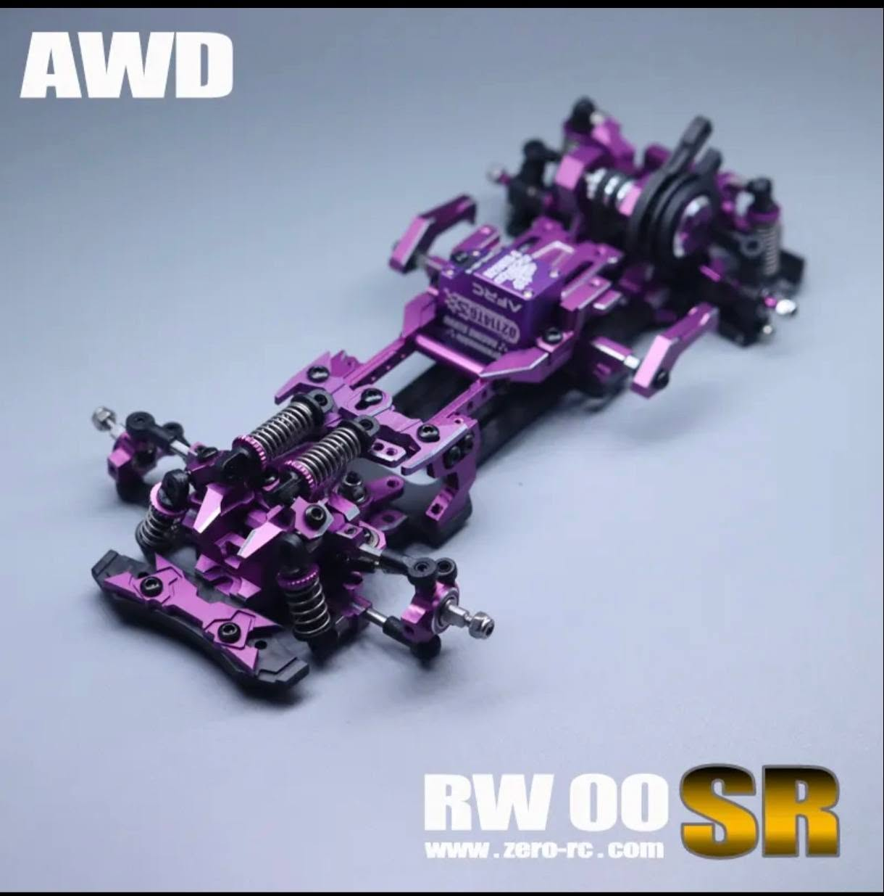
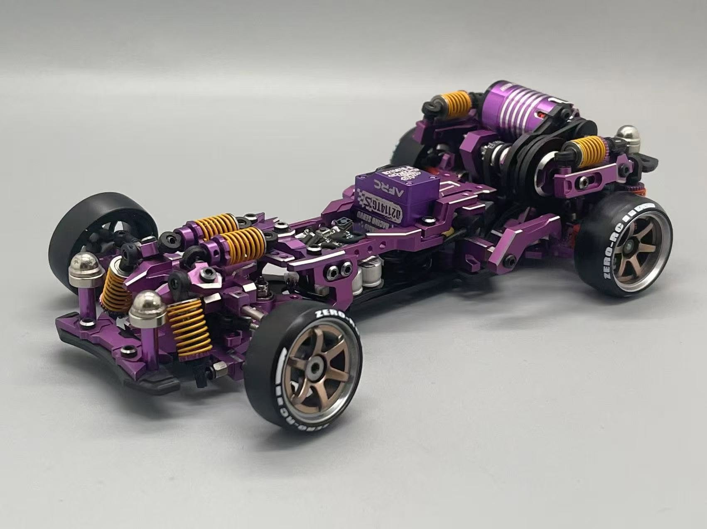

# ZERO-RC RW00

{ width="500" }

## Quick facts

- **Developed by:** *Zero-RC*

- **Release:** *January 2022*

- **Origin:** *China*

- **Status:** *Discontinued(RW00SR is available)*

- **Production:** *Mass*

- **Scale:** *1/24*

- **Body mounting:** *Magnet mounting*

- **Materials:** *Aluminum, plastic*

---

## Adjustability

### At-a-glance

- **Wheelbase:** ✅

- **Camber:** Front ✅ / Rear ✅

- **Toe:** Front ✅ / Rear ✅

- **Caster:** ✅

- **Ackermann quick adjustment:** ❌

- **Ride height:** Front ✅ / Rear ✅

- **Track width:** Front ✅ / Rear ❌ (✅ upgrade parts)

- **Front shocks:** preload ✅ / angle ✅

- **Rear shocks:** preload ✅ / angle ✅

- **Active systems:** ❌

- **Motor position:** mid ✅ / high ✅ / rear ✅

- **Servo position:** ❌

- **Pinion-Spur distance:** ✅

- **Front knuckle KPI hinge point:** ❌

- **Front knuckle steering linkage hinge point:** ❌

- **Steering rack linkage hinge point:** ❌

### Details

- **Wheelbase adjustment method:** *slider*

- **Wheelbase range:** *98–120 mm*

- **Track width range:** *75–80 mm*

- **Caster adjustment:** *shims / slider(to be confirmed)*

- **Ackermann adjustment:** *linkages length*

- **Rear toe behavior:** *static*

---

## Drivetrain

- **Gearbox type:** *gear-driven / belt-driven(v-belt) / mixed*

- **Motor orientation:** *transverse*

- **Forces:** *pro-torque / anti-torque*

- **Reversible:** ❌

- **Differential:** *Ball*

---

## Steering

- **Steering method:** *pivoted*

- **Steering system:** *dual bellcrank*

- **Servo position:** *both upper and lower deck fixed*

---

## Suspension

- **Front:** *double wishbone, independent, 2 cantilever shocks*

- **Rear:** *multi-link, independent, 2 shocks*

- **Shocks type:** *friction shocks*

## Notes

Zero RW00 is a beautiful, high-quality platform with a few evolutions and can be adjusted in variety of different ways.
Zero RC is known for providing one of the most detailed instruction manuals, including setup and tuning recommendations.

**RW00S** released in may 2024
{ width="500" }

**RW00SR** released in may 2025 in a few different versions, including AWD front axles
{ width="500" }

The platform supports more than 10 shocks, allowing very fine control over suspension behavior throughout the travel range.
Multiple drivtrain layouts and extensive possibilities in a single chassis. 
{ width="500" }

---

## Contribute

Have extra info or experience with this chassis? [Contribute here](../../contribute/contribute.md)

---

## Sources / credits / reviews

