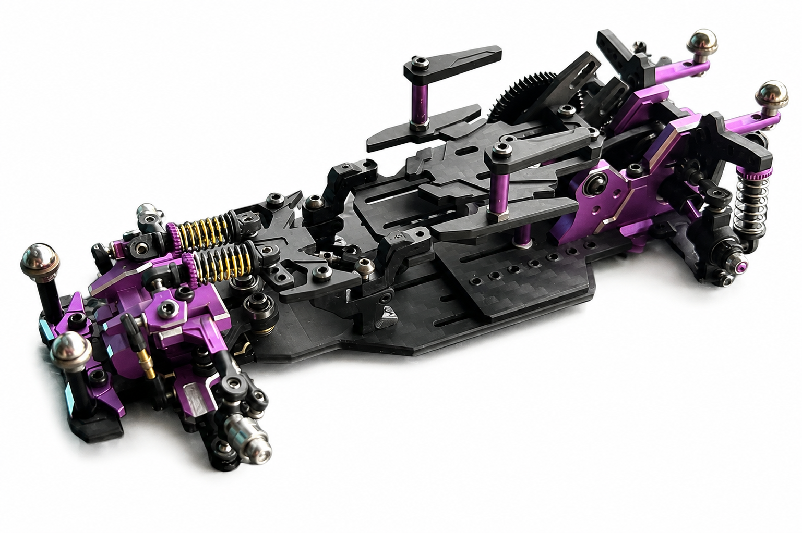
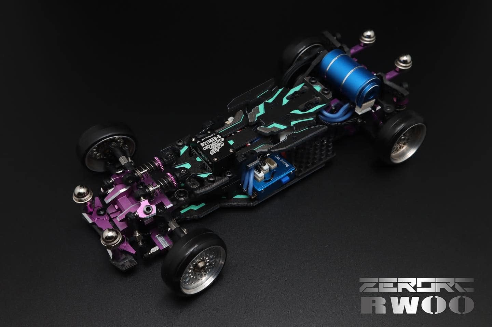
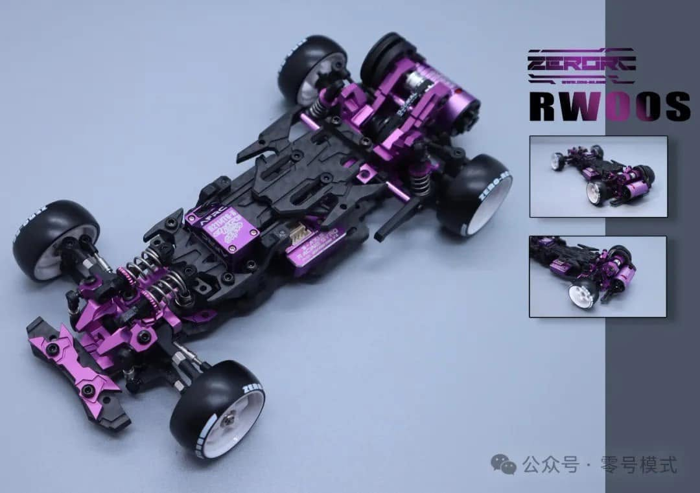
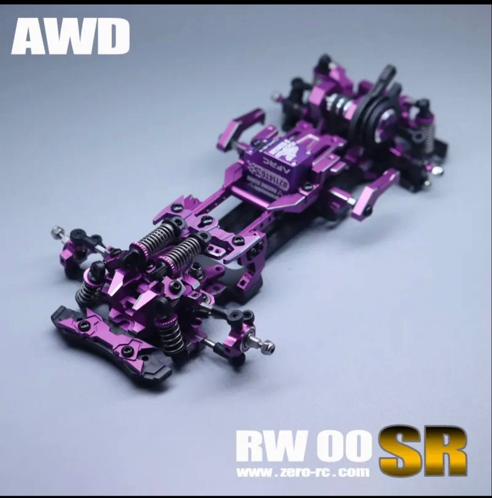
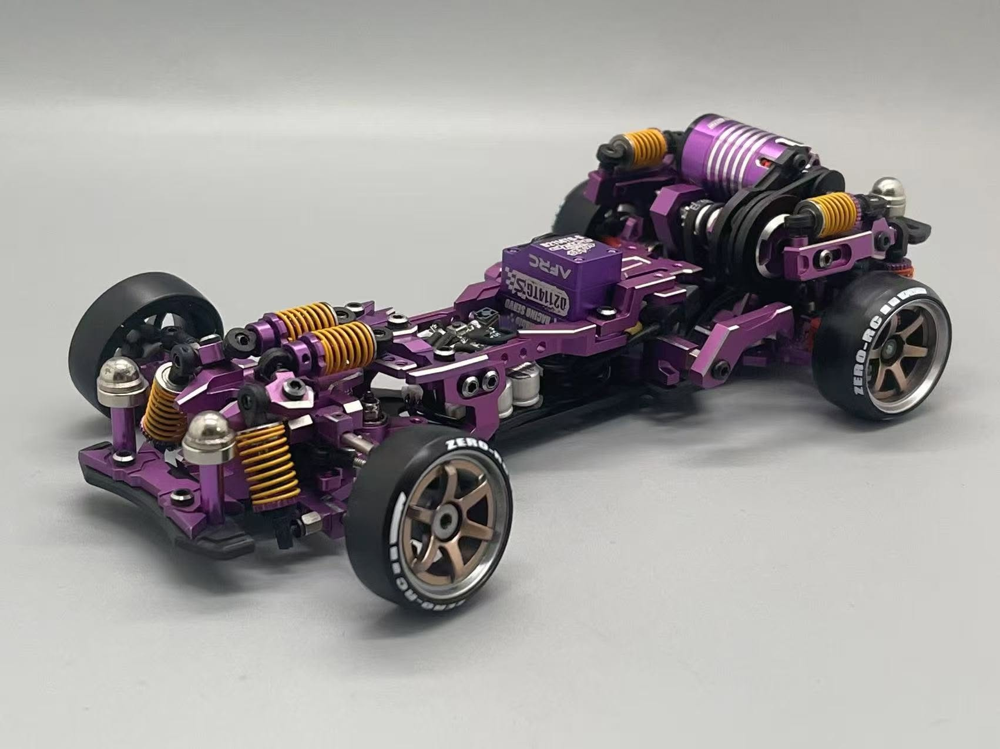

# ZERO-RC RW00 / RW00S / RW00SR

{ width="500" }

## Quick facts

- **Developed by:** *Zero-RC*

- **Release:** *June 2021*

- **Origin:** *China*

- **Status:** *RW00 & RW00S discontinued / RW00SR available*

- **Production:** *Mass*

- **Scale:** *1/24*

- **Body mounting:** *Magnet mounting*

- **Materials:** *Aluminum, carbon fiber, plastic*

---

## Adjustability

### At-a-glance

- **Wheelbase:** ✅

- **Track width:** Front ✅ / Rear ❌ (✅ optional parts)

- **Camber:** Front ✅ / Rear ✅

- **Caster:** ✅

- **Camber gain:** Front ❌ / Rear ✅

- **Ackermann quick adjustment:** RW00 ❌ / RW00S ✅ / RW00SR ✅

- **Toe:** Front ✅ / Rear ✅

- **Ride height:** Front ✅ / Rear ✅

- **Front shocks:** preload ✅ / angle ✅

- **Rear shocks:** preload ✅ / angle ✅

- **Active systems:** ❌

- **Motor position:** mid ✅ / high ✅ / rear ✅

- **Belt tension/Pinion size:** ✅
  
- **Extendable dogbones:** ❌  

- **Front knuckle KPI:** RW00 ❌ / RW00S ❌ / RW00SR ✅

- **Steering linkage position on knuckle:** RW00 ❌ / RW00S ❌ / RW00SR ✅

- **Steering rack linkage position:** RW00 ❌ / RW00S ✅ / RW00SR ✅

### Details

- **Wheelbase adjustment method:** *slider*

- **Wheelbase range:** *98–120 mm*

- **Track width range:** *RW00 75–80 mm / RW00S 67.2–83.5 mm / RW00SR 76–87 mm*

- **Caster adjustment:** *slider*

- **Ackermann adjustment:** *RW00 tie-rod length / RW00S & RW00SR slider*

- **Rear toe behavior:** *static*

---

## Drivetrain

- **Gearbox type:** *gear-driven / belt-driven(v-belt) / mixed*

- **Motor orientation:** *transverse*

- **Forces:** *pro-torque / anti-torque*

- **Reversible:** RW00 ❌ / RW00S ✅ / RW00SR ✅

- **Differential:** *Ball*

---

## Steering

- **Steering method:** *pivoted*

- **Steering system:** *dual bellcrank*

---

## Suspension

- **Front:** *double wishbone, independent, 2 cantilever shocks, up to 4 shocks depending on version and optional parts*

- **Rear:** *multi-link, independent, 2 shocks, up to 5 shocks depending on version and optional parts*

- **Shocks type:** *friction shocks*

## Community ratings

## History & Development

The Zero-RC RW00 was first announced in 2021, introducing not only a new RWD chassis but also the philosophy behind the Zero-RC brand. The company described its goal as making highly adjustable small-scale RWD drift chassis easier to build, tune and understand, while the name RW00 reflected both the rear-wheel-drive layout and the brand's "starting from zero" philosophy. Community discussions suggested that the original BM Racing [BMR-X](../bm-racing/bmrx/page.md) and the Zero-RC RW00 shared the same designer. This was later confirmed directly by the designer himself. According to him, the first-generation BMR-X was his design, while the subsequent BM Racing products were developed after his departure.

Unlike many manufacturers, Zero-RC publicly documented the chassis throughout its development and placed a strong emphasis on education. Before the chassis even reached production, the company announced that its manual would go far beyond assembly instructions, covering setup theory, tuning principles and practical guidance for open chassis. This comprehensive documentation quickly became one of the platform's defining characteristics.

The first production batch was released as a limited run of 100 chassis for the domestic Chinese market. These early kits featured decorative printed carbon plates and aluminum front and rear gearboxes, while later production batches omitted the decorative graphics. Shortly after release, Zero RC continued publishing setup guides covering steering geometry, Ackermann adjustment and other technical subjects, reinforcing the company's commitment to supporting users beyond the initial purchase.

Community reception during 2022 was largely positive. Early owners consistently praised the machining quality, detailed English documentation, logical packaging and straightforward assembly process. Many also highlighted the manufacturer's responsiveness when technical questions arose. Minor criticisms primarily concerned small manufacturing imperfections on individual hardware pieces, steering link play on early versions and ball differential adjustment, while overall build quality and driving performance were widely regarded as strengths. The online manual itself became a frequently referenced resource, with experienced owners regularly recommending that newcomers follow the factory setup before making tuning changes.

Development of the platform continued after release through a growing range of optional components and technical improvements. By 2023, Zero RC had introduced additional aluminum option parts, upgraded steering components and brake accessories while continuing to expand the chassis ecosystem rather than replacing it outright.

In 2024, Zero RC introduced the RW00S as the official successor to the original RW00. It was developed as an extensive evolution focused on increasing adjustability and track adaptability. Major revisions included redesigned front and rear gearboxes, multi-position drivetrain and motor angle adjustment, improved suspension mounting options and a new integrated rear gearbox capable of supporting both MR and RR layouts. Importantly, Zero RC stated that approximately 90% of the existing RW00 optional parts remained compatible with the RW00S, and confirmed that existing RW00 owners could upgrade to the newer specification by replacing several major assemblies rather than purchasing an entirely new ecosystem.

This strong emphasis on backward compatibility reflected the broader development philosophy behind the platform. From its initial public announcement through successive revisions, Zero RC consistently expanded the RW00 through documentation, tutorials, option parts and iterative engineering improvements. The platform continued evolving further with the later RW00SR, while the introduction of the GP00 established a separate, more beginner-oriented product line.

---

**RW00 Limited Edition**

{ width="500" }

---

**RW00S** released May-June 2024

{ width="500" }

The RW00S was introduced as the official successor to the RW00. It retained compatibility with most existing RW00 option parts but redesigned the main gearbox and chassis structures, expanded drivetrain positioning and added more suspension and steering setup combinations.

---

**RW00SR** released in July 2025 in a few different versions, including AWD front axles

{ width="500" }

The RW00SR is the most developed version of the family. It adds a revised metal steering system, suspended-servo mounting, a revised lower chassis plate and multi-stage suspension arrangements.

{ width="500" }

The RW00SR supports layouts with up to nine spring/damper units, allowing extensive suspension tuning depending on the chassis version and installed option parts.

!!! note "About the AWD and RWD labels"
    Some RW00-family listings use AWD and RWD to describe the compatible Mini-Z front-wheel/axle standard. They do not indicate that the chassis itself is all-wheel drive. The chassis remains rear-wheel drive; the difference is whether the front hub arrangement accepts AWD-style wheels or RWD-style wheels with bearings fitted in the wheel.

---

## Contribute

Have extra info or experience with this chassis? [Contribute here](../../contribute/contribute.md)

---

## Sources / credits / reviews

Zero-RC, Bilibili, Community discussions

