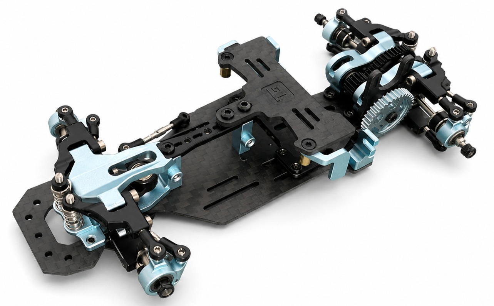

# TG Racing

{ width="500" }

## Quick facts

- **Developed by:** *MA Racing (design), TG Racing (production and marketing)*

- **Release:** *February 2023*

- **Origin:** *China*

- **Status:** *Discontinued*

- **Production:** *Mass*

- **Scale:** *1/24-1/28*

- **Body mounting:** *Magnet mounting/MINI-Z*

- **Materials:** *Aluminum, carbon fiber, plastic (ball cups)*

---

## Adjustability

### At-a-glance

- **Wheelbase:** ✅

- **Track width:** Front ✅ / Rear ✅

- **Camber:** Front ✅ / Rear ✅ 

- **Camber gain:** Front ❌ / Rear ❌

- **Caster:** ❌

- **Toe:** Front ✅ / Rear ✅

- **Ackermann quick adjustment:** ✅

- **Ride height:** Front ✅ / Rear ✅

- **Front shocks:** preload ✅ / angle ❌

- **Rear shocks:** preload ✅ / angle ❌

- **Active systems:** ✅

- **Motor position:** mid ✅ / high ✅ / rear ✅

- **Belt tension/Pinion size:** ✅

- **Extendable dogbones:** ❌

- **Front knuckle KPI:** ❌

- **Steering linkage position on knuckle:** ❌

- **Steering rack linkage position:** ❌

### Details

- **Wheelbase adjustment method:** *slider*

- **Wheelbase range:** *90–124 mm*

- **Track width range:** *70–85 mm*

- **Caster adjustment:** *static*

- **Ackermann adjustment:** *stepless*

- **Rear toe behavior:** *dynamic*

---

## Drivetrain

- **Gearbox type:** *gear-driven / belt-driven (optional)*

- **Motor orientation:** *transverse*

- **Forces:** *anti-torque*

- **Reversible:** ✅

- **Differential:** *spool*

---

## Steering

- **Steering method:** *pivoted*

- **Steering system:** *bellcrank*

- **Servo position:** *lower deck*

---

## Suspension

- **Front:** *double wishbone, independent, 2 shocks*

- **Rear:** *multi-link, independent, 2 shocks*

- **Shocks type:** *friction shocks*

## Community ratings

## History & Development

TG Racing entered the small-scale RWD scene in early 2023, but the company's first chassis did not originate as an in-house project. According to information confirmed by Jack Nares, the original platform was designed by MA Racing before the design was sold to TG Racing, which then manufactured and marketed the chassis under its own brand, partnering with GUO Racing.

When TG Racing was first introduced, many hobbyists were skeptical. An aluminum and carbon fiber chassis at such a low price seemed almost too good to be true. While the early kits had some QC issues and a relatively basic suspension design, they offered exceptional value and quickly gained popularity as an affordable entry into CNC chassis.

The chassis was available in two versions at launch: TG Official and TG Lite.
Differences between the two versions:

- Official: metal spur gear / Lite: plastic spur gear
- Official: metal chassis brace / Lite: carbon fiber chassis brace
- Official: metal top deck / Lite: carbon fiber top deck
- Official: metal Mini-Z body clip holder / Lite: not included

TG Racing maintained close contact with the community, refining later releases based on user feedback. Following the original launch, the partnership between TG Racing and GUO Racing eventually came to an end. Later, the [TG Super](../tg-super/page.md) chassis was produced by Wentao Sun, representing the next evolution of the TG lineup. Over the following years, the company expanded its lineup into several platforms, eventually becoming one of the most recognizable names in the small-scale RWD scene.

---

## Contribute

Have extra info or experience with this chassis? [Contribute here](../../../contribute/contribute.md)

---

## Sources / credits / reviews
Jack Nares, GT55Racing, Wentao Sun