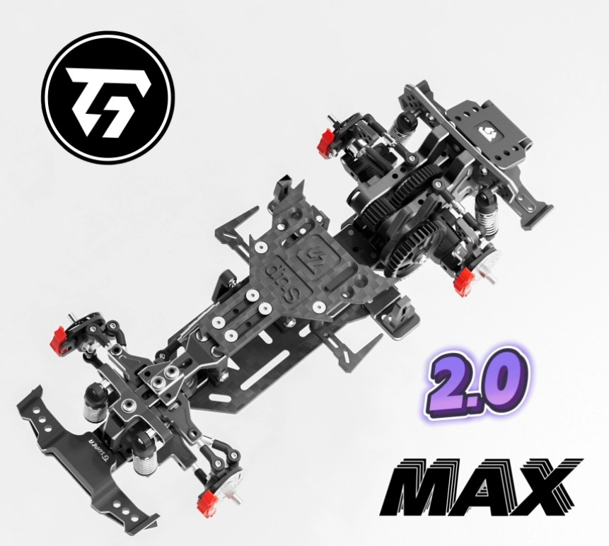

# TG Super 2.0

{ width="500" }

## Quick facts

- **Developed by:** *TG Racing*

- **Release:** *December 2023*

- **Origin:** *China*

- **Status:** *Discontinued*

- **Production:** *Batch*

- **Scale:** *1/24*

- **Body mounting:** *Magnet mounting, Kyosho body mounts (sold separately)*

- **Materials:** *Aluminum, stainless steel, carbon fiber*

---

## Adjustability

### At-a-glance

- **Wheelbase:** ✅

- **Camber:** Front ✅/ Rear ✅

- **Toe:** Front ✅/ Rear ✅

- **Caster:** ✅

- **Ackermann quick adjustment:** ✅

- **Ride height:** Front ✅ / Rear ✅

- **Track width:** Front ✅/ Rear ✅

- **Front shocks:** preload ✅ / angle ✅

- **Rear shocks:** preload ✅ / angle ✅

- **Active systems:** ✅

- **Motor position:** mid ✅ / high ✅ / rear ✅

- **Servo position:** ✅

- **Pinion-Spur distance:** ✅

- **Front knuckle KPI hinge point:** ❌

- **Front knuckle steering linkage hinge point:** ❌

- **Steering rack linkage hinge point:** ❌

- **Extendable dogbones:** ✅

### Details

- **Wheelbase adjustment method:** *slider / steps*

- **Wheelbase range:** *86–108 mm / up to 122 mm with wide track upgrade*

- **Track width range:** *70–85 mm / up to 90 mm with wide track upgrade*

- **Caster adjustment:** *stepless*

- **Ackermann adjustment:** *stepless*

- **Rear toe behavior:** *static*

- **Rear camber behavior:** *adjustable*

---

## Drivetrain

- **Gearbox type:** *gear-driven (metal gears)*

- **Motor orientation:** *transverse*

- **Forces:** *anti-torque*

- **Reversible:** ✅

- **Differential:** *spool*

---

## Steering

- **Steering method:** *pivoted*

- **Steering system:** *bellcrank*

- **Servo position:** *lower deck*

---

## Suspension

- **Front:** *double wishbone, independent, 2 shocks*

- **Rear:** *double wishbone, independent, 2 shocks*

- **Shocks type:** *friction shocks*

## Notes

TG Super 2.0 Max "upgraded version"

{ width="500" }

Upgrades:

- aluminum front and rear bumpers

- brake discs with rotating calipers

- kyosho mounting metal L-brackets and carbon body mount

---

## Contribute

Have extra info or experience with this chassis? [Contribute here](../../../contribute/contribute.md)

---

## Sources / credits / reviews

