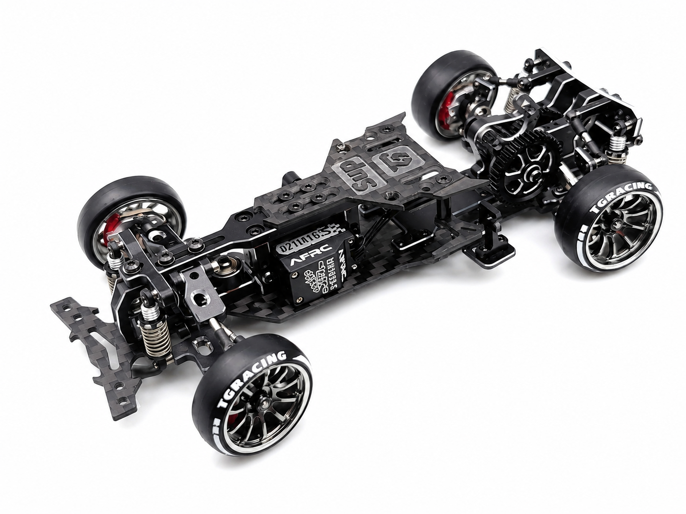
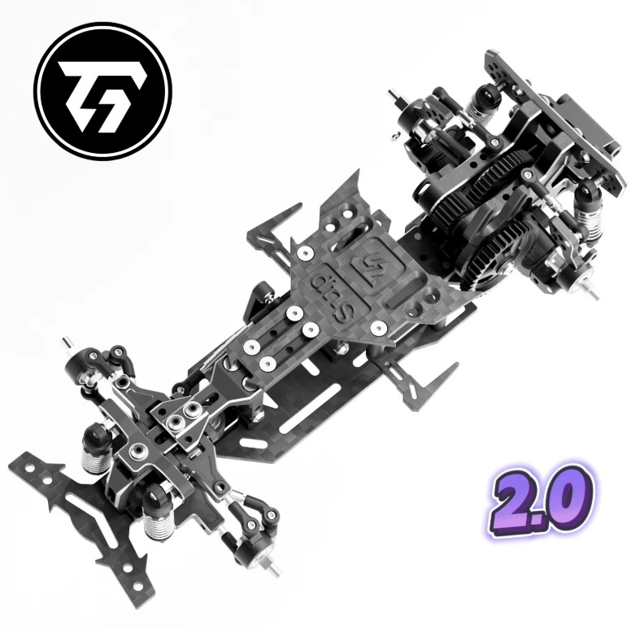
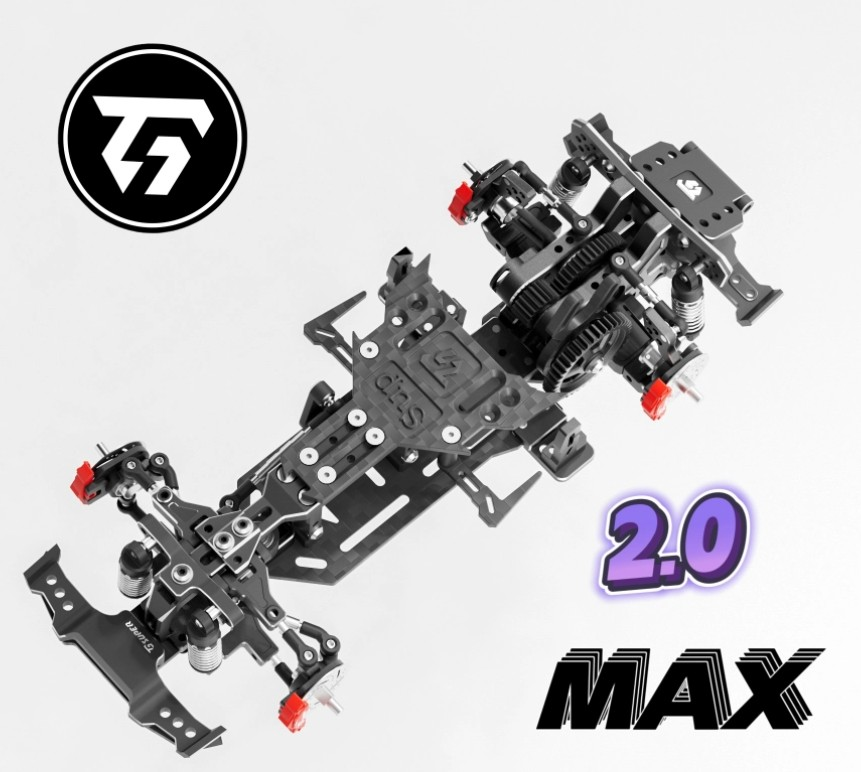

# TG Super/TG Super 2.0

{ width="500" }

## Quick facts

- **Developed by:** *TG Racing*

- **Release:** *December 2023*

- **Origin:** *China*

- **Status:** *Discontinued*

- **Production:** *Batch*

- **Scale:** *1/24*

- **Body mounting:** *Magnet mounting, Kyosho body mounts (sold separately)*

- **Materials:** *Aluminum, stainless steel, carbon fiber, plastic (ball cups)*

---

## Adjustability

### At-a-glance

- **Wheelbase:** ✅

- **Track width:** Front ✅/ Rear ✅

- **Camber:** Front ✅ / Rear ✅

- **Camber gain:** Front ❌ / Rear ✅

- **Caster:** ✅

- **Toe:** Front ✅ / Rear ✅

- **Ackermann quick adjustment:** ✅

- **Ride height:** Front ✅ / Rear ✅

- **Front shocks:** preload ✅ / angle ✅

- **Rear shocks:** preload ✅ / angle ✅

- **Active systems:** ✅

- **Motor position:** mid ✅ / high ✅ / rear ✅

- **Belt tension/Pinion size:** ✅

- **Extendable dogbones:** ✅

- **Front knuckle KPI:** ❌

- **Steering linkage position on knuckle:** ❌

- **Steering rack linkage position:** ❌

### Details

- **Wheelbase adjustment method:** *slider / steps*

- **Wheelbase range:** *86–108 mm / up to 122 mm with wide track upgrade*

- **Track width range:** *70–85 mm / up to 90 mm with wide track upgrade*

- **Caster adjustment:** *stepless*

- **Ackermann adjustment:** *stepless*

- **Rear toe behavior:** *static*

- **Rear camber behavior:** *adjustable*

---

## Drivetrain

- **Gearbox type:** *gear-driven (metal gears) / belt-driven (optional)*

- **Motor orientation:** *transverse*

- **Forces:** *anti-torque*

- **Reversible:** ✅

- **Differential:** *spool*

---

## Steering

- **Steering method:** *pivoted*

- **Steering system:** *bellcrank*

- **Servo position:** *lower deck*

---

## Suspension

- **Front:** *double wishbone, independent, 2 shocks*

- **Rear:** *double wishbone, independent, 2 shocks*

- **Shocks type:** *friction shocks*

## Community ratings

## History & Development

Following the original [TG Racing](../tg-racing/page.md) platform, the TG Super was introduced in December 2023 as the next generation of the TG lineup. The chassis was produced by Wentao Sun and retained the modular philosophy of its predecessor while introducing numerous mechanical refinements aimed at improving precision, adjustability and overall driving feel.

Compared to the original TG Racing chassis, the first TG Super addressed several areas identified by the community. Improvements included reduced steering bellcrank play, the introduction of conventional shock absorbers, increased adjustability through quick caster adjustment, reduced suspension slop, improved left-to-right symmetry during wheelbase adjustment, and an upgraded rotating brake disc option replacing the earlier static decorative discs. A rear balancing stand (BRS) system was also available as an optional upgrade. The improvements came at the cost of a higher initial price than its predecessor, though the chassis continued to offer strong value for money.

The TG Super was released in December 2023 and was available in two color options: black and purple.

{ width="500" }

In April 2024, the platform evolved into the TG Super 2.0 and TG Super 2.0 Max. Rather than being a complete redesign, version 2.0 refined numerous individual components, including the front upper and lower suspension arms, suspension pins, upper arm mount, caster block, shock ball cups, steering ball cups, rear lower arms and Mini-Z side mounting brackets.

{ width="500" }

The TG Super 2.0 Max represented the highest specification offered by the factory, adding several components not included with the standard 2.0 package:

- Aluminum front and rear bumpers
- Rotating brake discs with calipers
- Metal Kyosho body mounting brackets with carbon fiber body mounts

Over time, the TG Super established itself as the natural successor to the original TG Racing chassis, continuing the evolution of the platform through incremental mechanical improvements while preserving its modular design philosophy.

---

## Contribute

Have extra info or experience with this chassis? [Contribute here](../../../contribute/contribute.md)

---

## Sources / credits / reviews
Wentao Sun, GT55Racing

