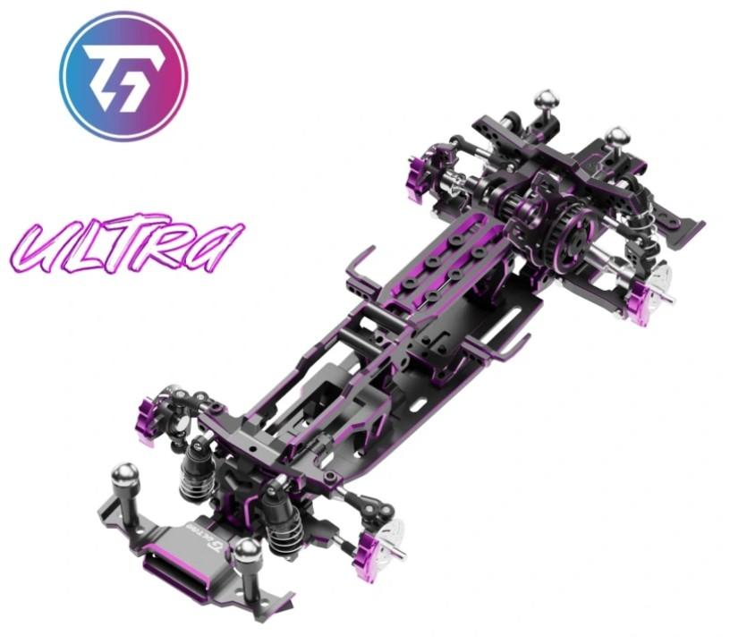

# TGS Ultra

{ width="500" }

## Quick facts

- **Developed by:** *TG Racing*

- **Release:** *April 2025*

- **Origin:** *China*

- **Status:** *Available*

- **Production:** *Batch*

- **Scale:** *1/24*

- **Body mounting:** *Magnet mounting*

- **Materials:** *Aluminum*

---

## Adjustability

### At-a-glance

- **Wheelbase:** ✅ 

- **Camber:** Front ✅ / Rear ✅

- **Toe:** Front ✅ / Rear ✅

- **Caster:** ✅

- **Ackermann quick adjustment:** ✅

- **Ride height:** Front ✅ / Rear ✅

- **Track width:** Front ✅ / Rear ✅

- **Front shocks:** preload ✅ / angle ✅

- **Rear shocks:** preload ✅ / angle ✅ 

- **Active systems:** ❌

- **Motor position:** mid ✅ / high ✅ / rear ✅

- **Servo position:** ✅

- **Pinion-Spur distance:** ✅

- **Front knuckle KPI hinge point:** ❌

- **Front knuckle steering linkage hinge point:** ❌

- **Steering rack linkage hinge point:** ❌

- **Extendable dogbones:** ✅

### Details

- **Wheelbase adjustment method:** *slider*

- **Wheelbase range:** *94–122 mm*

- **Track width range:** *Front: 73–90 mm Rear: 73-80*

- **Front width adjustment method:** *D-rod slide*

- **Rear width adjustment method:** *gasket*

- **Caster adjustment:** *shims*

- **Ackermann adjustment:** *stepless*

- **Rear toe behavior:** *static*

- **Rear toe adjustment method:** *shims*

---

## Drivetrain

- **Gearbox type:** *belt-driven(v-belt)*

- **Motor orientation:** *transverse*

- **Forces:** *anti-torque*

- **Reversible:** ✅

- **Differential:** *spool*

---

## Steering

- **Steering method:** *direct*

- **Servo position:** *bulkhead*

---

## Suspension

- **Front:** *double wishbone, independent, 2 shocks*

- **Rear:** *double wishbone, independent, 2 shocks*

- **Shocks type:** *friction shocks*

## Notes

---

## Contribute

Have extra info or experience with this chassis? [Contribute here](../../../contribute/contribute.md)

---

## Sources / credits / reviews

